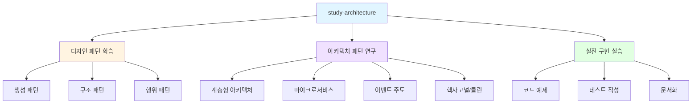
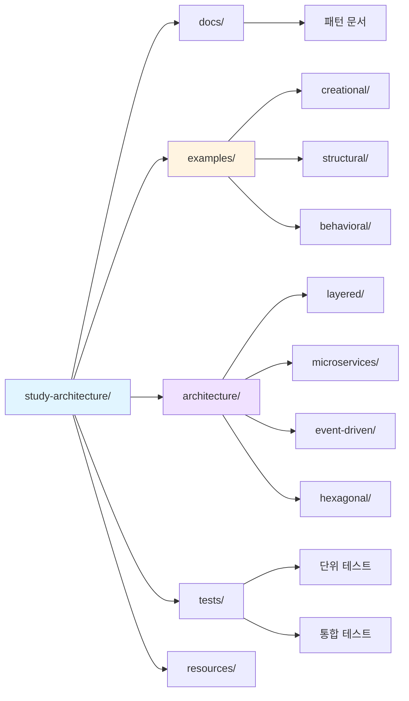
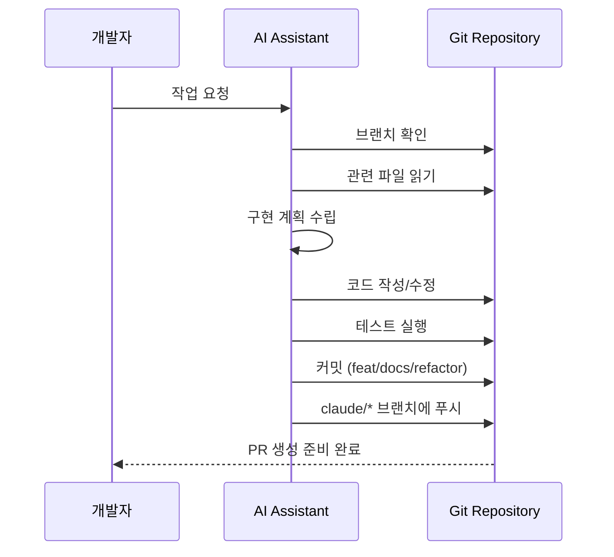
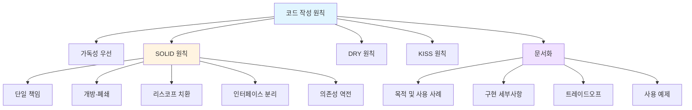
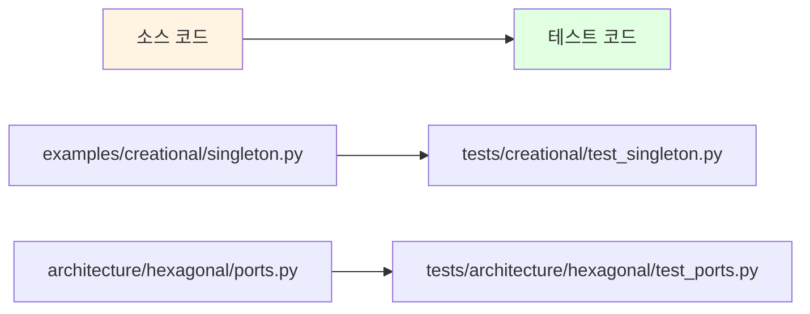
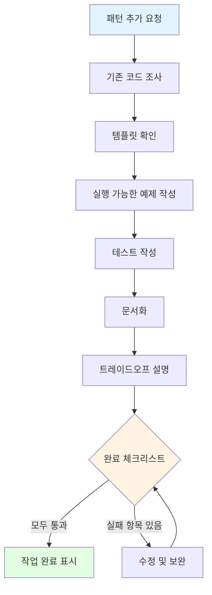
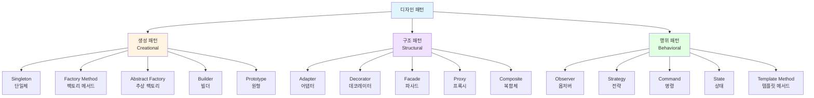
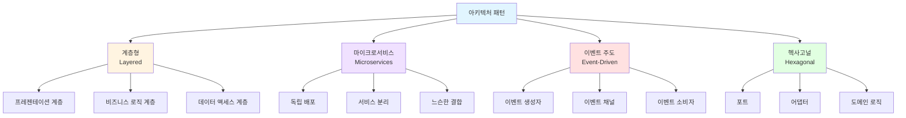
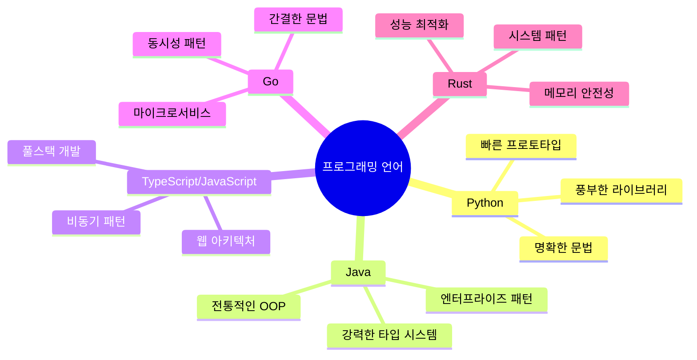
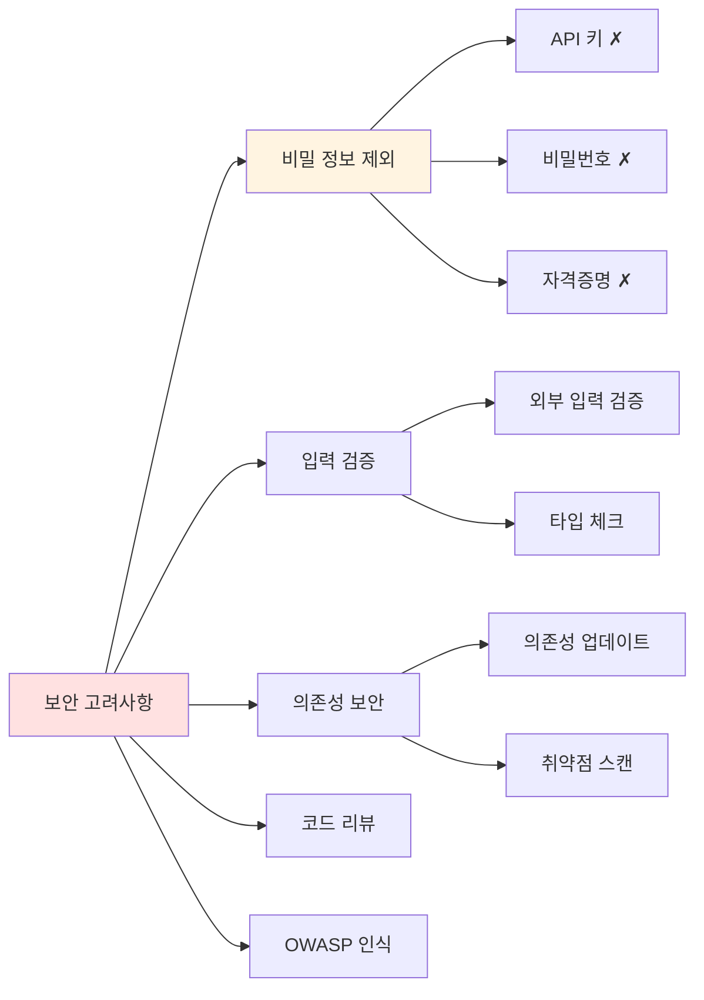

# CLAUDE.md - AI 어시스턴트 가이드

**최종 업데이트**: 2025-12-18
**저장소**: study-architecture
**목적**: 소프트웨어 아키텍처 패턴과 원칙을 학습하고 구현하기 위한 저장소

---

## 저장소 개요

이 저장소는 소프트웨어 아키텍처 패턴, 설계 원칙, 모범 사례를 학습하고 실험하기 위해 설계되었습니다. 다양한 아키텍처 접근 방식을 구현하고 각각의 장단점을 연구하는 실습 공간입니다.



### 현재 상태
- **상태**: 초기 설정 단계
- **구조**: 최소 구조 (README.md, CLAUDE.md)
- **언어**: 아직 미정 (Python, JavaScript, Java, Go 또는 다중 언어)
- **의존성**: 없음

---

## 저장소 구조

### 현재 구조

```
study-architecture/
├── README.md           # 프로젝트 개요
└── CLAUDE.md          # AI 어시스턴트 가이드 (현재 파일)
```

### 향후 예상 구조



저장소가 성장함에 따라 다음과 같은 구조를 갖게 될 것입니다:

```
study-architecture/
├── docs/                    # 패턴 및 원칙 문서
│   ├── design-patterns/    # 디자인 패턴 문서
│   ├── architecture/       # 아키텍처 패턴 문서
│   └── principles/         # 설계 원칙 문서
├── examples/               # 실용적인 구현 예제
│   ├── creational/         # 생성 패턴
│   │   ├── singleton/
│   │   ├── factory/
│   │   └── builder/
│   ├── structural/         # 구조 패턴
│   │   ├── adapter/
│   │   ├── decorator/
│   │   └── proxy/
│   └── behavioral/         # 행위 패턴
│       ├── observer/
│       ├── strategy/
│       └── command/
├── architecture/           # 대규모 아키텍처 패턴
│   ├── layered/           # 계층형 아키텍처
│   ├── microservices/     # 마이크로서비스 패턴
│   ├── event-driven/      # 이벤트 주도 아키텍처
│   └── hexagonal/         # 헥사고널/클린 아키텍처
├── tests/                 # 단위 및 통합 테스트
└── resources/             # 추가 학습 자료
```

---

## 개발 워크플로우



### 브랜치 전략
- **메인 브랜치**: `main` (또는 `master`)
- **기능 브랜치**: 명확한 이름 사용 (예: `feature/observer-pattern`, `arch/microservices-example`)
- **Claude 브랜치**: `claude/` 접두사로 AI 지원 개발용 자동 생성

### 커밋 컨벤션
명확하고 설명적인 커밋 메시지를 작성하며, 가능한 경우 다음 형식을 따릅니다:

- `feat:` - 새로운 기능/패턴 추가
- `docs:` - 문서 업데이트
- `refactor:` - 코드 개선
- `test:` - 테스트 추가
- `fix:` - 버그 수정

**예시:**
```
feat: Observer 패턴 예제 구현
docs: State 패턴 문서 추가
refactor: Factory 패턴 구현 개선
test: Singleton 패턴 단위 테스트 추가
```

---

## 코드 규칙

### 기본 원칙



1. **가독성 우선 (Clarity over Cleverness)**: 코드는 읽기 쉽고 자체 문서화되어야 함
2. **SOLID 원칙**: 단일 책임, 개방-폐쇄, 리스코프 치환, 인터페이스 분리, 의존성 역전
3. **DRY (Don't Repeat Yourself)**: 코드 중복 방지
4. **KISS (Keep It Simple, Stupid)**: 단순한 솔루션 선호
5. **문서화**: 각 패턴/예제는 다음을 포함해야 함:
   - 목적 및 사용 사례
   - 구현 세부사항
   - 트레이드오프 및 고려사항
   - 사용 예제

### 파일 구조
- 패턴당 하나의 디렉토리
- 각 패턴 디렉토리에 README.md 포함:
  - 패턴이 무엇인지
  - 언제 사용하는지
  - 장단점
  - 구현 참고사항

### 네이밍 규칙
- **파일명**: 소문자와 하이픈 사용 (예: `observer-pattern.py`, `팩토리-패턴.js`)
- **클래스**: PascalCase 사용 (예: `ObserverPattern`, `SingletonManager`)
- **함수/메서드**: camelCase 또는 snake_case (언어에 따라)
- **상수**: UPPER_SNAKE_CASE

---

## 테스트 표준

### 테스트 커버리지
- 비즈니스 로직에 대해 높은 테스트 커버리지 목표 (80%+)
- 일반적인 경우와 엣지 케이스 모두 테스트
- 아키텍처 패턴에 대한 통합 테스트 포함

### 테스트 구성
- 소스 구조를 tests 디렉토리에 미러링
- 테스트 파일명에 `test_` 접두사 또는 `_test` 접미사 사용
- 관련 테스트를 테스트 클래스/스위트로 그룹화



---

## 문서화 요구사항

### 패턴 문서화 템플릿

각 아키텍처 패턴 또는 디자인 패턴은 다음을 포함해야 합니다:

```markdown
# [패턴 이름]

## 개요
패턴에 대한 간단한 설명

## 의도 (Intent)
이 패턴이 해결하는 문제는 무엇인가?

## 적용 가능성 (Applicability)
이 패턴을 언제 사용해야 하는가?

## 구조 (Structure)
```mermaid
# 패턴 구조를 나타내는 다이어그램
```

## 참여자 (Participants)
주요 컴포넌트와 그 역할

## 협력 관계 (Collaborations)
컴포넌트들이 상호작용하는 방식

## 구현 (Implementation)
코드 예제와 설명

## 결과 (Consequences)
장단점, 트레이드오프

## 관련 패턴 (Related Patterns)
유사하거나 보완적인 패턴

## 참고 자료 (References)
책, 기사 또는 리소스
```

---

## AI 어시스턴트 가이드라인

### 새 패턴 추가 시



1. **먼저 조사**: 구조를 이해하기 위해 기존 코드 읽기
2. **템플릿 따르기**: 패턴 문서화 템플릿 사용
3. **예제 추가**: 실용적이고 실행 가능한 예제 포함
4. **철저한 테스트**: 작업 완료 표시 전 테스트 작성
5. **트레이드오프 문서화**: 패턴을 사용할 때와 사용하지 말아야 할 때 설명

### 리팩토링 시

1. **의도 보존**: 교육적 가치 유지
2. **명확성 개선**: 코드를 더 이해하기 쉽게 만들기
3. **문서 업데이트**: 변경사항을 문서에 반영
4. **테스트 커버리지**: 테스트가 여전히 통과하는지 확인

### 질문 응답 시

1. **컨텍스트 이해**: 답변 전 관련 파일 읽기
2. **출처 인용**: 특정 파일 및 라인 번호 참조
3. **트레이드오프 설명**: 장단점 논의
4. **대안 제시**: 관련 패턴이나 접근 방식 언급

### 코드 품질 체크리스트

작업 완료 전:
- [ ] 코드가 언어별 규칙을 따름
- [ ] 테스트가 작성되고 통과함
- [ ] 문서가 업데이트됨
- [ ] 예제가 실행 가능하고 명확함
- [ ] 트레이드오프가 문서화됨
- [ ] 보안 취약점이 없음
- [ ] 불필요한 복잡성이 추가되지 않음

---

## 학습할 아키텍처 패턴

### 디자인 패턴 (GoF - Gang of Four)



#### 생성 패턴 (Creational Patterns)
객체 생성 메커니즘을 다루며, 상황에 맞는 방식으로 객체를 생성합니다.

- **Singleton (싱글톤)**: 클래스의 인스턴스가 하나만 존재하도록 보장
- **Factory Method (팩토리 메서드)**: 객체 생성 인터페이스를 정의하되, 서브클래스가 인스턴스화할 클래스를 결정
- **Abstract Factory (추상 팩토리)**: 구체적인 클래스를 지정하지 않고 관련 객체 군을 생성
- **Builder (빌더)**: 복잡한 객체의 생성 과정을 단계별로 분리
- **Prototype (원형)**: 기존 인스턴스를 복제하여 새 객체 생성

#### 구조 패턴 (Structural Patterns)
클래스와 객체를 조합하여 더 큰 구조를 형성합니다.

- **Adapter (어댑터)**: 호환되지 않는 인터페이스를 연결
- **Bridge (브리지)**: 추상화와 구현을 분리
- **Composite (복합체)**: 객체들을 트리 구조로 구성
- **Decorator (데코레이터)**: 객체에 동적으로 새로운 책임 추가
- **Facade (파사드)**: 서브시스템에 대한 통합 인터페이스 제공
- **Flyweight (플라이웨이트)**: 많은 수의 객체를 효율적으로 공유
- **Proxy (프록시)**: 다른 객체에 대한 대리자 제공

#### 행위 패턴 (Behavioral Patterns)
객체 간의 책임 분배와 알고리즘을 다룹니다.

- **Chain of Responsibility (책임 연쇄)**: 요청을 처리할 기회를 여러 객체에 부여
- **Command (명령)**: 요청을 객체로 캡슐화
- **Interpreter (인터프리터)**: 언어에 대한 문법 표현과 해석기 정의
- **Iterator (반복자)**: 내부 표현을 노출하지 않고 순차 접근
- **Mediator (중재자)**: 객체 간의 상호작용을 캡슐화
- **Memento (메멘토)**: 객체의 내부 상태를 저장하고 복원
- **Observer (옵저버)**: 객체 상태 변화를 다른 객체에 자동 통지
- **State (상태)**: 객체의 내부 상태에 따라 행위 변경
- **Strategy (전략)**: 알고리즘 군을 정의하고 교체 가능하게 만듦
- **Template Method (템플릿 메서드)**: 알고리즘의 골격을 정의
- **Visitor (방문자)**: 객체 구조를 변경하지 않고 새로운 연산 추가

### 아키텍처 패턴



- **Layered Architecture (계층형 아키텍처)**: 프레젠테이션, 비즈니스, 데이터 계층으로 분리
- **Microservices (마이크로서비스)**: 독립적으로 배포 가능한 분산 서비스
- **Event-Driven (이벤트 주도)**: 이벤트를 통한 통신
- **Hexagonal/Clean (헥사고널/클린)**: 의존성 역전, 포트와 어댑터
- **CQRS**: Command Query Responsibility Segregation (명령과 조회의 책임 분리)
- **Event Sourcing (이벤트 소싱)**: 상태 변경을 이벤트 시퀀스로 관리
- **Service-Oriented (서비스 지향)**: 프로토콜을 통해 통신하는 서비스
- **Serverless (서버리스)**: Function-as-a-Service 아키텍처
- **MVC/MVVM**: Model-View-Controller/ViewModel 패턴

---

## 기술 고려사항

### 언어 선택



- **Python**: 빠른 프로토타입, 명확한 문법
- **Java**: 전통적인 OOP 패턴에 탁월
- **TypeScript/JavaScript**: 현대적인 웹 아키텍처
- **Go**: 마이크로서비스와 동시성 패턴
- **Rust**: 메모리 안전성과 시스템 패턴

### 도구 및 프레임워크
- 언어에 적합한 테스트 프레임워크
- 다이어그램 도구 (PlantUML, Mermaid)
- 문서 생성기 (Sphinx, JSDoc 등)

---

## 참고 자료

### 추천 도서
- "Design Patterns: Elements of Reusable Object-Oriented Software" (Gang of Four)
- "Clean Architecture" - Robert C. Martin
- "Domain-Driven Design" - Eric Evans
- "Patterns of Enterprise Application Architecture" - Martin Fowler
- "Building Microservices" - Sam Newman
- "Head First Design Patterns" - Eric Freeman & Elisabeth Robson

### 온라인 리소스
- **refactoring.guru** - 디자인 패턴 카탈로그 (한글 지원)
- **martinfowler.com** - 아키텍처 및 패턴 아티클
- **Microsoft Architecture Guides** - 마이크로소프트 아키텍처 가이드
- **AWS Architecture Center** - AWS 아키텍처 센터

---

## Git 워크플로우 (AI 어시스턴트용)

### 작업 시작 전
1. 현재 브랜치 상태 확인
2. 요청된 변경사항 이해
3. 관련 기존 파일 읽기
4. 구현 계획 수립

### 개발 중
1. 집중적이고 원자적인 커밋 작성
2. 명확한 커밋 메시지 작성
3. 코드와 함께 문서 업데이트
4. 테스트 자주 실행

### 푸시 전
1. 모든 테스트가 통과하는지 확인
2. 문서가 완성되었는지 확인
3. 변경사항 품질 검토
4. 민감한 데이터가 커밋되지 않았는지 확인

### 푸시 프로토콜
- 항상 할당된 `claude/` 브랜치에 푸시
- 사용: `git push -u origin <branch-name>`
- 네트워크 실패 시 지수 백오프로 재시도

---

## 보안 고려사항



- **비밀 정보 제외**: API 키, 비밀번호, 자격증명 절대 커밋 금지
- **입력 검증**: 모든 외부 입력 검증
- **의존성 보안**: 의존성을 최신 상태로 유지
- **코드 리뷰**: 일반적인 취약점에 대한 패턴 검토
- **OWASP 인식**: 일반적인 보안 문제 인지

---

## 향후 개선 사항

저장소 성장을 위한 잠재적 영역:
- 대화형 튜토리얼
- 패턴의 성능 비교
- 실제 사례 연구
- 비디오/애니메이션 설명
- 언어별 최적화
- 분산 시스템 패턴
- 클라우드 네이티브 아키텍처
- 도메인 주도 설계 예제

---

## 질문이나 개선사항?

이것은 살아있는 문서입니다. 저장소가 발전함에 따라 이 가이드는 다음을 반영하도록 업데이트되어야 합니다:
- 추가된 새 패턴
- 규칙 변경
- 도구 업데이트
- 배운 교훈

의심스러울 때는 다음을 우선시하세요:
1. **교육적 가치**: 배우기 쉽게
2. **명확성**: 이해하기 쉽게
3. **실용성**: 실제 프로젝트에서 유용하게

---

**AI 어시스턴트를 위한 참고사항**: 이 저장소에서 작업을 시작하기 전에 항상 이 파일을 읽으세요. 새 콘텐츠를 추가할 때는 교육적 목표에 부합하고 기존 예제와 일관성을 유지하는지 확인하세요.
