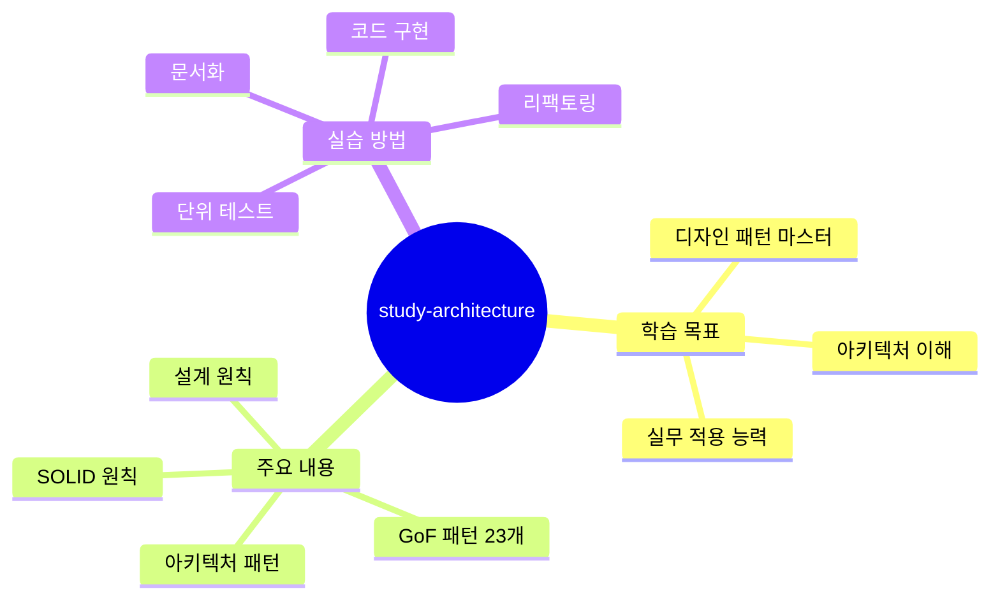
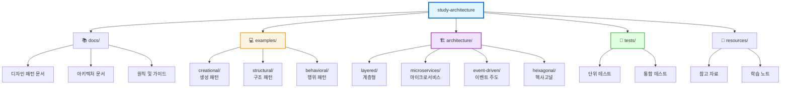
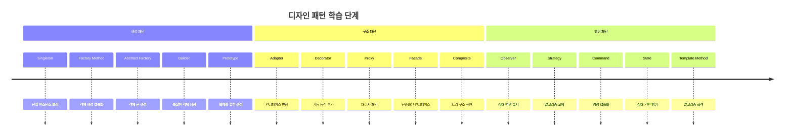
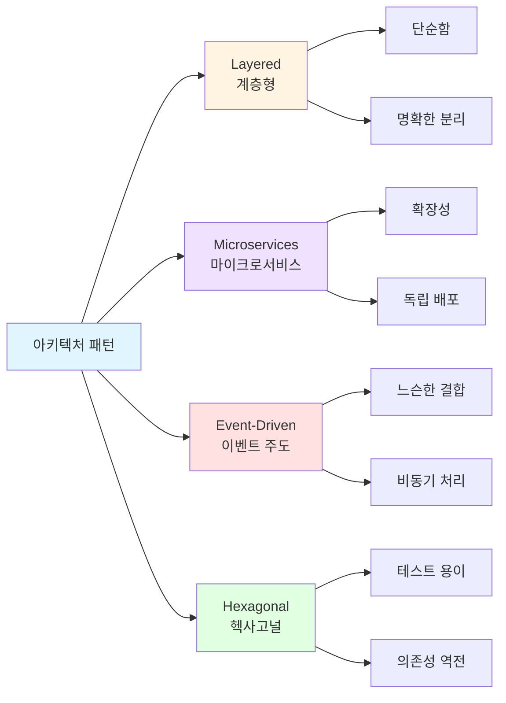
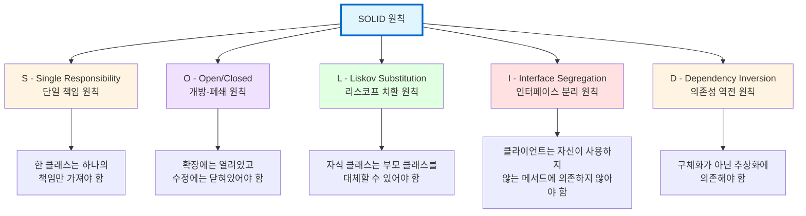
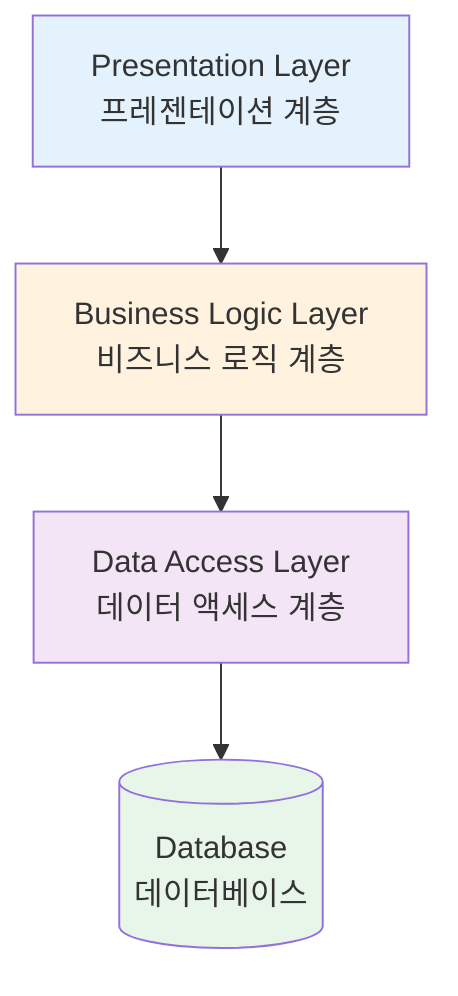
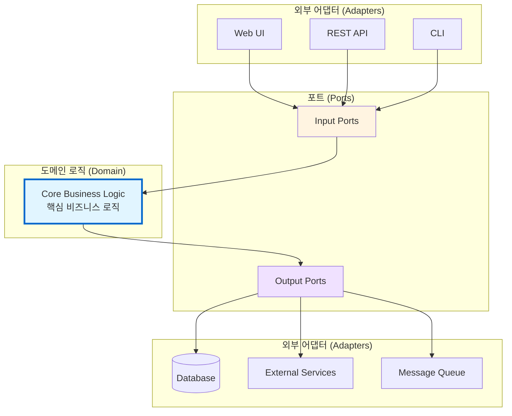
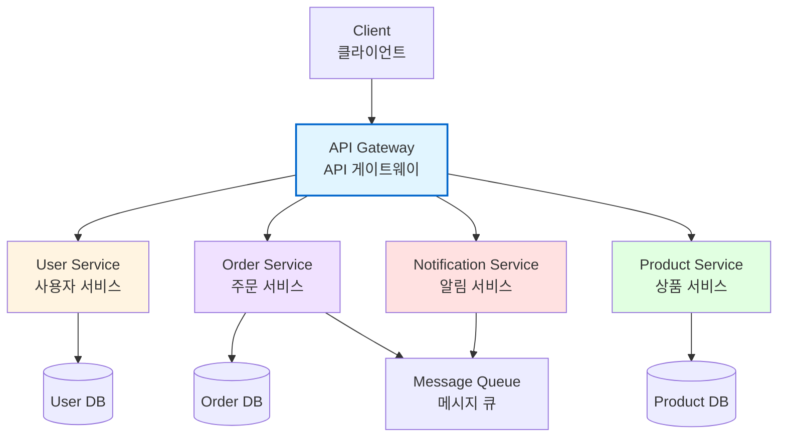
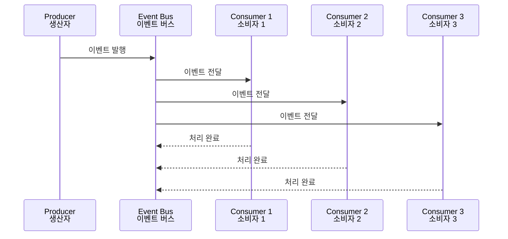
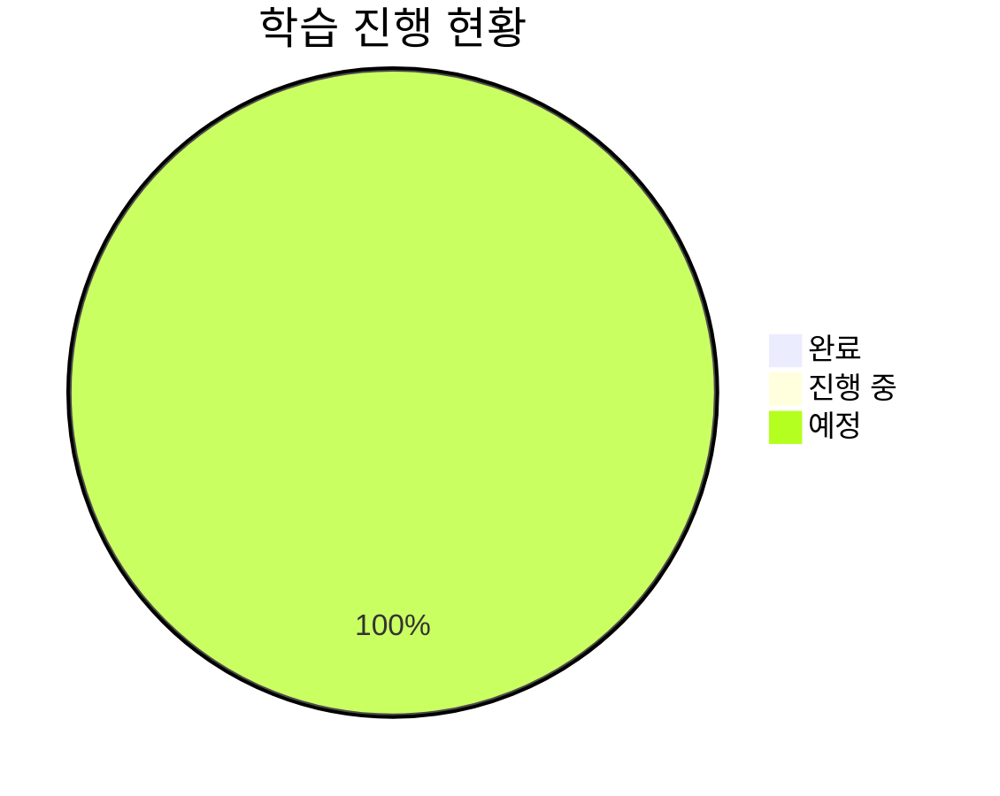

# 소프트웨어 아키텍처 학습 (study-architecture)

> 소프트웨어 아키텍처 패턴과 디자인 패턴을 체계적으로 학습하고 실습하는 저장소입니다.

---

## 📋 프로젝트 개요

이 저장소는 소프트웨어 개발에서 널리 사용되는 **디자인 패턴**과 **아키텍처 패턴**을 학습하고 실제로 구현해보는 것을 목표로 합니다. 각 패턴에 대한 이론적 설명과 함께 실행 가능한 코드 예제, 테스트, 그리고 실무 적용 사례를 포함합니다.



---

## 🎯 학습 목표

1. **디자인 패턴 이해**: GoF(Gang of Four)의 23가지 디자인 패턴 학습
2. **아키텍처 패턴 습득**: 계층형, 마이크로서비스, 헥사고널 등 주요 아키텍처 패턴 학습
3. **실전 적용 능력**: 실제 프로젝트에 패턴을 적용하는 능력 배양
4. **트레이드오프 이해**: 각 패턴의 장단점과 적용 시점 판단 능력 개발

---

## 🗂️ 저장소 구조



---

## 📚 학습 로드맵

### 1단계: 디자인 패턴 기초 (GoF Patterns)



### 2단계: 아키텍처 패턴



---

## 🔑 핵심 설계 원칙

### SOLID 원칙



---

## 📖 디자인 패턴 카탈로그

### 생성 패턴 (Creational Patterns)

객체 생성에 관련된 패턴으로, 객체의 생성 과정을 유연하고 효율적으로 만듭니다.

| 패턴 | 목적 | 사용 시점 |
|------|------|-----------|
| **Singleton** | 단일 인스턴스 보장 | 전역 상태 관리, 리소스 공유 |
| **Factory Method** | 객체 생성 인터페이스 정의 | 생성할 객체 타입을 서브클래스가 결정 |
| **Abstract Factory** | 관련 객체 군 생성 | 여러 제품군을 일관되게 생성 |
| **Builder** | 복잡한 객체의 단계별 생성 | 생성 단계가 복잡하거나 많은 경우 |
| **Prototype** | 기존 객체 복제 | 객체 생성 비용이 클 때 |

### 구조 패턴 (Structural Patterns)

클래스나 객체를 조합해 더 큰 구조를 만드는 패턴입니다.

| 패턴 | 목적 | 사용 시점 |
|------|------|-----------|
| **Adapter** | 인터페이스 호환성 제공 | 기존 클래스를 수정하지 않고 재사용 |
| **Bridge** | 추상화와 구현 분리 | 추상화와 구현이 독립적으로 확장 |
| **Composite** | 트리 구조 표현 | 부분-전체 계층 구조 표현 |
| **Decorator** | 동적으로 기능 추가 | 상속 없이 객체 기능 확장 |
| **Facade** | 단순화된 인터페이스 제공 | 복잡한 서브시스템을 단순화 |
| **Flyweight** | 메모리 효율적 객체 공유 | 많은 수의 유사한 객체 사용 |
| **Proxy** | 대리 객체 제공 | 접근 제어, 지연 로딩 등 |

### 행위 패턴 (Behavioral Patterns)

객체 간의 알고리즘이나 책임 분배에 관련된 패턴입니다.

| 패턴 | 목적 | 사용 시점 |
|------|------|-----------|
| **Chain of Responsibility** | 요청 처리 체인 구성 | 여러 객체가 요청 처리 기회 |
| **Command** | 요청을 객체로 캡슐화 | 작업 취소/재실행, 작업 큐 |
| **Interpreter** | 문법 표현 및 해석 | 간단한 언어 해석 |
| **Iterator** | 순차적 접근 제공 | 내부 구조를 노출하지 않고 순회 |
| **Mediator** | 객체 간 상호작용 중재 | 객체 간 복잡한 통신 단순화 |
| **Memento** | 객체 상태 저장/복원 | 상태 스냅샷, 실행 취소 |
| **Observer** | 상태 변화 자동 통지 | 일대다 의존 관계, 이벤트 처리 |
| **State** | 상태에 따른 행위 변경 | 객체의 상태가 행위를 결정 |
| **Strategy** | 알고리즘 캡슐화 및 교체 | 알고리즘을 런타임에 선택 |
| **Template Method** | 알고리즘 골격 정의 | 알고리즘 구조는 유지, 단계는 재정의 |
| **Visitor** | 새로운 연산 추가 | 구조 변경 없이 새 연산 추가 |

---

## 🏗️ 아키텍처 패턴

### 계층형 아키텍처 (Layered Architecture)



### 헥사고널 아키텍처 (Hexagonal Architecture)



### 마이크로서비스 아키텍처 (Microservices)



### 이벤트 주도 아키텍처 (Event-Driven Architecture)



---

## 🚀 시작하기

### 필수 요구사항

- 프로그래밍 언어: Python, JavaScript, Java, Go 중 하나 이상
- Git
- 해당 언어의 테스트 프레임워크
- 다이어그램 도구 (선택사항): PlantUML, Mermaid

### 설치 및 실행

```bash
# 저장소 클론
git clone https://github.com/yourusername/study-architecture.git
cd study-architecture

# 예제 실행 (언어별로 다름)
# Python 예제
python examples/creational/singleton/example.py

# JavaScript 예제
node examples/structural/adapter/example.js

# 테스트 실행
# Python
pytest tests/

# JavaScript
npm test
```

---

## 📝 학습 방법

### 1. 이론 학습
각 패턴 디렉토리의 README.md를 읽고 패턴의 개념, 목적, 사용 시점을 이해합니다.

### 2. 코드 분석
제공된 예제 코드를 읽고 패턴이 어떻게 구현되는지 분석합니다.

### 3. 직접 구현
예제를 참고하여 다른 시나리오에 패턴을 적용해봅니다.

### 4. 테스트 작성
작성한 코드에 대한 단위 테스트를 작성하여 동작을 검증합니다.

### 5. 문서화
학습한 내용을 정리하고 실제 적용 사례를 문서화합니다.

---

## 🤝 기여하기

이 프로젝트는 학습 목적의 저장소입니다. 기여를 환영합니다!

### 기여 방법
1. Fork the repository
2. Create your feature branch (`git checkout -b feature/amazing-pattern`)
3. Commit your changes (`git commit -m 'feat: Add some amazing pattern'`)
4. Push to the branch (`git push origin feature/amazing-pattern`)
5. Open a Pull Request

### 기여 가이드라인
- 코드는 명확하고 이해하기 쉽게 작성
- 각 패턴에 대한 충분한 주석과 문서 포함
- 테스트 코드 작성 필수
- Mermaid 다이어그램을 활용한 시각적 설명 권장

---

## 📚 참고 자료

### 추천 도서
- 📕 **Design Patterns** - Gang of Four (Erich Gamma, Richard Helm, Ralph Johnson, John Vlissides)
- 📗 **Clean Architecture** - Robert C. Martin
- 📘 **Domain-Driven Design** - Eric Evans
- 📙 **Patterns of Enterprise Application Architecture** - Martin Fowler
- 📓 **Head First Design Patterns** - Eric Freeman & Elisabeth Robson
- 📔 **Building Microservices** - Sam Newman

### 온라인 리소스
- 🌐 [Refactoring.Guru](https://refactoring.guru/ko/design-patterns) - 디자인 패턴 카탈로그 (한글)
- 🌐 [Martin Fowler's Blog](https://martinfowler.com) - 아키텍처 및 패턴 아티클
- 🌐 [Microsoft Architecture Guide](https://docs.microsoft.com/en-us/azure/architecture/) - 클라우드 아키텍처 가이드
- 🌐 [AWS Architecture Center](https://aws.amazon.com/architecture/) - AWS 아키텍처 베스트 프랙티스

---

## 📊 프로젝트 진행 상황



> 이 차트는 패턴 구현이 완료됨에 따라 업데이트됩니다.

---

## 📜 라이선스

이 프로젝트는 학습 목적으로 만들어졌으며, 자유롭게 사용하고 수정할 수 있습니다.

---

## 📧 연락처

질문이나 제안사항이 있으시면 이슈를 등록해주세요!

---

**Happy Learning! 즐거운 학습 되세요! 🎓**
