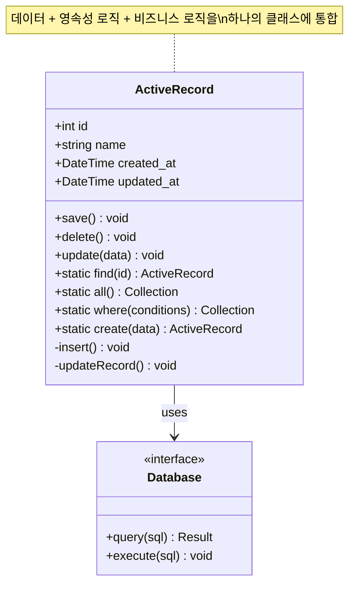
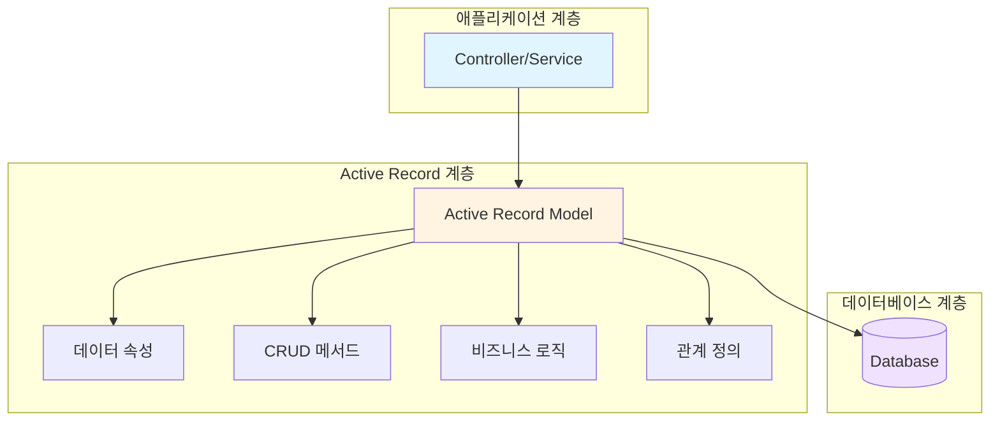
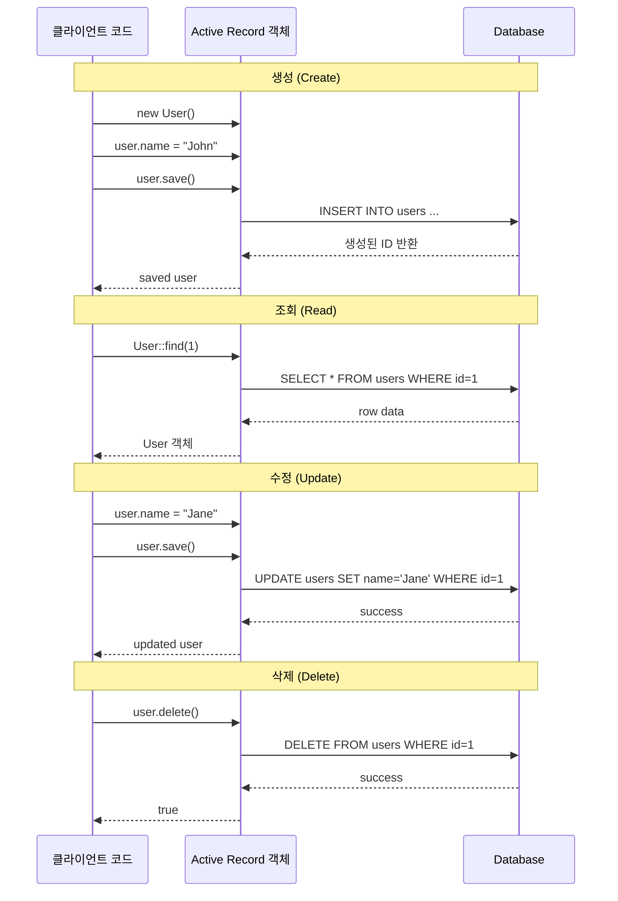
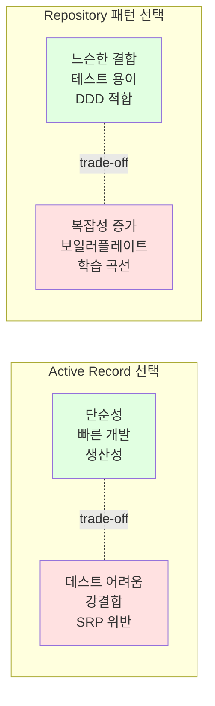
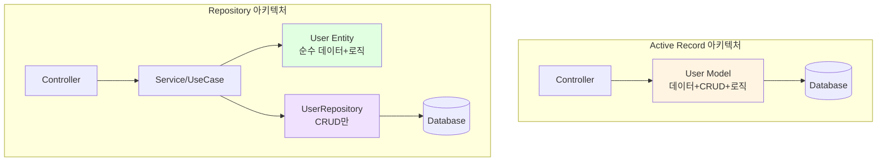
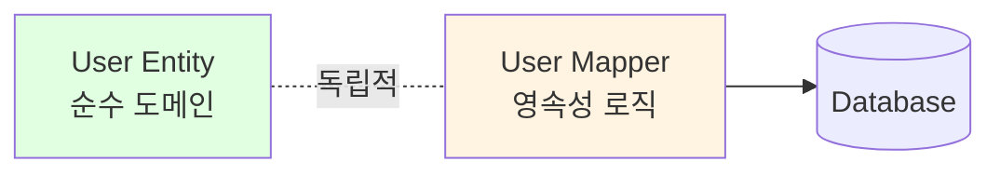

# Active Record 패턴

## 개요

Active Record는 **데이터베이스 테이블의 행(row)을 객체로 래핑**하고, 데이터 접근 로직과 도메인 로직을 함께 캡슐화하는 데이터 접근 패턴입니다. Martin Fowler의 "Patterns of Enterprise Application Architecture"(2002)에서 정의된 패턴으로, Ruby on Rails, Laravel 등 많은 웹 프레임워크에서 채택하고 있습니다.

## 의도 (Intent)

- **단일 객체**가 데이터베이스 테이블의 한 행을 나타내며, 해당 데이터에 대한 CRUD 작업을 수행
- 데이터와 데이터를 조작하는 행동을 하나의 클래스에 통합
- 객체-관계형 매핑(ORM)을 단순하게 구현

## 적용 가능성 (Applicability)

다음과 같은 경우에 Active Record 패턴을 사용하는 것이 적합합니다:

### ✅ 사용하기 좋은 경우

1. **단순한 도메인 로직**: CRUD 중심의 애플리케이션
2. **빠른 개발**: 프로토타입이나 MVP 개발
3. **테이블 구조와 객체가 1:1 매핑**: 복잡한 객체-관계 변환이 필요 없는 경우
4. **소규모 프로젝트**: 과도한 추상화가 필요 없는 경우
5. **팀의 숙련도**: ORM에 익숙한 팀

### ⚠️ 피해야 하는 경우

1. **복잡한 도메인 로직**: 비즈니스 규칙이 복잡한 경우
2. **도메인 주도 설계(DDD)**: 풍부한 도메인 모델이 필요한 경우
3. **높은 테스트 커버리지**: 단위 테스트 격리가 중요한 경우
4. **데이터베이스 독립성**: 여러 데이터 소스를 추상화해야 하는 경우
5. **복잡한 쿼리**: 다중 조인, 복잡한 집계 등이 많은 경우

## 구조 (Structure)



### 계층 관점에서의 위치



## 참여자 (Participants)

### 1. Active Record 클래스
- **역할**: 데이터베이스 테이블의 행을 나타내는 도메인 객체
- **책임**:
  - 데이터 속성 보유 (테이블 컬럼에 매핑)
  - CRUD 작업 제공 (save, delete, update)
  - 쿼리 메서드 제공 (find, where, all)
  - 비즈니스 로직 포함 가능
  - 관계 정의 (hasMany, belongsTo 등)

### 2. 데이터베이스 연결
- **역할**: 실제 데이터베이스와의 통신
- **책임**:
  - SQL 쿼리 실행
  - 연결 관리
  - 트랜잭션 처리

## 협력 관계 (Collaborations)



### 상호작용 패턴

1. **클라이언트 → Active Record**: 도메인 객체로 작업
2. **Active Record → Database**: 내부적으로 SQL 변환 및 실행
3. **투명한 영속성**: 클라이언트는 SQL을 몰라도 됨

## 구현 (Implementation)

### 기본 개념 코드 (PHP)

```php
<?php

// Active Record 기본 구현
abstract class ActiveRecord
{
    protected static $table;
    protected $attributes = [];
    protected $exists = false;

    // 생성자
    public function __construct(array $attributes = [])
    {
        $this->attributes = $attributes;
    }

    // 속성 접근
    public function __get($key)
    {
        return $this->attributes[$key] ?? null;
    }

    public function __set($key, $value)
    {
        $this->attributes[$key] = $value;
    }

    // 저장 (INSERT or UPDATE)
    public function save()
    {
        if ($this->exists) {
            return $this->update();
        }
        return $this->insert();
    }

    // INSERT
    protected function insert()
    {
        $table = static::$table;
        $columns = implode(', ', array_keys($this->attributes));
        $placeholders = implode(', ', array_fill(0, count($this->attributes), '?'));

        $sql = "INSERT INTO {$table} ({$columns}) VALUES ({$placeholders})";
        $stmt = DB::prepare($sql);
        $stmt->execute(array_values($this->attributes));

        $this->attributes['id'] = DB::lastInsertId();
        $this->exists = true;

        return $this;
    }

    // UPDATE
    protected function update()
    {
        $table = static::$table;
        $sets = implode(', ', array_map(fn($k) => "{$k} = ?", array_keys($this->attributes)));

        $sql = "UPDATE {$table} SET {$sets} WHERE id = ?";
        $stmt = DB::prepare($sql);
        $stmt->execute([...array_values($this->attributes), $this->id]);

        return $this;
    }

    // DELETE
    public function delete()
    {
        $table = static::$table;
        $sql = "DELETE FROM {$table} WHERE id = ?";
        $stmt = DB::prepare($sql);
        return $stmt->execute([$this->id]);
    }

    // 조회 메서드
    public static function find($id)
    {
        $table = static::$table;
        $sql = "SELECT * FROM {$table} WHERE id = ?";
        $stmt = DB::prepare($sql);
        $stmt->execute([$id]);

        $data = $stmt->fetch(PDO::FETCH_ASSOC);
        if (!$data) return null;

        $instance = new static($data);
        $instance->exists = true;

        return $instance;
    }

    public static function all()
    {
        $table = static::$table;
        $sql = "SELECT * FROM {$table}";
        $stmt = DB::query($sql);

        $results = [];
        while ($data = $stmt->fetch(PDO::FETCH_ASSOC)) {
            $instance = new static($data);
            $instance->exists = true;
            $results[] = $instance;
        }

        return $results;
    }

    public static function where($conditions)
    {
        $table = static::$table;
        $where = implode(' AND ', array_map(fn($k) => "{$k} = ?", array_keys($conditions)));

        $sql = "SELECT * FROM {$table} WHERE {$where}";
        $stmt = DB::prepare($sql);
        $stmt->execute(array_values($conditions));

        $results = [];
        while ($data = $stmt->fetch(PDO::FETCH_ASSOC)) {
            $instance = new static($data);
            $instance->exists = true;
            $results[] = $instance;
        }

        return $results;
    }
}

// 구체적인 Active Record 클래스
class User extends ActiveRecord
{
    protected static $table = 'users';

    // 비즈니스 로직
    public function isAdmin()
    {
        return $this->role === 'admin';
    }

    public function getFullName()
    {
        return $this->first_name . ' ' . $this->last_name;
    }

    // 관계
    public function posts()
    {
        return Post::where(['user_id' => $this->id]);
    }
}

// 사용 예제
$user = new User();
$user->name = 'John Doe';
$user->email = 'john@example.com';
$user->role = 'user';
$user->save();

$foundUser = User::find(1);
echo $foundUser->name; // John Doe

$foundUser->name = 'Jane Doe';
$foundUser->save();

$foundUser->delete();
```

### Laravel Eloquent 예제

Laravel의 Eloquent ORM은 Active Record 패턴의 강력한 구현입니다:

```php
<?php

namespace App\Models;

use Illuminate\Database\Eloquent\Model;

class User extends Model
{
    // 테이블명 (생략시 자동으로 복수형 users)
    protected $table = 'users';

    // Mass assignment 보호
    protected $fillable = ['name', 'email', 'password'];
    protected $hidden = ['password', 'remember_token'];

    // 타입 캐스팅
    protected $casts = [
        'email_verified_at' => 'datetime',
        'is_admin' => 'boolean',
    ];

    // 비즈니스 로직
    public function isAdmin(): bool
    {
        return $this->role === 'admin';
    }

    public function hasVerifiedEmail(): bool
    {
        return !is_null($this->email_verified_at);
    }

    // 관계 정의
    public function posts()
    {
        return $this->hasMany(Post::class);
    }

    public function profile()
    {
        return $this->hasOne(Profile::class);
    }

    public function roles()
    {
        return $this->belongsToMany(Role::class);
    }

    // 이벤트 훅
    protected static function booted()
    {
        static::creating(function ($user) {
            $user->uuid = Str::uuid();
        });

        static::updating(function ($user) {
            if ($user->isDirty('email')) {
                $user->email_verified_at = null;
            }
        });
    }

    // 쿼리 스코프
    public function scopeActive($query)
    {
        return $query->where('status', 'active');
    }

    public function scopeAdmins($query)
    {
        return $query->where('role', 'admin');
    }
}

// 사용 예제

// CREATE
$user = User::create([
    'name' => 'John Doe',
    'email' => 'john@example.com',
    'password' => bcrypt('secret'),
]);

// 또는
$user = new User();
$user->name = 'Jane Doe';
$user->email = 'jane@example.com';
$user->password = bcrypt('secret');
$user->save();

// READ
$user = User::find(1);
$user = User::where('email', 'john@example.com')->first();
$users = User::all();
$activeUsers = User::active()->get();
$admins = User::admins()->get();

// UPDATE
$user = User::find(1);
$user->name = 'John Smith';
$user->save();

// 또는 대량 업데이트
User::where('status', 'inactive')->update(['status' => 'active']);

// DELETE
$user = User::find(1);
$user->delete();

// 또는 직접 삭제
User::destroy(1);
User::destroy([1, 2, 3]);
User::where('status', 'deleted')->delete();

// 관계 사용
$user = User::find(1);
$posts = $user->posts; // user의 모든 포스트
$user->posts()->create(['title' => 'New Post', 'content' => '...']);

// Eager Loading (N+1 문제 해결)
$users = User::with('posts', 'profile')->get();

// 쿼리 빌더
$users = User::where('status', 'active')
    ->where('created_at', '>', now()->subDays(30))
    ->orderBy('name')
    ->limit(10)
    ->get();
```

## 구현 고려사항

### 1. 트랜잭션 처리

```php
DB::transaction(function () {
    $user = User::create(['name' => 'John', 'email' => 'john@example.com']);
    $user->profile()->create(['bio' => 'Developer']);
    $user->roles()->attach([1, 2, 3]);
});
```

### 2. 이벤트와 옵저버

```php
// Observer 패턴과 결합
class UserObserver
{
    public function creating(User $user)
    {
        // 생성 전
    }

    public function created(User $user)
    {
        // 생성 후
        Mail::to($user)->send(new WelcomeEmail());
    }

    public function updating(User $user)
    {
        // 업데이트 전
    }

    public function updated(User $user)
    {
        // 업데이트 후
    }
}

// Observer 등록
User::observe(UserObserver::class);
```

### 3. 쿼리 최적화

```php
// N+1 문제 발생
$users = User::all();
foreach ($users as $user) {
    echo $user->posts->count(); // 각 user마다 쿼리 실행
}

// Eager Loading으로 해결
$users = User::with('posts')->get();
foreach ($users as $user) {
    echo $user->posts->count(); // 이미 로드됨
}

// 조건부 Eager Loading
$users = User::with(['posts' => function ($query) {
    $query->where('published', true)->orderBy('created_at', 'desc');
}])->get();
```

## 결과 (Consequences)

### ✅ 장점

1. **단순성과 직관성**
   - 객체 = 테이블 행의 명확한 매핑
   - 적은 보일러플레이트 코드
   - 학습 곡선이 낮음

2. **빠른 개발 속도**
   - CRUD 작업이 매우 간단
   - 프로토타입 개발에 이상적
   - 코드 작성량 감소

3. **강력한 ORM 기능** (Laravel Eloquent 기준)
   - 관계 정의 (hasMany, belongsTo 등)
   - Eager Loading으로 N+1 문제 해결
   - 쿼리 빌더 제공
   - 이벤트 시스템

4. **생산성**
   - Migration과 함께 사용하면 스키마 관리 용이
   - Accessor/Mutator로 데이터 변환
   - 스코프로 재사용 가능한 쿼리

### ⚠️ 단점

1. **단일 책임 원칙(SRP) 위반**
   ```
   User 클래스가 담당하는 책임:
   - 데이터 저장 (속성)
   - 영속성 로직 (save, delete)
   - 비즈니스 로직 (isAdmin, hasAccess)
   - 관계 관리 (posts, roles)
   ```

2. **테스트 어려움**
   - 데이터베이스 의존성 때문에 단위 테스트 복잡
   - Mock/Stub 생성이 어려움
   - 통합 테스트 위주로 작성해야 함

3. **복잡한 도메인에 부적합**
   - 비즈니스 로직이 복잡해지면 모델이 비대해짐
   - 도메인 주도 설계(DDD)와 충돌
   - Value Objects, Aggregates 구현이 어려움

4. **데이터베이스 강결합**
   - 테이블 구조 변경이 어려움
   - 다중 데이터 소스 추상화 어려움
   - 레거시 스키마 적용 어려움

5. **성능 이슈**
   - N+1 쿼리 문제 발생 가능
   - 불필요한 데이터 로딩
   - 복잡한 쿼리는 Raw SQL이 더 효율적일 수 있음

### 트레이드오프



## Active Record vs Repository 패턴



### 비교표

| 측면 | Active Record | Repository 패턴 |
|------|---------------|-----------------|
| **복잡도** | 낮음 | 높음 |
| **학습 곡선** | 완만함 | 가파름 |
| **개발 속도** | 빠름 | 느림 |
| **테스트** | 통합 테스트 위주 | 단위 테스트 용이 |
| **의존성** | 강결합 (DB) | 느슨한 결합 |
| **유연성** | 낮음 | 높음 |
| **DDD 적합성** | 낮음 | 높음 |
| **SOLID 원칙** | SRP 위반 | SOLID 준수 |
| **코드량** | 적음 | 많음 |
| **적합한 프로젝트** | CRUD 중심, 소규모 | 복잡한 도메인, 대규모 |

### 혼합 접근 (Hybrid)

실무에서는 두 패턴을 혼합하여 사용하기도 합니다:

```php
// 간단한 CRUD는 Active Record
class Tag extends Model
{
    protected $fillable = ['name', 'slug'];
}

// 복잡한 비즈니스 로직은 Repository + Service
class OrderRepository
{
    public function findPendingOrders($userId)
    {
        return Order::where('user_id', $userId)
            ->where('status', 'pending')
            ->with('items', 'payment')
            ->get();
    }
}

class OrderService
{
    public function __construct(
        private OrderRepository $orderRepo,
        private PaymentService $paymentService
    ) {}

    public function processOrder(Order $order)
    {
        DB::transaction(function () use ($order) {
            $this->paymentService->charge($order->total);
            $order->status = 'processing';
            $order->save();
            event(new OrderProcessed($order));
        });
    }
}
```

## 관련 패턴 (Related Patterns)

### 1. **Data Mapper 패턴**
- Active Record의 대안
- 데이터베이스와 도메인 객체를 완전히 분리
- 더 복잡하지만 더 유연함



### 2. **Repository 패턴**
- 데이터 접근 로직을 캡슐화
- Active Record보다 추상화 수준이 높음
- 컬렉션과 유사한 인터페이스 제공

### 3. **Unit of Work 패턴**
- 트랜잭션 관리를 추상화
- Active Record와 함께 사용 가능
- Laravel의 DB::transaction이 이 역할

### 4. **Observer 패턴**
- 모델 이벤트 처리
- Laravel Eloquent의 이벤트 시스템

### 5. **Query Object 패턴**
- 복잡한 쿼리를 캡슐화
- Laravel의 Query Scopes가 이 역할

## 실전 예제

### 예제 1: 블로그 시스템

```php
class Post extends Model
{
    protected $fillable = ['title', 'content', 'user_id', 'status'];

    protected $casts = [
        'published_at' => 'datetime',
    ];

    // 관계
    public function author()
    {
        return $this->belongsTo(User::class, 'user_id');
    }

    public function comments()
    {
        return $this->hasMany(Comment::class);
    }

    public function tags()
    {
        return $this->belongsToMany(Tag::class);
    }

    // 비즈니스 로직
    public function isPublished(): bool
    {
        return $this->status === 'published'
            && $this->published_at !== null
            && $this->published_at->isPast();
    }

    public function publish()
    {
        $this->status = 'published';
        $this->published_at = now();
        $this->save();

        event(new PostPublished($this));
    }

    // 스코프
    public function scopePublished($query)
    {
        return $query->where('status', 'published')
            ->whereNotNull('published_at')
            ->where('published_at', '<=', now());
    }

    public function scopeByAuthor($query, User $author)
    {
        return $query->where('user_id', $author->id);
    }
}

// 사용 예제
$posts = Post::published()
    ->with('author', 'tags')
    ->latest('published_at')
    ->paginate(10);

$post = Post::find(1);
$post->publish();
```

### 예제 2: 전자상거래 주문

```php
class Order extends Model
{
    protected $fillable = ['user_id', 'total', 'status'];

    protected $casts = [
        'total' => 'decimal:2',
    ];

    // 관계
    public function user()
    {
        return $this->belongsTo(User::class);
    }

    public function items()
    {
        return $this->hasMany(OrderItem::class);
    }

    public function payment()
    {
        return $this->hasOne(Payment::class);
    }

    // 비즈니스 로직
    public function calculateTotal()
    {
        $this->total = $this->items->sum(function ($item) {
            return $item->price * $item->quantity;
        });
        $this->save();
    }

    public function isPaid(): bool
    {
        return $this->payment && $this->payment->status === 'completed';
    }

    public function canBeCancelled(): bool
    {
        return in_array($this->status, ['pending', 'processing'])
            && !$this->isPaid();
    }

    public function cancel()
    {
        if (!$this->canBeCancelled()) {
            throw new \Exception('Order cannot be cancelled');
        }

        DB::transaction(function () {
            $this->status = 'cancelled';
            $this->save();

            // 재고 복원
            foreach ($this->items as $item) {
                $item->product->increment('stock', $item->quantity);
            }

            event(new OrderCancelled($this));
        });
    }
}
```

## 모범 사례 (Best Practices)

### 1. ✅ Fat Models, Skinny Controllers

```php
// ❌ 나쁜 예: Controller에 비즈니스 로직
class UserController extends Controller
{
    public function activate($id)
    {
        $user = User::find($id);
        $user->status = 'active';
        $user->activated_at = now();
        $user->save();

        Mail::to($user)->send(new AccountActivated());

        return response()->json($user);
    }
}

// ✅ 좋은 예: Model에 비즈니스 로직
class User extends Model
{
    public function activate()
    {
        $this->status = 'active';
        $this->activated_at = now();
        $this->save();

        event(new UserActivated($this));
    }
}

class UserController extends Controller
{
    public function activate($id)
    {
        $user = User::findOrFail($id);
        $user->activate();

        return response()->json($user);
    }
}
```

### 2. ✅ 스코프 활용

```php
// 재사용 가능한 쿼리 로직
class User extends Model
{
    public function scopeActive($query)
    {
        return $query->where('status', 'active');
    }

    public function scopeVerified($query)
    {
        return $query->whereNotNull('email_verified_at');
    }

    public function scopeRecent($query, $days = 30)
    {
        return $query->where('created_at', '>', now()->subDays($days));
    }
}

// 사용
$users = User::active()->verified()->recent(7)->get();
```

### 3. ✅ Eager Loading으로 N+1 방지

```php
// ❌ N+1 문제
$posts = Post::all();
foreach ($posts as $post) {
    echo $post->author->name; // 각 포스트마다 쿼리 실행
}

// ✅ Eager Loading
$posts = Post::with('author')->get();
foreach ($posts as $post) {
    echo $post->author->name; // 이미 로드됨
}
```

### 4. ✅ Accessor/Mutator 활용

```php
class User extends Model
{
    // Accessor: 데이터를 가져올 때 변환
    public function getFullNameAttribute()
    {
        return "{$this->first_name} {$this->last_name}";
    }

    // Mutator: 데이터를 저장할 때 변환
    public function setPasswordAttribute($value)
    {
        $this->attributes['password'] = bcrypt($value);
    }
}

// 사용
$user->full_name; // John Doe (실제 컬럼은 없음)
$user->password = 'secret'; // 자동으로 해시됨
```

### 5. ✅ 이벤트 활용

```php
class User extends Model
{
    protected static function booted()
    {
        static::created(function ($user) {
            // 새 사용자 생성 시
            $user->generateApiToken();
        });

        static::updating(function ($user) {
            // 업데이트 시
            if ($user->isDirty('email')) {
                $user->email_verified_at = null;
            }
        });
    }
}
```

## 안티패턴과 주의사항

### ❌ 안티패턴 1: God Object (신 객체)

```php
// 너무 많은 책임을 가진 User 모델
class User extends Model
{
    // 100개 이상의 메서드...
    public function sendEmail() { }
    public function processPayment() { }
    public function generateReport() { }
    public function exportToPDF() { }
    // ...
}

// ✅ 해결: 책임 분리
class User extends Model
{
    // 핵심 도메인 로직만
}

class UserMailer {
    public function sendWelcomeEmail(User $user) { }
}

class PaymentProcessor {
    public function processUserPayment(User $user) { }
}
```

### ❌ 안티패턴 2: 직접 SQL 남용

```php
// ❌ Active Record의 장점을 살리지 못함
$users = DB::select('SELECT * FROM users WHERE status = ?', ['active']);

// ✅ Eloquent 활용
$users = User::where('status', 'active')->get();
```

### ❌ 안티패턴 3: 불필요한 데이터 로딩

```php
// ❌ 모든 컬럼 로딩
$users = User::all();

// ✅ 필요한 컬럼만 선택
$users = User::select('id', 'name', 'email')->get();
```

## 테스트 전략

```php
// Feature Test (통합 테스트)
class UserTest extends TestCase
{
    use RefreshDatabase;

    public function test_user_can_be_created()
    {
        $user = User::create([
            'name' => 'John Doe',
            'email' => 'john@example.com',
            'password' => 'secret',
        ]);

        $this->assertDatabaseHas('users', [
            'email' => 'john@example.com',
        ]);
    }

    public function test_user_can_activate_account()
    {
        $user = User::factory()->create(['status' => 'pending']);

        $user->activate();

        $this->assertEquals('active', $user->status);
        $this->assertNotNull($user->activated_at);
    }
}

// Unit Test (비즈니스 로직만)
class UserUnitTest extends TestCase
{
    public function test_user_is_admin()
    {
        $user = new User(['role' => 'admin']);

        $this->assertTrue($user->isAdmin());
    }

    public function test_user_full_name()
    {
        $user = new User([
            'first_name' => 'John',
            'last_name' => 'Doe',
        ]);

        $this->assertEquals('John Doe', $user->full_name);
    }
}
```

## 참고 자료 (References)

### 책
- **"Patterns of Enterprise Application Architecture"** - Martin Fowler (2002)
  - Active Record 패턴의 원전
- **"Domain-Driven Design"** - Eric Evans
  - Active Record의 한계와 대안 (Repository, Data Mapper)
- **"Laravel: Up & Running"** - Matt Stauffer
  - Laravel Eloquent 실전 가이드

### 온라인 리소스
- [Laravel Eloquent 공식 문서](https://laravel.com/docs/eloquent) - Laravel ORM 문서
- [Martin Fowler - Active Record](https://martinfowler.com/eaaCatalog/activeRecord.html) - 패턴 정의
- [Ruby on Rails Active Record](https://guides.rubyonrails.org/active_record_basics.html) - Rails의 구현

### 관련 아티클
- "Active Record vs Repository Pattern" - 패턴 비교
- "The Active Record Pattern: What is it and when should you use it?"
- "Fat Models, Skinny Controllers" - Laravel 모범 사례

---

## 다음 단계

1. **PHP/Laravel 구현 예제**: [php/README.md](./php/README.md)
2. **Ruby on Rails 예제**: Ruby의 Active Record 구현
3. **Python Django ORM**: Django의 Active Record 스타일 ORM
4. **비교 연구**: Active Record vs Data Mapper vs Repository

---

**마지막 업데이트**: 2025-12-18
