# 이벤트 드리븐 아키텍처 (Event-Driven Architecture)

> 이벤트의 생성, 감지, 소비 및 반응을 중심으로 설계된 소프트웨어 아키텍처 패턴

---

## 📑 목차

1. [개요](#-개요)
2. [정의](#-정의)
3. [핵심 용어](#-핵심-용어)
4. [아키텍처 구조](#-아키텍처-구조)
5. [주요 구성 요소](#-주요-구성-요소)
6. [이벤트 드리븐 패턴](#-이벤트-드리븐-패턴)
7. [폴더 구조](#-폴더-구조)
8. [메커니즘과 동작 원리](#-메커니즘과-동작-원리)
9. [통신 모델](#-통신-모델)
10. [장단점](#-장단점)
11. [사용 사례](#-사용-사례)
12. [구현 예제 (PHP)](#-구현-예제-php)
13. [안티패턴과 주의사항](#-안티패턴과-주의사항)
14. [참고 자료](#-참고-자료)

---

## 🎯 개요

이벤트 드리븐 아키텍처(EDA, Event-Driven Architecture)는 **이벤트의 생성, 전파, 감지, 소비를 기반**으로 시스템의 구성 요소들이 통신하고 협력하는 아키텍처 패턴입니다. 전통적인 요청-응답 방식과 달리, 시스템의 상태 변화나 중요한 사건을 이벤트로 표현하여 비동기적으로 처리합니다.

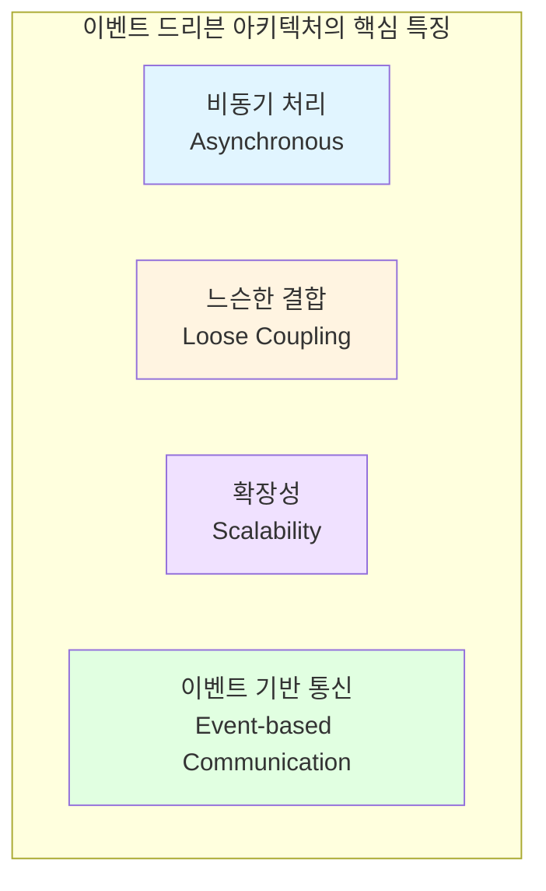

---

## 📖 정의

**이벤트 드리븐 아키텍처(Event-Driven Architecture, EDA)** 는 시스템 내에서 발생하는 이벤트를 중심으로 애플리케이션의 흐름을 제어하는 소프트웨어 설계 패턴입니다. 이벤트는 시스템 상태의 변화를 나타내며, 이벤트 생산자와 소비자 간의 느슨한 결합을 통해 높은 확장성과 유연성을 제공합니다.

### 핵심 원칙

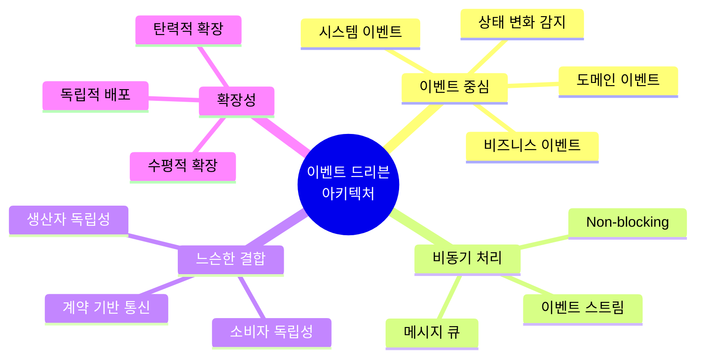

---

## 🔑 핵심 용어

### 1. **이벤트 (Event)**
시스템 내에서 발생한 중요한 상태 변화나 사건을 나타내는 불변(Immutable) 객체입니다.

**특징:**
- **불변성**: 한번 발생하면 변경되지 않음
- **과거형**: "주문이 생성됨", "결제가 완료됨" 등 과거 사실을 표현
- **도메인 의미**: 비즈니스 도메인의 중요한 사건

**구성 요소:**
```
Event {
  - Event ID (고유 식별자)
  - Event Type (이벤트 유형)
  - Timestamp (발생 시각)
  - Payload (이벤트 데이터)
  - Metadata (메타데이터)
}
```

### 2. **이벤트 프로듀서 (Event Producer)**
이벤트를 생성하고 발행하는 컴포넌트입니다.

### 3. **이벤트 컨슈머 (Event Consumer)**
이벤트를 구독하고 처리하는 컴포넌트입니다.

### 4. **이벤트 브로커 (Event Broker)**
이벤트를 프로듀서에서 컨슈머로 전달하는 중간 매개체입니다.
- 예: RabbitMQ, Apache Kafka, Redis Pub/Sub, AWS SNS/SQS

### 5. **이벤트 채널 (Event Channel)**
이벤트가 흐르는 논리적 경로입니다.
- Queue (큐): 점대점 통신
- Topic (토픽): 발행-구독 패턴

### 6. **이벤트 스트림 (Event Stream)**
연속적인 이벤트의 흐름입니다.

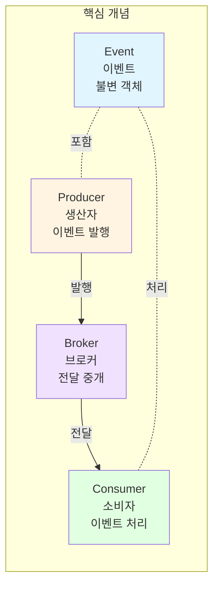

---

## 🏗️ 아키텍처 구조

### 기본 구조

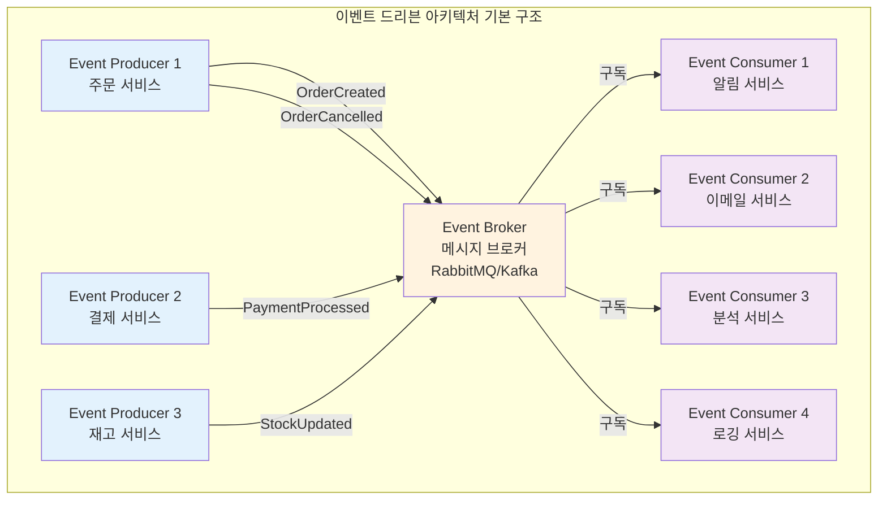

### 계층화된 이벤트 드리븐 아키텍처

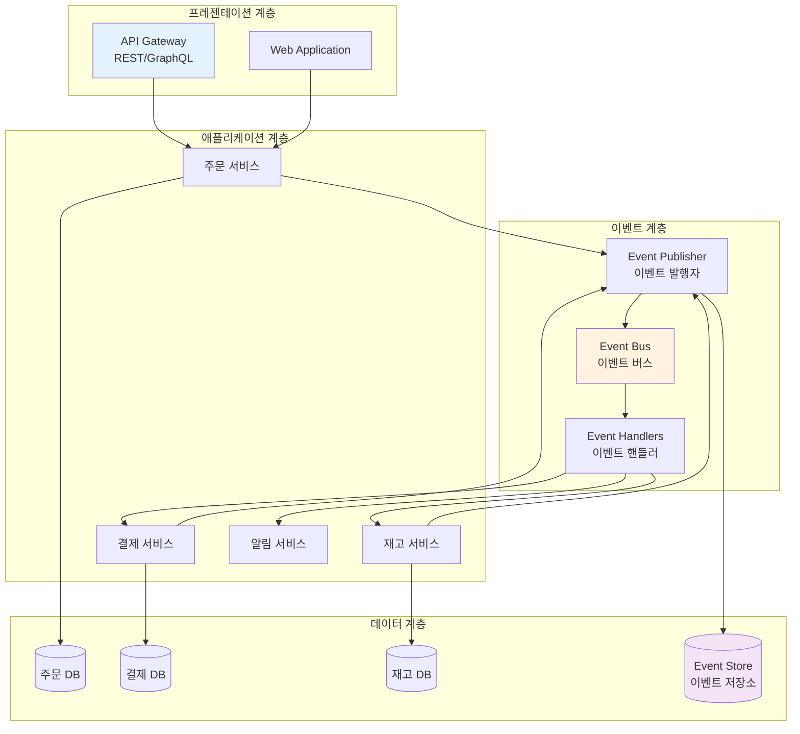

---

## 📋 주요 구성 요소

### 1. 이벤트 (Event)

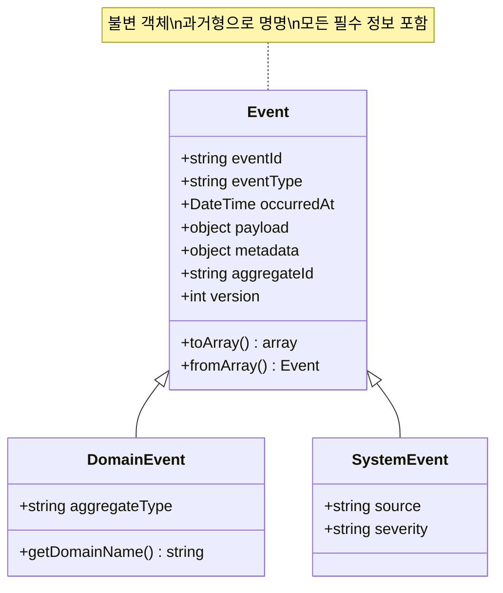

**이벤트 유형:**

1. **도메인 이벤트 (Domain Event)**
   - 비즈니스 도메인에서 발생하는 중요한 사건
   - 예: `OrderCreated`, `PaymentProcessed`, `UserRegistered`

2. **시스템 이벤트 (System Event)**
   - 시스템 레벨에서 발생하는 기술적 사건
   - 예: `ServerStarted`, `DatabaseConnected`, `CacheCleared`

3. **통합 이벤트 (Integration Event)**
   - 서비스 간 통신을 위한 이벤트
   - 외부 시스템과의 통합

### 2. 이벤트 프로듀서 (Event Producer)

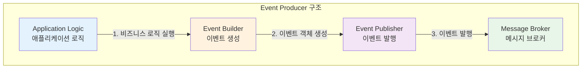

**책임:**
- 비즈니스 로직 실행 후 이벤트 생성
- 이벤트를 이벤트 브로커에 발행
- 이벤트 발행 실패 시 처리 (재시도, 로깅)

### 3. 이벤트 브로커 (Event Broker)

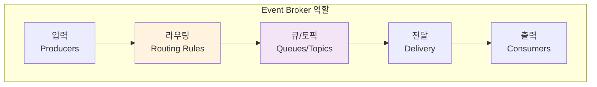

**주요 기능:**
- 이벤트 라우팅
- 메시지 큐 관리
- 전달 보장 (At-least-once, Exactly-once)
- 순서 보장 (Ordering)
- 내구성 (Durability)

**인기 있는 브로커:**
- **RabbitMQ**: AMQP 프로토콜, 유연한 라우팅
- **Apache Kafka**: 고처리량, 이벤트 스트리밍
- **Redis Pub/Sub**: 경량, 빠른 처리
- **AWS SNS/SQS**: 클라우드 네이티브
- **Azure Service Bus**: 엔터프라이즈급
- **Google Cloud Pub/Sub**: 확장 가능

### 4. 이벤트 컨슈머 (Event Consumer)

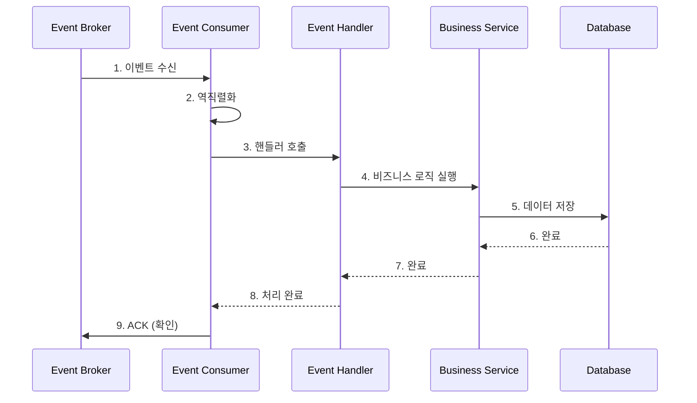

**책임:**
- 이벤트 구독
- 이벤트 역직렬화
- 핸들러에 전달
- 처리 완료 확인 (ACK)
- 에러 처리 및 재시도

---

## 🎭 이벤트 드리븐 패턴

### 1. Pub/Sub 패턴 (발행-구독)

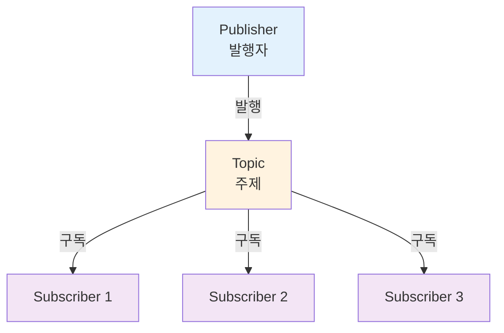

**특징:**
- 1:N 통신
- 발행자는 구독자를 모름
- 다수의 구독자가 동일한 이벤트 수신

### 2. Event Streaming 패턴

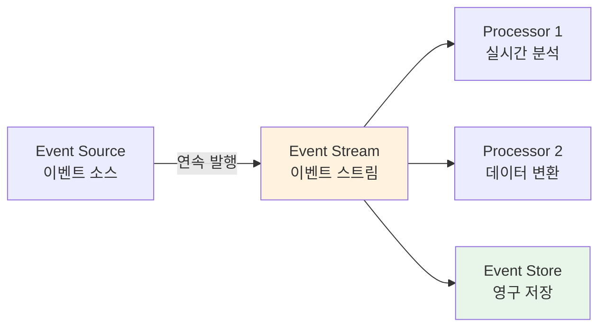

**특징:**
- 연속적인 이벤트 흐름
- 실시간 처리
- 이벤트 순서 보장
- 예: Apache Kafka Streams, AWS Kinesis

### 3. Event Sourcing 패턴

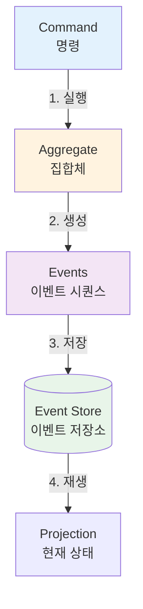

**특징:**
- 모든 상태 변화를 이벤트로 저장
- 현재 상태는 이벤트를 재생하여 복원
- 완벽한 감사 추적
- 시점 복원 가능

### 4. CQRS + Event-Driven 패턴

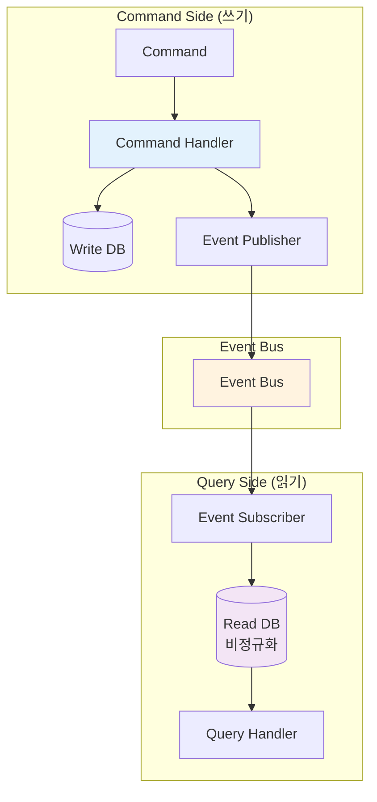

**특징:**
- 읽기와 쓰기 모델 분리
- 이벤트로 읽기 모델 동기화
- 확장성 향상
- 복잡한 쿼리 최적화

---

## 📁 폴더 구조

### PHP/Laravel 기반 이벤트 드리븐 아키텍처 폴더 구조

```
laravel-eda-project/
│
├── app/
│   │
│   ├── Events/                        # 도메인 이벤트
│   │   ├── Order/
│   │   │   ├── OrderCreated.php
│   │   │   ├── OrderCancelled.php
│   │   │   ├── OrderShipped.php
│   │   │   └── OrderCompleted.php
│   │   │
│   │   ├── Payment/
│   │   │   ├── PaymentProcessed.php
│   │   │   ├── PaymentFailed.php
│   │   │   └── RefundIssued.php
│   │   │
│   │   └── User/
│   │       ├── UserRegistered.php
│   │       ├── UserActivated.php
│   │       └── PasswordChanged.php
│   │
│   ├── Listeners/                     # 이벤트 리스너 (핸들러)
│   │   ├── Order/
│   │   │   ├── SendOrderConfirmation.php
│   │   │   ├── UpdateInventory.php
│   │   │   ├── NotifyWarehouse.php
│   │   │   └── CreateInvoice.php
│   │   │
│   │   ├── Payment/
│   │   │   ├── SendPaymentReceipt.php
│   │   │   ├── UpdateOrderStatus.php
│   │   │   └── LogPaymentEvent.php
│   │   │
│   │   └── User/
│   │       ├── SendWelcomeEmail.php
│   │       ├── CreateUserProfile.php
│   │       └── LogUserActivity.php
│   │
│   ├── Services/                      # 비즈니스 서비스
│   │   ├── OrderService.php
│   │   ├── PaymentService.php
│   │   ├── NotificationService.php
│   │   └── InventoryService.php
│   │
│   ├── EventSourcing/                 # Event Sourcing (선택적)
│   │   ├── EventStore.php
│   │   ├── Aggregates/
│   │   │   ├── OrderAggregate.php
│   │   │   └── PaymentAggregate.php
│   │   │
│   │   └── Projections/
│   │       ├── OrderProjection.php
│   │       └── UserProjection.php
│   │
│   ├── Jobs/                          # 비동기 작업 (큐)
│   │   ├── ProcessOrderJob.php
│   │   ├── SendEmailJob.php
│   │   └── GenerateReportJob.php
│   │
│   ├── Broadcasting/                  # 실시간 브로드캐스팅
│   │   ├── Channels/
│   │   └── Events/
│   │
│   ├── Providers/
│   │   ├── EventServiceProvider.php   # 이벤트 매핑
│   │   └── BroadcastServiceProvider.php
│   │
│   └── Console/
│       └── Commands/
│           ├── ConsumeEventsCommand.php
│           └── ReplayEventsCommand.php
│
├── config/
│   ├── queue.php                      # 큐 설정 (RabbitMQ, Redis 등)
│   ├── broadcasting.php               # 브로드캐스팅 설정
│   └── events.php                     # 커스텀 이벤트 설정
│
├── database/
│   ├── migrations/
│   │   ├── create_events_table.php    # 이벤트 저장 테이블
│   │   ├── create_event_streams_table.php
│   │   └── create_failed_jobs_table.php
│   │
│   └── seeders/
│
├── routes/
│   ├── web.php
│   ├── api.php
│   └── channels.php                   # 브로드캐스트 채널
│
├── tests/
│   ├── Unit/
│   │   ├── Events/
│   │   └── Listeners/
│   │
│   └── Feature/
│       ├── EventFlowTest.php
│       └── EventSourcingTest.php
│
└── docker-compose.yml                 # RabbitMQ, Redis 등
```

### 마이크로서비스 환경에서의 구조

```
microservices-eda/
│
├── services/
│   ├── order-service/
│   │   ├── src/
│   │   │   ├── Events/
│   │   │   │   └── OrderCreated.php
│   │   │   ├── Producers/
│   │   │   │   └── OrderEventProducer.php
│   │   │   └── Consumers/
│   │   │       └── PaymentEventConsumer.php
│   │   ├── Dockerfile
│   │   └── docker-compose.yml
│   │
│   ├── payment-service/
│   │   ├── src/
│   │   │   ├── Events/
│   │   │   │   └── PaymentProcessed.php
│   │   │   ├── Producers/
│   │   │   └── Consumers/
│   │   └── Dockerfile
│   │
│   ├── notification-service/
│   │   ├── src/
│   │   │   ├── Consumers/
│   │   │   │   ├── OrderEventConsumer.php
│   │   │   │   └── PaymentEventConsumer.php
│   │   │   └── Services/
│   │   │       ├── EmailService.php
│   │   │       └── SMSService.php
│   │   └── Dockerfile
│   │
│   └── analytics-service/
│       ├── src/
│       │   └── Consumers/
│       │       └── AllEventsConsumer.php
│       └── Dockerfile
│
├── shared/
│   └── events/                        # 공유 이벤트 스키마
│       ├── order-events.json
│       ├── payment-events.json
│       └── user-events.json
│
├── infrastructure/
│   ├── rabbitmq/
│   │   └── config/
│   ├── kafka/
│   │   └── config/
│   └── redis/
│       └── config/
│
└── docker-compose.yml                 # 전체 인프라
```

---

## ⚙️ 메커니즘과 동작 원리

### 1. 이벤트 라이프사이클

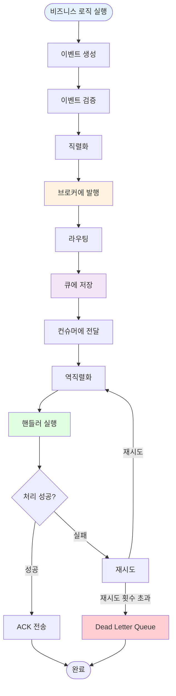

### 2. 이벤트 발행 메커니즘

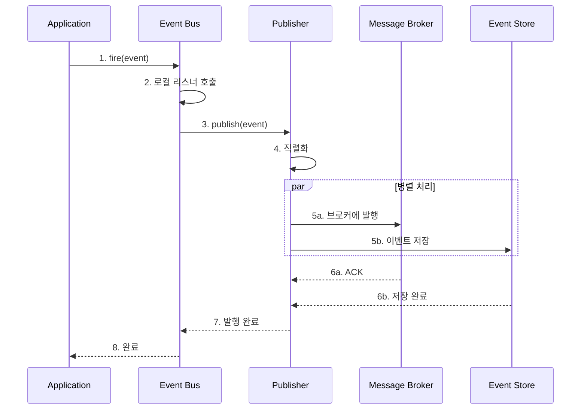

### 3. 이벤트 소비 메커니즘

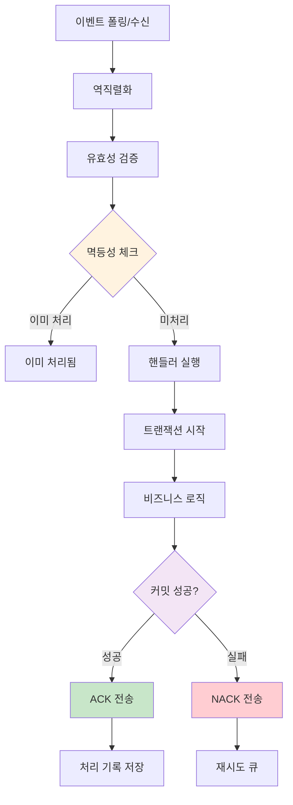

### 4. 멱등성 보장 메커니즘

멱등성(Idempotency)은 동일한 이벤트를 여러 번 처리해도 결과가 같도록 보장하는 것입니다.

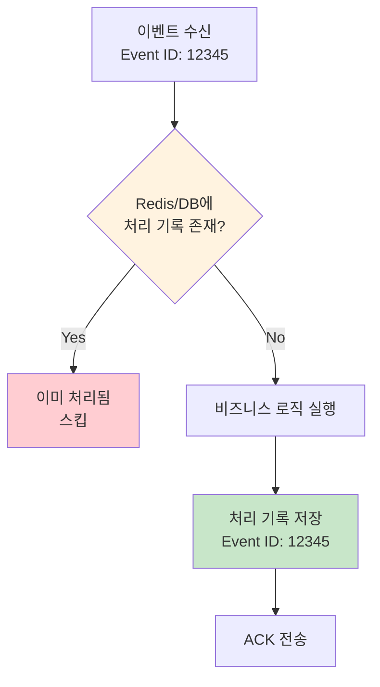

**구현 방법:**
1. **Event ID 기반**: 이벤트 ID를 저장하고 중복 확인
2. **버전 번호**: Aggregate 버전으로 중복 방지
3. **Unique Constraint**: DB 제약조건 활용
4. **분산 락**: Redis Lock 사용

---

## 🌐 통신 모델

### 1. Point-to-Point (점대점)

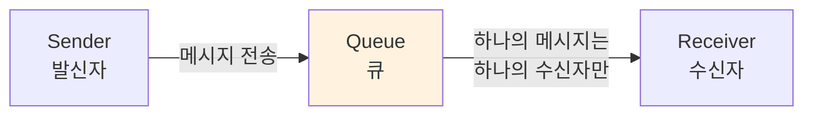

**특징:**
- 1:1 통신
- 큐의 메시지는 하나의 컨슈머만 소비
- 작업 분산에 적합

### 2. Publish-Subscribe (발행-구독)

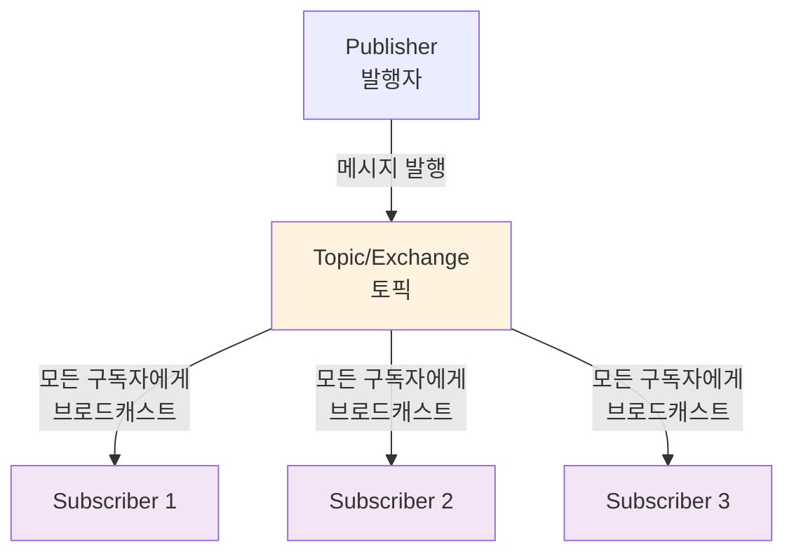

**특징:**
- 1:N 통신
- 모든 구독자가 동일한 메시지 수신
- 이벤트 브로드캐스팅에 적합

### 3. 전달 보장 수준

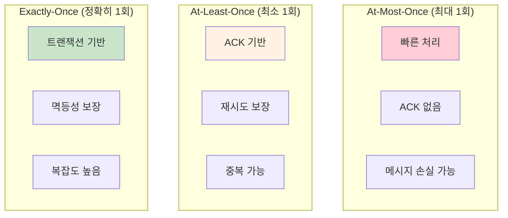

| 수준 | 장점 | 단점 | 사용 사례 |
|------|------|------|-----------|
| **At-Most-Once** | 빠름, 간단 | 메시지 손실 가능 | 로깅, 모니터링 |
| **At-Least-Once** | 손실 방지 | 중복 처리 가능 | 대부분의 비즈니스 로직 |
| **Exactly-Once** | 정확성 보장 | 복잡, 느림 | 금융 거래, 결제 |

---

## ⚖️ 장단점

### ✅ 장점

```mermaid
mindmap
  root((이벤트 드리븐<br/>아키텍처<br/>장점))
    느슨한 결합
      독립적 배포
      서비스 분리
      유연한 확장
    확장성
      수평 확장
      부하 분산
      탄력적 확장
    비동기 처리
      Non-blocking
      높은 처리량
      빠른 응답
    유연성
      새 기능 추가 용이
      서비스 교체 가능
      점진적 마이그레이션
```

1. **느슨한 결합 (Loose Coupling)**
   - 프로듀서와 컨슈머가 서로를 알 필요 없음
   - 서비스 독립적 개발 및 배포
   - 변경에 대한 영향 최소화

2. **확장성 (Scalability)**
   - 수평적 확장 용이 (컨슈머 추가)
   - 트래픽에 따라 탄력적 확장
   - 부하 분산

3. **비동기 처리 (Asynchronous)**
   - Non-blocking 작업
   - 높은 처리량
   - 빠른 응답 시간

4. **유연성 (Flexibility)**
   - 새로운 이벤트 리스너 추가 용이
   - 기존 코드 변경 없이 기능 확장
   - 서비스 교체 가능

5. **복원력 (Resilience)**
   - 일부 서비스 장애가 전체에 영향 없음
   - 재시도 메커니즘
   - 장애 격리

6. **실시간 처리**
   - 이벤트 발생 즉시 반응
   - 실시간 알림
   - 스트리밍 분석

### ⚠️ 단점

```mermaid
mindmap
  root((이벤트 드리븐<br/>아키텍처<br/>단점))
    복잡도
      디버깅 어려움
      분산 추적 필요
      학습 곡선
    일관성
      최종 일관성
      데이터 동기화
      트랜잭션 관리
    운영 부담
      인프라 복잡
      모니터링 필요
      장애 추적
    순서 보장
      이벤트 순서
      인과관계
      동시성 문제
```

1. **복잡도 증가**
   - 분산 시스템의 복잡성
   - 디버깅 어려움
   - 흐름 파악 어려움

2. **최종 일관성 (Eventual Consistency)**
   - 즉시 일관성 보장 어려움
   - 데이터 동기화 시간 지연
   - 비즈니스 로직 복잡성 증가

3. **메시지 순서 보장**
   - 이벤트 순서가 중요한 경우 처리 복잡
   - 인과관계 관리 필요

4. **모니터링과 추적**
   - 분산 추적 필요
   - 로그 집계 필요
   - 디버깅 도구 필수

5. **중복 및 멱등성**
   - 중복 메시지 처리 필요
   - 멱등성 구현 필수

6. **인프라 의존성**
   - 메시지 브로커 필요
   - 인프라 관리 부담
   - 비용 증가

### 트레이드오프

```mermaid
graph LR
    subgraph "얻는 것"
        GAIN1[확장성]
        GAIN2[유연성]
        GAIN3[느슨한 결합]
    end

    subgraph "잃는 것"
        LOSS1[즉시 일관성]
        LOSS2[단순성]
        LOSS3[추적 용이성]
    end

    GAIN1 -.trade-off.- LOSS1
    GAIN2 -.trade-off.- LOSS2
    GAIN3 -.trade-off.- LOSS3

    style GAIN1 fill:#c8e6c9
    style GAIN2 fill:#c8e6c9
    style GAIN3 fill:#c8e6c9
    style LOSS1 fill:#ffcdd2
    style LOSS2 fill:#ffcdd2
    style LOSS3 fill:#ffcdd2
```

---

## 💼 사용 사례

### ✅ 이벤트 드리븐 아키텍처가 적합한 경우

```mermaid
graph TB
    subgraph "적합한 사용 사례"
        A[마이크로서비스<br/>아키텍처]
        B[실시간 알림<br/>시스템]
        C[비동기 처리<br/>워크플로우]
        D[이벤트 소싱<br/>CQRS]
        E[IoT 및<br/>스트리밍]
    end

    style A fill:#c8e6c9
    style B fill:#c8e6c9
    style C fill:#c8e6c9
    style D fill:#c8e6c9
    style E fill:#c8e6c9
```

1. **전자상거래 플랫폼**
   - 주문 → 결제 → 재고 → 배송 → 알림
   - 각 단계가 독립적으로 처리
   - 높은 트래픽 대응

2. **실시간 알림 시스템**
   - 채팅 메시지
   - 푸시 알림
   - 이메일/SMS 발송

3. **금융 거래 시스템**
   - 거래 이벤트 추적
   - 감사 로그
   - 사기 탐지

4. **IoT 및 센서 데이터**
   - 센서 데이터 스트리밍
   - 실시간 분석
   - 이상 탐지

5. **분석 및 데이터 파이프라인**
   - 실시간 분석
   - 데이터 집계
   - 리포팅

6. **마이크로서비스 통신**
   - 서비스 간 느슨한 결합
   - 비동기 통신
   - 독립적 배포

### ❌ 부적합한 경우

```mermaid
graph TB
    subgraph "부적합한 사용 사례"
        A[단순 CRUD<br/>애플리케이션]
        B[강한 일관성<br/>필요]
        C[동기 처리<br/>필수]
        D[작은 모놀리식<br/>앱]
    end

    style A fill:#ffcdd2
    style B fill:#ffcdd2
    style C fill:#ffcdd2
    style D fill:#ffcdd2
```

1. **단순 CRUD 애플리케이션**
   - 과도한 복잡성
   - 불필요한 인프라

2. **강한 일관성이 필요한 경우**
   - 즉시 일관성 보장 어려움
   - 트랜잭션 보장 복잡

3. **동기 처리가 필수인 경우**
   - 즉시 응답 필요
   - 순서 보장 중요

4. **작은 모놀리식 애플리케이션**
   - 과도한 엔지니어링
   - 유지보수 부담

---

## 🔧 구현 예제 (PHP)

### 1. 기본 이벤트 클래스

```php
<?php

namespace App\Events;

use DateTimeImmutable;
use JsonSerializable;

abstract class Event implements JsonSerializable
{
    protected string $eventId;
    protected string $eventType;
    protected DateTimeImmutable $occurredAt;
    protected array $payload;
    protected array $metadata;

    public function __construct(array $payload, array $metadata = [])
    {
        $this->eventId = $this->generateEventId();
        $this->eventType = static::class;
        $this->occurredAt = new DateTimeImmutable();
        $this->payload = $payload;
        $this->metadata = array_merge([
            'user_id' => auth()->id() ?? null,
            'ip_address' => request()->ip() ?? null,
        ], $metadata);
    }

    protected function generateEventId(): string
    {
        return sprintf(
            '%s-%s',
            date('YmdHis'),
            bin2hex(random_bytes(8))
        );
    }

    public function getEventId(): string
    {
        return $this->eventId;
    }

    public function getEventType(): string
    {
        return $this->eventType;
    }

    public function getOccurredAt(): DateTimeImmutable
    {
        return $this->occurredAt;
    }

    public function getPayload(): array
    {
        return $this->payload;
    }

    public function getMetadata(): array
    {
        return $this->metadata;
    }

    public function jsonSerialize(): array
    {
        return [
            'event_id' => $this->eventId,
            'event_type' => $this->eventType,
            'occurred_at' => $this->occurredAt->format('c'),
            'payload' => $this->payload,
            'metadata' => $this->metadata,
        ];
    }

    public static function fromArray(array $data): static
    {
        $event = new static($data['payload'], $data['metadata'] ?? []);
        $event->eventId = $data['event_id'];
        $event->occurredAt = new DateTimeImmutable($data['occurred_at']);

        return $event;
    }
}
```

### 2. 구체적인 도메인 이벤트

```php
<?php

namespace App\Events\Order;

use App\Events\Event;

class OrderCreated extends Event
{
    public function __construct(int $orderId, int $userId, float $total, array $items)
    {
        parent::__construct([
            'order_id' => $orderId,
            'user_id' => $userId,
            'total' => $total,
            'items' => $items,
            'status' => 'created',
        ]);
    }

    public function getOrderId(): int
    {
        return $this->payload['order_id'];
    }

    public function getUserId(): int
    {
        return $this->payload['user_id'];
    }

    public function getTotal(): float
    {
        return $this->payload['total'];
    }

    public function getItems(): array
    {
        return $this->payload['items'];
    }
}

class OrderCancelled extends Event
{
    public function __construct(int $orderId, string $reason)
    {
        parent::__construct([
            'order_id' => $orderId,
            'reason' => $reason,
            'cancelled_at' => now()->toIso8601String(),
        ]);
    }
}

class OrderShipped extends Event
{
    public function __construct(
        int $orderId,
        string $trackingNumber,
        string $carrier
    ) {
        parent::__construct([
            'order_id' => $orderId,
            'tracking_number' => $trackingNumber,
            'carrier' => $carrier,
            'shipped_at' => now()->toIso8601String(),
        ]);
    }
}
```

### 3. 이벤트 발행자 (Event Publisher)

```php
<?php

namespace App\EventBus;

use App\Events\Event;
use Illuminate\Support\Facades\Log;

interface EventPublisher
{
    public function publish(Event $event): void;
}

class RabbitMQEventPublisher implements EventPublisher
{
    private $connection;
    private $channel;

    public function __construct()
    {
        $this->connection = new \PhpAmqpLib\Connection\AMQPStreamConnection(
            config('queue.connections.rabbitmq.host'),
            config('queue.connections.rabbitmq.port'),
            config('queue.connections.rabbitmq.user'),
            config('queue.connections.rabbitmq.password')
        );
        $this->channel = $this->connection->channel();
    }

    public function publish(Event $event): void
    {
        $exchange = 'events';
        $routingKey = $this->getRoutingKey($event);

        // Exchange 선언 (Topic Exchange)
        $this->channel->exchange_declare(
            $exchange,
            'topic',
            false,
            true,  // durable
            false
        );

        // 메시지 생성
        $message = new \PhpAmqpLib\Message\AMQPMessage(
            json_encode($event),
            [
                'content_type' => 'application/json',
                'delivery_mode' => 2, // persistent
                'message_id' => $event->getEventId(),
                'timestamp' => $event->getOccurredAt()->getTimestamp(),
                'type' => $event->getEventType(),
            ]
        );

        // 발행
        $this->channel->basic_publish($message, $exchange, $routingKey);

        Log::info('Event published', [
            'event_id' => $event->getEventId(),
            'event_type' => $event->getEventType(),
            'routing_key' => $routingKey,
        ]);
    }

    protected function getRoutingKey(Event $event): string
    {
        // 예: App\Events\Order\OrderCreated -> order.created
        $className = class_basename($event);
        $namespace = (new \ReflectionClass($event))->getNamespaceName();

        $domain = strtolower(class_basename($namespace));
        $action = strtolower(preg_replace('/(?<!^)[A-Z]/', '_$0', $className));

        return "{$domain}.{$action}";
    }

    public function __destruct()
    {
        $this->channel->close();
        $this->connection->close();
    }
}
```

### 4. 이벤트 소비자 (Event Consumer)

```php
<?php

namespace App\EventBus;

use App\Events\Event;
use Illuminate\Support\Facades\Log;
use PhpAmqpLib\Connection\AMQPStreamConnection;
use PhpAmqpLib\Message\AMQPMessage;

class RabbitMQEventConsumer
{
    private $connection;
    private $channel;
    private array $handlers = [];

    public function __construct()
    {
        $this->connection = new AMQPStreamConnection(
            config('queue.connections.rabbitmq.host'),
            config('queue.connections.rabbitmq.port'),
            config('queue.connections.rabbitmq.user'),
            config('queue.connections.rabbitmq.password')
        );
        $this->channel = $this->connection->channel();
    }

    public function subscribe(string $queueName, string $routingKey, callable $handler): void
    {
        $exchange = 'events';

        // Exchange 선언
        $this->channel->exchange_declare($exchange, 'topic', false, true, false);

        // Queue 선언
        $this->channel->queue_declare($queueName, false, true, false, false);

        // Binding
        $this->channel->queue_bind($queueName, $exchange, $routingKey);

        // 핸들러 등록
        $this->handlers[$queueName] = $handler;

        Log::info("Subscribed to queue", [
            'queue' => $queueName,
            'routing_key' => $routingKey,
        ]);
    }

    public function consume(string $queueName): void
    {
        $callback = function (AMQPMessage $msg) use ($queueName) {
            try {
                // 이벤트 역직렬화
                $data = json_decode($msg->body, true);
                $eventType = $data['event_type'];
                $event = $eventType::fromArray($data);

                Log::info('Event received', [
                    'event_id' => $event->getEventId(),
                    'event_type' => $event->getEventType(),
                ]);

                // 멱등성 체크
                if ($this->isAlreadyProcessed($event->getEventId())) {
                    Log::warning('Event already processed, skipping', [
                        'event_id' => $event->getEventId(),
                    ]);
                    $msg->ack();
                    return;
                }

                // 핸들러 실행
                $handler = $this->handlers[$queueName];
                $handler($event);

                // 처리 완료 기록
                $this->markAsProcessed($event->getEventId());

                // ACK
                $msg->ack();

                Log::info('Event processed successfully', [
                    'event_id' => $event->getEventId(),
                ]);
            } catch (\Exception $e) {
                Log::error('Failed to process event', [
                    'error' => $e->getMessage(),
                    'trace' => $e->getTraceAsString(),
                ]);

                // NACK with requeue
                $msg->nack(true);
            }
        };

        $this->channel->basic_qos(null, 1, null); // Prefetch 1
        $this->channel->basic_consume($queueName, '', false, false, false, false, $callback);

        while ($this->channel->is_consuming()) {
            $this->channel->wait();
        }
    }

    protected function isAlreadyProcessed(string $eventId): bool
    {
        return \Illuminate\Support\Facades\Cache::has("event_processed:{$eventId}");
    }

    protected function markAsProcessed(string $eventId): void
    {
        \Illuminate\Support\Facades\Cache::put(
            "event_processed:{$eventId}",
            true,
            now()->addDays(7)
        );
    }

    public function __destruct()
    {
        $this->channel->close();
        $this->connection->close();
    }
}
```

### 5. 이벤트 핸들러 (Laravel Listener)

```php
<?php

namespace App\Listeners\Order;

use App\Events\Order\OrderCreated;
use App\Services\NotificationService;
use App\Services\InventoryService;
use Illuminate\Support\Facades\Log;

class SendOrderConfirmation
{
    private NotificationService $notificationService;

    public function __construct(NotificationService $notificationService)
    {
        $this->notificationService = $notificationService;
    }

    public function handle(OrderCreated $event): void
    {
        Log::info('Sending order confirmation', [
            'order_id' => $event->getOrderId(),
        ]);

        $this->notificationService->sendEmail(
            $event->getUserId(),
            'Order Confirmation',
            'emails.order-confirmation',
            [
                'order_id' => $event->getOrderId(),
                'total' => $event->getTotal(),
                'items' => $event->getItems(),
            ]
        );
    }
}

class UpdateInventory
{
    private InventoryService $inventoryService;

    public function __construct(InventoryService $inventoryService)
    {
        $this->inventoryService = $inventoryService;
    }

    public function handle(OrderCreated $event): void
    {
        Log::info('Updating inventory', [
            'order_id' => $event->getOrderId(),
        ]);

        foreach ($event->getItems() as $item) {
            $this->inventoryService->decreaseStock(
                $item['product_id'],
                $item['quantity']
            );
        }
    }
}
```

### 6. Laravel EventServiceProvider 설정

```php
<?php

namespace App\Providers;

use Illuminate\Foundation\Support\Providers\EventServiceProvider as ServiceProvider;
use App\Events\Order\OrderCreated;
use App\Events\Order\OrderCancelled;
use App\Listeners\Order\SendOrderConfirmation;
use App\Listeners\Order\UpdateInventory;

class EventServiceProvider extends ServiceProvider
{
    protected $listen = [
        // 주문 이벤트
        OrderCreated::class => [
            SendOrderConfirmation::class,
            UpdateInventory::class,
        ],

        OrderCancelled::class => [
            \App\Listeners\Order\SendCancellationEmail::class,
            \App\Listeners\Order\RestoreInventory::class,
        ],

        // 결제 이벤트
        \App\Events\Payment\PaymentProcessed::class => [
            \App\Listeners\Payment\SendPaymentReceipt::class,
            \App\Listeners\Payment\UpdateOrderStatus::class,
        ],
    ];

    public function boot()
    {
        parent::boot();

        // 커스텀 이벤트 발행자 바인딩
        $this->app->singleton(
            \App\EventBus\EventPublisher::class,
            \App\EventBus\RabbitMQEventPublisher::class
        );
    }
}
```

### 7. 사용 예제

```php
<?php

namespace App\Services;

use App\Events\Order\OrderCreated;
use App\EventBus\EventPublisher;
use Illuminate\Support\Facades\DB;

class OrderService
{
    private EventPublisher $eventPublisher;

    public function __construct(EventPublisher $eventPublisher)
    {
        $this->eventPublisher = $eventPublisher;
    }

    public function createOrder(int $userId, array $items): int
    {
        return DB::transaction(function () use ($userId, $items) {
            // 1. 주문 생성
            $order = DB::table('orders')->insertGetId([
                'user_id' => $userId,
                'total' => $this->calculateTotal($items),
                'status' => 'created',
                'created_at' => now(),
            ]);

            // 2. 주문 상품 저장
            foreach ($items as $item) {
                DB::table('order_items')->insert([
                    'order_id' => $order,
                    'product_id' => $item['product_id'],
                    'quantity' => $item['quantity'],
                    'price' => $item['price'],
                ]);
            }

            // 3. 이벤트 발행
            $event = new OrderCreated(
                $order,
                $userId,
                $this->calculateTotal($items),
                $items
            );

            // 로컬 리스너 실행
            event($event);

            // 외부 브로커에 발행
            $this->eventPublisher->publish($event);

            return $order;
        });
    }

    private function calculateTotal(array $items): float
    {
        return array_reduce($items, function ($total, $item) {
            return $total + ($item['price'] * $item['quantity']);
        }, 0);
    }
}
```

### 8. Artisan 명령어로 이벤트 소비

```php
<?php

namespace App\Console\Commands;

use Illuminate\Console\Command;
use App\EventBus\RabbitMQEventConsumer;
use App\Events\Order\OrderCreated;

class ConsumeOrderEvents extends Command
{
    protected $signature = 'events:consume-orders';
    protected $description = 'Consume order events from RabbitMQ';

    public function handle()
    {
        $this->info('Starting to consume order events...');

        $consumer = new RabbitMQEventConsumer();

        // 주문 생성 이벤트 구독
        $consumer->subscribe(
            'order-notifications',
            'order.order_created',
            function (OrderCreated $event) {
                $this->info("Processing OrderCreated: {$event->getOrderId()}");
                // 핸들러 실행
                app(\App\Listeners\Order\SendOrderConfirmation::class)->handle($event);
            }
        );

        // 소비 시작
        $consumer->consume('order-notifications');
    }
}
```

---

## ⚠️ 안티패턴과 주의사항

### 1. 이벤트 체인의 과도한 깊이

```php
// ❌ 나쁜 예: 이벤트가 이벤트를 계속 발생시킴
class OrderCreatedHandler
{
    public function handle(OrderCreated $event)
    {
        // 처리...
        event(new InventoryUpdated(...));  // 이벤트 발행
    }
}

class InventoryUpdatedHandler
{
    public function handle(InventoryUpdated $event)
    {
        // 처리...
        event(new NotificationSent(...));  // 또 이벤트 발행
    }
}

// ✅ 좋은 예: 명확한 흐름
class OrderCreatedHandler
{
    public function handle(OrderCreated $event)
    {
        // 직접 처리하거나 Job 큐 사용
        UpdateInventoryJob::dispatch($event->getOrderId());
        SendNotificationJob::dispatch($event->getUserId());
    }
}
```

### 2. 동기 작업을 이벤트로 처리

```php
// ❌ 나쁜 예: 즉시 응답이 필요한 작업을 이벤트로 처리
public function login(Request $request)
{
    event(new UserLoginAttempt($request->email));
    // 이벤트가 처리될 때까지 기다려야 함 (비효율)
    return response()->json(['token' => $token]);
}

// ✅ 좋은 예: 동기 처리 후 비동기 이벤트 발행
public function login(Request $request)
{
    $token = $this->authService->login($request->email, $request->password);

    // 로그인 성공 후 비동기로 이벤트 발행
    event(new UserLoggedIn($request->email));

    return response()->json(['token' => $token]);
}
```

### 3. 이벤트에 너무 많은 데이터 포함

```php
// ❌ 나쁜 예: 불필요하게 큰 페이로드
class OrderCreated extends Event
{
    public function __construct(
        Order $order,           // 전체 Order 객체
        User $user,             // 전체 User 객체
        array $products,        // 모든 상품 정보
        array $relatedOrders    // 관련 주문들
    ) {
        // ...
    }
}

// ✅ 좋은 예: 필요한 최소한의 데이터만
class OrderCreated extends Event
{
    public function __construct(
        int $orderId,
        int $userId,
        float $total
    ) {
        parent::__construct([
            'order_id' => $orderId,
            'user_id' => $userId,
            'total' => $total,
        ]);
    }
}
```

### 4. 멱등성 무시

```php
// ❌ 나쁜 예: 멱등성 체크 없이 처리
class UpdateInventoryHandler
{
    public function handle(OrderCreated $event)
    {
        // 중복 처리 시 재고가 두 번 감소할 수 있음
        Inventory::where('product_id', $productId)
            ->decrement('stock', $quantity);
    }
}

// ✅ 좋은 예: 멱등성 보장
class UpdateInventoryHandler
{
    public function handle(OrderCreated $event)
    {
        $eventId = $event->getEventId();

        // 이미 처리된 이벤트인지 확인
        if (Cache::has("inventory_updated:{$eventId}")) {
            return; // 이미 처리됨
        }

        DB::transaction(function () use ($event, $eventId) {
            Inventory::where('product_id', $productId)
                ->decrement('stock', $quantity);

            // 처리 완료 기록
            Cache::put("inventory_updated:{$eventId}", true, now()->addDays(7));
        });
    }
}
```

### 5. 에러 처리 부족

```php
// ❌ 나쁜 예: 예외 처리 없음
class SendEmailHandler
{
    public function handle(OrderCreated $event)
    {
        Mail::to($user)->send(new OrderConfirmation($order));
        // 실패 시 예외 발생, 재시도 없음
    }
}

// ✅ 좋은 예: 적절한 에러 처리와 재시도
class SendEmailHandler
{
    public function handle(OrderCreated $event)
    {
        try {
            Mail::to($user)->send(new OrderConfirmation($order));
        } catch (MailException $e) {
            Log::error('Failed to send order confirmation', [
                'order_id' => $event->getOrderId(),
                'error' => $e->getMessage(),
            ]);

            // 재시도 큐에 추가
            SendEmailJob::dispatch($event->getOrderId())
                ->delay(now()->addMinutes(5))
                ->onQueue('retry');

            throw $e; // NACK를 위해 재발생
        }
    }
}
```

### 주의사항 체크리스트

```mermaid
graph TB
    subgraph "피해야 할 것"
        A1[❌ 이벤트 체인 과다]
        A2[❌ 동기 작업을 이벤트로]
        A3[❌ 큰 페이로드]
        A4[❌ 멱등성 무시]
        A5[❌ 에러 처리 부족]
        A6[❌ 순서 보장 없음]
    end

    subgraph "지켜야 할 것"
        B1[✅ 명확한 이벤트 흐름]
        B2[✅ 비동기에 적합한 작업]
        B3[✅ 최소한의 데이터]
        B4[✅ 멱등성 보장]
        B5[✅ 재시도 메커니즘]
        B6[✅ 모니터링과 추적]
    end

    style A1 fill:#ffcdd2
    style A2 fill:#ffcdd2
    style A3 fill:#ffcdd2
    style A4 fill:#ffcdd2
    style A5 fill:#ffcdd2
    style A6 fill:#ffcdd2

    style B1 fill:#c8e6c9
    style B2 fill:#c8e6c9
    style B3 fill:#c8e6c9
    style B4 fill:#c8e6c9
    style B5 fill:#c8e6c9
    style B6 fill:#c8e6c9
```

---

## 📚 참고 자료

### 추천 도서
- 📕 **"Enterprise Integration Patterns"** - Gregor Hohpe & Bobby Woolf
  - 메시징 패턴의 바이블
- 📗 **"Building Event-Driven Microservices"** - Adam Bellemare
  - 이벤트 드리븐 마이크로서비스 실전 가이드
- 📘 **"Domain-Driven Design"** - Eric Evans
  - 도메인 이벤트 개념
- 📙 **"Designing Data-Intensive Applications"** - Martin Kleppmann
  - 이벤트 스트리밍과 메시징 시스템

### 온라인 리소스
- 🌐 [Martin Fowler - Event-Driven Architecture](https://martinfowler.com/articles/201701-event-driven.html)
- 🌐 [AWS - Event-Driven Architecture](https://aws.amazon.com/event-driven-architecture/)
- 🌐 [Microsoft - Event-driven architecture style](https://learn.microsoft.com/en-us/azure/architecture/guide/architecture-styles/event-driven)
- 🌐 [Apache Kafka Documentation](https://kafka.apache.org/documentation/)
- 🌐 [RabbitMQ Tutorials](https://www.rabbitmq.com/getstarted.html)

### 도구 및 프레임워크
- **Message Brokers**
  - [RabbitMQ](https://www.rabbitmq.com/) - AMQP 메시지 브로커
  - [Apache Kafka](https://kafka.apache.org/) - 분산 이벤트 스트리밍
  - [Redis Pub/Sub](https://redis.io/topics/pubsub) - 경량 메시징
  - [AWS SNS/SQS](https://aws.amazon.com/messaging/) - 클라우드 메시징

- **PHP/Laravel 라이브러리**
  - [Laravel Events](https://laravel.com/docs/events) - 내장 이벤트 시스템
  - [Laravel Queue](https://laravel.com/docs/queues) - 큐 시스템
  - [Broadway](https://github.com/broadway/broadway) - Event Sourcing & CQRS
  - [Ecotone](https://docs.ecotone.tech/) - DDD & Messaging

---

## 📊 요약

```mermaid
mindmap
  root((이벤트 드리븐<br/>아키텍처<br/>핵심 요약))
    구성 요소
      Event
        도메인 이벤트
        시스템 이벤트
        통합 이벤트
      Producer
        이벤트 생성
        발행
      Broker
        라우팅
        큐 관리
        전달 보장
      Consumer
        구독
        처리
        ACK
    패턴
      Pub/Sub
      Event Streaming
      Event Sourcing
      CQRS
    장점
      느슨한 결합
      확장성
      비동기 처리
      유연성
    고려사항
      멱등성
      순서 보장
      에러 처리
      모니터링
```

이벤트 드리븐 아키텍처는 **확장 가능하고 유연한 시스템**을 구축하는 데 강력한 패턴입니다. 특히 마이크로서비스 환경, 실시간 처리, 비동기 워크플로우에 적합합니다.

하지만 **최종 일관성, 복잡도 증가, 디버깅 어려움** 등의 트레이드오프가 있으므로, 프로젝트의 요구사항과 팀의 역량을 고려하여 신중하게 적용해야 합니다.

---

**다음 단계:**
- [PHP/Laravel 구현 예제](./php/README.md)
- [Event Sourcing 패턴 상세](./event-sourcing.md)
- [CQRS + Event-Driven](./cqrs-event-driven.md)

---

**마지막 업데이트**: 2025-12-18
