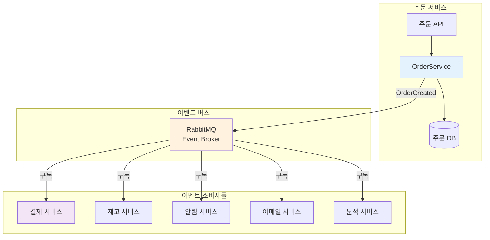

# 이벤트 드리븐 아키텍처 - PHP/Laravel 구현 예제

> Laravel 프레임워크를 사용한 이벤트 드리븐 아키텍처 실전 구현 가이드

---

## 📑 목차

1. [Laravel 이벤트 시스템 개요](#laravel-이벤트-시스템-개요)
2. [기본 구현](#기본-구현)
3. [RabbitMQ 통합](#rabbitmq-통합)
4. [실전 예제: 전자상거래 시스템](#실전-예제-전자상거래-시스템)
5. [테스트 전략](#테스트-전략)
6. [모니터링과 디버깅](#모니터링과-디버깅)

---

## Laravel 이벤트 시스템 개요

Laravel은 강력한 이벤트 시스템을 내장하고 있습니다:

```mermaid
graph TB
    subgraph "Laravel Event System"
        FACADE[Event Facade]
        DISPATCHER[Event Dispatcher]
        LISTENERS[Listeners]
        QUEUE[Queue System]
    end

    APP[Application Code] -->|event()| FACADE
    FACADE --> DISPATCHER
    DISPATCHER -->|동기| LISTENERS
    DISPATCHER -->|비동기| QUEUE
    QUEUE --> LISTENERS

    style FACADE fill:#e3f2fd
    style DISPATCHER fill:#fff3e0
    style LISTENERS fill:#f3e5f5
```

---

## 기본 구현

### 1. 프로젝트 설정

```bash
# Laravel 프로젝트 생성
composer create-project laravel/laravel event-driven-app

cd event-driven-app

# RabbitMQ 라이브러리 설치
composer require php-amqplib/php-amqplib

# Redis 큐 드라이버 (선택사항)
composer require predis/predis
```

### 2. 환경 설정

```bash
# .env
QUEUE_CONNECTION=rabbitmq

# RabbitMQ 설정
RABBITMQ_HOST=127.0.0.1
RABBITMQ_PORT=5672
RABBITMQ_USER=guest
RABBITMQ_PASSWORD=guest
RABBITMQ_VHOST=/
```

### 3. RabbitMQ 큐 설정

```php
// config/queue.php
'connections' => [
    'rabbitmq' => [
        'driver' => 'rabbitmq',
        'host' => env('RABBITMQ_HOST', '127.0.0.1'),
        'port' => env('RABBITMQ_PORT', 5672),
        'user' => env('RABBITMQ_USER', 'guest'),
        'password' => env('RABBITMQ_PASSWORD', 'guest'),
        'vhost' => env('RABBITMQ_VHOST', '/'),
        'queue' => env('RABBITMQ_QUEUE', 'default'),
        'options' => [
            'exchange' => [
                'name' => 'events',
                'type' => 'topic',
                'durable' => true,
            ],
        ],
    ],
],
```

---

## RabbitMQ 통합

### 1. 이벤트 브로커 인터페이스

```php
<?php

namespace App\EventBus;

use App\Events\DomainEvent;

interface EventBroker
{
    public function publish(DomainEvent $event): void;
    public function subscribe(string $eventType, callable $handler): void;
}
```

### 2. RabbitMQ 브로커 구현

```php
<?php

namespace App\EventBus;

use App\Events\DomainEvent;
use PhpAmqpLib\Connection\AMQPStreamConnection;
use PhpAmqpLib\Message\AMQPMessage;
use Illuminate\Support\Facades\Log;

class RabbitMQBroker implements EventBroker
{
    private AMQPStreamConnection $connection;
    private $channel;
    private string $exchange = 'events';

    public function __construct()
    {
        $this->connection = new AMQPStreamConnection(
            config('queue.connections.rabbitmq.host'),
            config('queue.connections.rabbitmq.port'),
            config('queue.connections.rabbitmq.user'),
            config('queue.connections.rabbitmq.password'),
            config('queue.connections.rabbitmq.vhost')
        );

        $this->channel = $this->connection->channel();

        // Exchange 선언
        $this->channel->exchange_declare(
            $this->exchange,
            'topic',      // Topic exchange for routing
            false,
            true,         // durable
            false
        );
    }

    public function publish(DomainEvent $event): void
    {
        $routingKey = $this->getRoutingKey($event);
        $messageBody = json_encode($event->toArray());

        $message = new AMQPMessage($messageBody, [
            'content_type' => 'application/json',
            'delivery_mode' => AMQPMessage::DELIVERY_MODE_PERSISTENT,
            'message_id' => $event->getEventId(),
            'timestamp' => $event->getOccurredAt()->getTimestamp(),
            'type' => get_class($event),
            'app_id' => config('app.name'),
        ]);

        $this->channel->basic_publish(
            $message,
            $this->exchange,
            $routingKey
        );

        Log::info('Event published to RabbitMQ', [
            'event_id' => $event->getEventId(),
            'event_type' => get_class($event),
            'routing_key' => $routingKey,
        ]);
    }

    public function subscribe(string $eventType, callable $handler): void
    {
        // Subscriber는 별도의 Consumer 프로세스에서 처리
        // 이 메서드는 설정 등록용으로 사용
    }

    protected function getRoutingKey(DomainEvent $event): string
    {
        $reflection = new \ReflectionClass($event);
        $namespace = $reflection->getNamespaceName();
        $className = $reflection->getShortName();

        // App\Events\Order\OrderCreated -> order.order_created
        $domain = strtolower(basename(str_replace('\\', '/', $namespace)));
        $action = strtolower(preg_replace('/(?<!^)[A-Z]/', '_$0', $className));

        return "{$domain}.{$action}";
    }

    public function __destruct()
    {
        $this->channel->close();
        $this->connection->close();
    }
}
```

### 3. 이벤트 컨슈머

```php
<?php

namespace App\EventBus;

use PhpAmqpLib\Connection\AMQPStreamConnection;
use PhpAmqpLib\Message\AMQPMessage;
use Illuminate\Support\Facades\Log;
use Illuminate\Support\Facades\Cache;

class RabbitMQConsumer
{
    private AMQPStreamConnection $connection;
    private $channel;
    private string $exchange = 'events';
    private array $handlers = [];

    public function __construct()
    {
        $this->connection = new AMQPStreamConnection(
            config('queue.connections.rabbitmq.host'),
            config('queue.connections.rabbitmq.port'),
            config('queue.connections.rabbitmq.user'),
            config('queue.connections.rabbitmq.password'),
            config('queue.connections.rabbitmq.vhost')
        );

        $this->channel = $this->connection->channel();

        $this->channel->exchange_declare(
            $this->exchange,
            'topic',
            false,
            true,
            false
        );
    }

    public function subscribe(
        string $queueName,
        array $routingKeys,
        callable $handler
    ): void {
        // Queue 선언
        $this->channel->queue_declare(
            $queueName,
            false,
            true,  // durable
            false,
            false,
            false,
            [
                'x-dead-letter-exchange' => ['S', 'dlx'],
                'x-message-ttl' => ['I', 86400000], // 24시간
            ]
        );

        // Routing keys 바인딩
        foreach ($routingKeys as $routingKey) {
            $this->channel->queue_bind($queueName, $this->exchange, $routingKey);
        }

        $this->handlers[$queueName] = $handler;

        Log::info("Subscribed to queue", [
            'queue' => $queueName,
            'routing_keys' => $routingKeys,
        ]);
    }

    public function consume(string $queueName): void
    {
        $callback = function (AMQPMessage $msg) use ($queueName) {
            try {
                $eventData = json_decode($msg->body, true);
                $eventType = $msg->get('type');
                $eventId = $msg->get('message_id');

                Log::info('Event received', [
                    'event_id' => $eventId,
                    'event_type' => $eventType,
                    'routing_key' => $msg->getRoutingKey(),
                ]);

                // 멱등성 체크
                $cacheKey = "event_processed:{$eventId}";
                if (Cache::has($cacheKey)) {
                    Log::warning('Event already processed', [
                        'event_id' => $eventId,
                    ]);
                    $msg->ack();
                    return;
                }

                // 이벤트 객체 복원
                $event = $eventType::fromArray($eventData);

                // 핸들러 실행
                $handler = $this->handlers[$queueName];
                $handler($event, $msg);

                // 처리 완료 기록 (7일간 유지)
                Cache::put($cacheKey, true, now()->addDays(7));

                // ACK
                $msg->ack();

                Log::info('Event processed successfully', [
                    'event_id' => $eventId,
                ]);

            } catch (\Exception $e) {
                Log::error('Failed to process event', [
                    'event_id' => $msg->get('message_id') ?? 'unknown',
                    'error' => $e->getMessage(),
                    'trace' => $e->getTraceAsString(),
                ]);

                // NACK with requeue
                $msg->nack(true);
            }
        };

        // Prefetch: 한 번에 하나씩 처리
        $this->channel->basic_qos(null, 1, null);

        $this->channel->basic_consume(
            $queueName,
            '',
            false,  // no_local
            false,  // no_ack
            false,  // exclusive
            false,  // nowait
            $callback
        );

        Log::info("Waiting for messages in queue: {$queueName}");

        while ($this->channel->is_consuming()) {
            $this->channel->wait();
        }
    }

    public function __destruct()
    {
        $this->channel->close();
        $this->connection->close();
    }
}
```

---

## 실전 예제: 전자상거래 시스템

### 시스템 아키텍처



### 1. 도메인 이벤트 정의

```php
<?php

namespace App\Events;

use DateTimeImmutable;
use Illuminate\Broadcasting\InteractsWithSockets;
use Illuminate\Foundation\Events\Dispatchable;
use Illuminate\Queue\SerializesModels;

abstract class DomainEvent
{
    use Dispatchable, InteractsWithSockets, SerializesModels;

    protected string $eventId;
    protected DateTimeImmutable $occurredAt;
    protected array $payload;
    protected array $metadata;

    public function __construct(array $payload, array $metadata = [])
    {
        $this->eventId = $this->generateEventId();
        $this->occurredAt = new DateTimeImmutable();
        $this->payload = $payload;
        $this->metadata = array_merge([
            'user_id' => auth()->id(),
            'ip_address' => request()->ip(),
            'user_agent' => request()->userAgent(),
        ], $metadata);
    }

    protected function generateEventId(): string
    {
        return sprintf(
            '%s-%s-%s',
            date('YmdHis'),
            getmypid(),
            bin2hex(random_bytes(8))
        );
    }

    public function getEventId(): string
    {
        return $this->eventId;
    }

    public function getOccurredAt(): DateTimeImmutable
    {
        return $this->occurredAt;
    }

    public function getPayload(): array
    {
        return $this->payload;
    }

    public function getMetadata(): array
    {
        return $this->metadata;
    }

    public function toArray(): array
    {
        return [
            'event_id' => $this->eventId,
            'event_type' => static::class,
            'occurred_at' => $this->occurredAt->format('c'),
            'payload' => $this->payload,
            'metadata' => $this->metadata,
        ];
    }

    public static function fromArray(array $data): static
    {
        $event = new static($data['payload'], $data['metadata'] ?? []);
        $event->eventId = $data['event_id'];
        $event->occurredAt = new DateTimeImmutable($data['occurred_at']);

        return $event;
    }
}
```

### 2. 주문 이벤트들

```php
<?php

namespace App\Events\Order;

use App\Events\DomainEvent;

class OrderCreated extends DomainEvent
{
    public function __construct(
        int $orderId,
        int $userId,
        float $totalAmount,
        array $items
    ) {
        parent::__construct([
            'order_id' => $orderId,
            'user_id' => $userId,
            'total_amount' => $totalAmount,
            'items' => $items,
            'status' => 'created',
        ]);
    }

    public function getOrderId(): int
    {
        return $this->payload['order_id'];
    }

    public function getUserId(): int
    {
        return $this->payload['user_id'];
    }

    public function getTotalAmount(): float
    {
        return $this->payload['total_amount'];
    }

    public function getItems(): array
    {
        return $this->payload['items'];
    }
}

class OrderPaid extends DomainEvent
{
    public function __construct(
        int $orderId,
        string $paymentMethod,
        float $amount,
        string $transactionId
    ) {
        parent::__construct([
            'order_id' => $orderId,
            'payment_method' => $paymentMethod,
            'amount' => $amount,
            'transaction_id' => $transactionId,
            'paid_at' => now()->toIso8601String(),
        ]);
    }
}

class OrderShipped extends DomainEvent
{
    public function __construct(
        int $orderId,
        string $trackingNumber,
        string $carrier,
        string $estimatedDelivery
    ) {
        parent::__construct([
            'order_id' => $orderId,
            'tracking_number' => $trackingNumber,
            'carrier' => $carrier,
            'estimated_delivery' => $estimatedDelivery,
            'shipped_at' => now()->toIso8601String(),
        ]);
    }
}

class OrderCompleted extends DomainEvent
{
    public function __construct(int $orderId)
    {
        parent::__construct([
            'order_id' => $orderId,
            'completed_at' => now()->toIso8601String(),
        ]);
    }
}

class OrderCancelled extends DomainEvent
{
    public function __construct(int $orderId, string $reason)
    {
        parent::__construct([
            'order_id' => $orderId,
            'reason' => $reason,
            'cancelled_at' => now()->toIso8601String(),
        ]);
    }
}
```

### 3. OrderService 구현

```php
<?php

namespace App\Services;

use App\Models\Order;
use App\Models\OrderItem;
use App\Events\Order\OrderCreated;
use App\Events\Order\OrderCancelled;
use App\EventBus\EventBroker;
use Illuminate\Support\Facades\DB;
use Illuminate\Support\Facades\Log;

class OrderService
{
    public function __construct(
        private EventBroker $eventBroker
    ) {}

    public function createOrder(int $userId, array $items): Order
    {
        return DB::transaction(function () use ($userId, $items) {
            // 1. 주문 생성
            $totalAmount = $this->calculateTotal($items);

            $order = Order::create([
                'user_id' => $userId,
                'total_amount' => $totalAmount,
                'status' => 'created',
            ]);

            // 2. 주문 항목 생성
            foreach ($items as $item) {
                OrderItem::create([
                    'order_id' => $order->id,
                    'product_id' => $item['product_id'],
                    'quantity' => $item['quantity'],
                    'price' => $item['price'],
                    'subtotal' => $item['price'] * $item['quantity'],
                ]);
            }

            // 3. 이벤트 발행
            $event = new OrderCreated(
                $order->id,
                $userId,
                $totalAmount,
                $items
            );

            // 로컬 리스너 실행
            event($event);

            // 외부 브로커로 발행
            $this->eventBroker->publish($event);

            Log::info('Order created', [
                'order_id' => $order->id,
                'event_id' => $event->getEventId(),
            ]);

            return $order;
        });
    }

    public function cancelOrder(int $orderId, string $reason): void
    {
        DB::transaction(function () use ($orderId, $reason) {
            $order = Order::findOrFail($orderId);

            if (!in_array($order->status, ['created', 'paid'])) {
                throw new \Exception("Order cannot be cancelled");
            }

            $order->update(['status' => 'cancelled']);

            $event = new OrderCancelled($orderId, $reason);

            event($event);
            $this->eventBroker->publish($event);

            Log::info('Order cancelled', [
                'order_id' => $orderId,
                'reason' => $reason,
            ]);
        });
    }

    private function calculateTotal(array $items): float
    {
        return array_reduce($items, function ($total, $item) {
            return $total + ($item['price'] * $item['quantity']);
        }, 0);
    }
}
```

### 4. 이벤트 리스너들

```php
<?php

namespace App\Listeners\Order;

use App\Events\Order\OrderCreated;
use App\Services\InventoryService;
use Illuminate\Support\Facades\Log;

class UpdateInventory
{
    public function __construct(
        private InventoryService $inventoryService
    ) {}

    public function handle(OrderCreated $event): void
    {
        Log::info('Updating inventory for order', [
            'order_id' => $event->getOrderId(),
        ]);

        try {
            foreach ($event->getItems() as $item) {
                $this->inventoryService->reserveStock(
                    $item['product_id'],
                    $item['quantity']
                );
            }

            Log::info('Inventory updated successfully', [
                'order_id' => $event->getOrderId(),
            ]);
        } catch (\Exception $e) {
            Log::error('Failed to update inventory', [
                'order_id' => $event->getOrderId(),
                'error' => $e->getMessage(),
            ]);

            throw $e;
        }
    }
}

class SendOrderConfirmation
{
    public function __construct(
        private NotificationService $notificationService
    ) {}

    public function handle(OrderCreated $event): void
    {
        Log::info('Sending order confirmation', [
            'order_id' => $event->getOrderId(),
        ]);

        $this->notificationService->sendOrderConfirmation(
            $event->getUserId(),
            $event->getOrderId(),
            $event->getTotalAmount(),
            $event->getItems()
        );
    }
}

class ProcessPayment
{
    public function __construct(
        private PaymentService $paymentService
    ) {}

    public function handle(OrderCreated $event): void
    {
        Log::info('Processing payment for order', [
            'order_id' => $event->getOrderId(),
        ]);

        // 비동기로 결제 처리
        ProcessPaymentJob::dispatch(
            $event->getOrderId(),
            $event->getTotalAmount()
        )->delay(now()->addSeconds(5));
    }
}
```

### 5. EventServiceProvider 설정

```php
<?php

namespace App\Providers;

use Illuminate\Foundation\Support\Providers\EventServiceProvider as ServiceProvider;
use App\Events\Order\OrderCreated;
use App\Events\Order\OrderPaid;
use App\Events\Order\OrderShipped;
use App\Events\Order\OrderCancelled;

class EventServiceProvider extends ServiceProvider
{
    protected $listen = [
        OrderCreated::class => [
            \App\Listeners\Order\SendOrderConfirmation::class,
            \App\Listeners\Order\UpdateInventory::class,
            \App\Listeners\Order\ProcessPayment::class,
            \App\Listeners\Order\LogOrderCreated::class,
        ],

        OrderPaid::class => [
            \App\Listeners\Order\SendPaymentReceipt::class,
            \App\Listeners\Order\UpdateOrderStatus::class,
        ],

        OrderShipped::class => [
            \App\Listeners\Order\SendShippingNotification::class,
            \App\Listeners\Order\UpdateTrackingInfo::class,
        ],

        OrderCancelled::class => [
            \App\Listeners\Order\SendCancellationEmail::class,
            \App\Listeners\Order\RefundPayment::class,
            \App\Listeners\Order\RestoreInventory::class,
        ],
    ];

    public function boot()
    {
        parent::boot();

        // EventBroker 바인딩
        $this->app->singleton(
            \App\EventBus\EventBroker::class,
            \App\EventBus\RabbitMQBroker::class
        );
    }
}
```

### 6. Artisan 명령어 - 이벤트 소비자

```php
<?php

namespace App\Console\Commands;

use Illuminate\Console\Command;
use App\EventBus\RabbitMQConsumer;
use App\Events\Order\OrderCreated;

class ConsumeOrderEventsCommand extends Command
{
    protected $signature = 'events:consume-orders
                            {--queue=order-events : Queue name to consume from}';

    protected $description = 'Consume order events from RabbitMQ';

    public function handle()
    {
        $queueName = $this->option('queue');

        $this->info("Starting to consume events from queue: {$queueName}");

        $consumer = app(RabbitMQConsumer::class);

        // 주문 관련 이벤트 구독
        $consumer->subscribe(
            $queueName,
            [
                'order.order_created',
                'order.order_cancelled',
                'order.order_paid',
                'order.order_shipped',
            ],
            function ($event, $msg) {
                $this->info("Processing: " . get_class($event));

                // 이벤트 타입에 따라 핸들러 실행
                match (get_class($event)) {
                    OrderCreated::class => $this->handleOrderCreated($event),
                    default => $this->info("Unknown event type"),
                };
            }
        );

        // 소비 시작
        $consumer->consume($queueName);
    }

    private function handleOrderCreated(OrderCreated $event): void
    {
        // 로컬 리스너 실행
        event($event);

        $this->info("Order {$event->getOrderId()} processed");
    }
}
```

### 7. Docker Compose 설정

```yaml
# docker-compose.yml
version: '3.8'

services:
  app:
    build:
      context: .
      dockerfile: Dockerfile
    ports:
      - "8000:8000"
    volumes:
      - .:/var/www/html
    environment:
      - DB_HOST=mysql
      - REDIS_HOST=redis
      - RABBITMQ_HOST=rabbitmq
    depends_on:
      - mysql
      - redis
      - rabbitmq

  mysql:
    image: mysql:8.0
    environment:
      MYSQL_ROOT_PASSWORD: secret
      MYSQL_DATABASE: laravel
    ports:
      - "3306:3306"
    volumes:
      - mysql_data:/var/lib/mysql

  redis:
    image: redis:7-alpine
    ports:
      - "6379:6379"

  rabbitmq:
    image: rabbitmq:3-management-alpine
    ports:
      - "5672:5672"
      - "15672:15672"  # Management UI
    environment:
      RABBITMQ_DEFAULT_USER: guest
      RABBITMQ_DEFAULT_PASS: guest
    volumes:
      - rabbitmq_data:/var/lib/rabbitmq

  # 이벤트 컨슈머
  order-consumer:
    build:
      context: .
      dockerfile: Dockerfile
    command: php artisan events:consume-orders --queue=order-events
    volumes:
      - .:/var/www/html
    depends_on:
      - rabbitmq
      - mysql
      - redis

volumes:
  mysql_data:
  rabbitmq_data:
```

---

## 테스트 전략

### 1. 단위 테스트 - 이벤트

```php
<?php

namespace Tests\Unit\Events;

use Tests\TestCase;
use App\Events\Order\OrderCreated;

class OrderCreatedTest extends TestCase
{
    public function test_event_creation()
    {
        $event = new OrderCreated(
            orderId: 1,
            userId: 100,
            totalAmount: 150.00,
            items: [
                ['product_id' => 1, 'quantity' => 2, 'price' => 50.00],
                ['product_id' => 2, 'quantity' => 1, 'price' => 50.00],
            ]
        );

        $this->assertEquals(1, $event->getOrderId());
        $this->assertEquals(100, $event->getUserId());
        $this->assertEquals(150.00, $event->getTotalAmount());
        $this->assertCount(2, $event->getItems());
        $this->assertNotNull($event->getEventId());
    }

    public function test_event_serialization()
    {
        $event = new OrderCreated(1, 100, 150.00, []);
        $array = $event->toArray();

        $this->assertArrayHasKey('event_id', $array);
        $this->assertArrayHasKey('event_type', $array);
        $this->assertArrayHasKey('occurred_at', $array);
        $this->assertArrayHasKey('payload', $array);
        $this->assertArrayHasKey('metadata', $array);
    }

    public function test_event_deserialization()
    {
        $original = new OrderCreated(1, 100, 150.00, []);
        $array = $original->toArray();

        $restored = OrderCreated::fromArray($array);

        $this->assertEquals($original->getEventId(), $restored->getEventId());
        $this->assertEquals($original->getOrderId(), $restored->getOrderId());
    }
}
```

### 2. 통합 테스트 - 이벤트 발행

```php
<?php

namespace Tests\Feature;

use Tests\TestCase;
use App\Services\OrderService;
use App\Events\Order\OrderCreated;
use App\EventBus\EventBroker;
use Illuminate\Foundation\Testing\RefreshDatabase;
use Illuminate\Support\Facades\Event;
use Mockery;

class OrderServiceTest extends TestCase
{
    use RefreshDatabase;

    public function test_create_order_publishes_event()
    {
        Event::fake();

        $brokerMock = Mockery::mock(EventBroker::class);
        $brokerMock->shouldReceive('publish')
            ->once()
            ->with(Mockery::type(OrderCreated::class));

        $this->app->instance(EventBroker::class, $brokerMock);

        $orderService = app(OrderService::class);

        $order = $orderService->createOrder(1, [
            ['product_id' => 1, 'quantity' => 2, 'price' => 50.00],
        ]);

        $this->assertDatabaseHas('orders', [
            'id' => $order->id,
            'user_id' => 1,
        ]);

        Event::assertDispatched(OrderCreated::class);
    }
}
```

### 3. 리스너 테스트

```php
<?php

namespace Tests\Unit\Listeners;

use Tests\TestCase;
use App\Events\Order\OrderCreated;
use App\Listeners\Order\UpdateInventory;
use App\Services\InventoryService;
use Mockery;

class UpdateInventoryTest extends TestCase
{
    public function test_updates_inventory_for_each_item()
    {
        $inventoryServiceMock = Mockery::mock(InventoryService::class);

        $inventoryServiceMock->shouldReceive('reserveStock')
            ->once()
            ->with(1, 2);

        $inventoryServiceMock->shouldReceive('reserveStock')
            ->once()
            ->with(2, 1);

        $listener = new UpdateInventory($inventoryServiceMock);

        $event = new OrderCreated(
            1,
            100,
            150.00,
            [
                ['product_id' => 1, 'quantity' => 2, 'price' => 50.00],
                ['product_id' => 2, 'quantity' => 1, 'price' => 50.00],
            ]
        );

        $listener->handle($event);
    }
}
```

---

## 모니터링과 디버깅

### 1. 이벤트 로깅

```php
<?php

namespace App\Listeners;

use App\Events\DomainEvent;
use Illuminate\Support\Facades\Log;

class LogAllEvents
{
    public function handle(DomainEvent $event): void
    {
        Log::channel('events')->info('Domain event occurred', [
            'event_id' => $event->getEventId(),
            'event_type' => get_class($event),
            'occurred_at' => $event->getOccurredAt()->format('c'),
            'payload' => $event->getPayload(),
            'metadata' => $event->getMetadata(),
        ]);
    }
}
```

### 2. 이벤트 저장소 (Event Store)

```php
<?php

namespace App\Services;

use App\Events\DomainEvent;
use App\Models\StoredEvent;

class EventStoreService
{
    public function store(DomainEvent $event): void
    {
        StoredEvent::create([
            'event_id' => $event->getEventId(),
            'event_type' => get_class($event),
            'occurred_at' => $event->getOccurredAt(),
            'payload' => json_encode($event->getPayload()),
            'metadata' => json_encode($event->getMetadata()),
        ]);
    }

    public function replay(string $eventId): void
    {
        $stored = StoredEvent::where('event_id', $eventId)->firstOrFail();

        $eventClass = $stored->event_type;
        $event = $eventClass::fromArray([
            'event_id' => $stored->event_id,
            'event_type' => $stored->event_type,
            'occurred_at' => $stored->occurred_at->format('c'),
            'payload' => json_decode($stored->payload, true),
            'metadata' => json_decode($stored->metadata, true),
        ]);

        event($event);
    }
}
```

### 3. 모니터링 대시보드

```php
<?php

namespace App\Http\Controllers;

use App\Models\StoredEvent;
use Illuminate\Http\Request;

class EventMonitoringController extends Controller
{
    public function index(Request $request)
    {
        $events = StoredEvent::query()
            ->when($request->event_type, function ($query, $type) {
                $query->where('event_type', $type);
            })
            ->latest('occurred_at')
            ->paginate(50);

        return view('monitoring.events', compact('events'));
    }

    public function show(string $eventId)
    {
        $event = StoredEvent::where('event_id', $eventId)->firstOrFail();

        return view('monitoring.event-detail', compact('event'));
    }

    public function statistics()
    {
        $stats = [
            'total_events' => StoredEvent::count(),
            'events_by_type' => StoredEvent::groupBy('event_type')
                ->selectRaw('event_type, count(*) as count')
                ->get(),
            'recent_events' => StoredEvent::latest('occurred_at')
                ->take(10)
                ->get(),
        ];

        return view('monitoring.statistics', compact('stats'));
    }
}
```

---

**다음 단계:**
- [Event Sourcing 구현](../event-sourcing.md)
- [CQRS 패턴 통합](../cqrs.md)
- [Saga 패턴으로 분산 트랜잭션](../saga.md)

---

**마지막 업데이트**: 2025-12-18
