# 계층형 아키텍처 (Layered Architecture)

> 소프트웨어를 수평적 계층으로 분리하여 관심사를 분리하고 유지보수성을 향상시키는 아키텍처 패턴

---

## 📑 목차

1. [개요](#-개요)
2. [정의](#-정의)
3. [핵심 용어](#-핵심-용어)
4. [계층 구조](#-계층-구조)
5. [각 계층의 역할과 책임](#-각-계층의-역할과-책임)
6. [폴더 구조 (PHP)](#-폴더-구조-php)
7. [계층 간 통신 규칙](#-계층-간-통신-규칙)
8. [의존성 규칙](#-의존성-규칙)
9. [데이터 흐름](#-데이터-흐름)
10. [장단점](#-장단점)
11. [사용 사례](#-사용-사례)
12. [PHP에서의 구현 전략](#-php에서의-구현-전략)
13. [안티패턴과 주의사항](#-안티패턴과-주의사항)
14. [참고 자료](#-참고-자료)

---

## 🎯 개요

계층형 아키텍처는 가장 일반적이고 전통적인 소프트웨어 아키텍처 패턴 중 하나입니다. 애플리케이션을 수평적인 계층으로 나누어 각 계층이 특정한 역할과 책임을 갖도록 구성합니다.

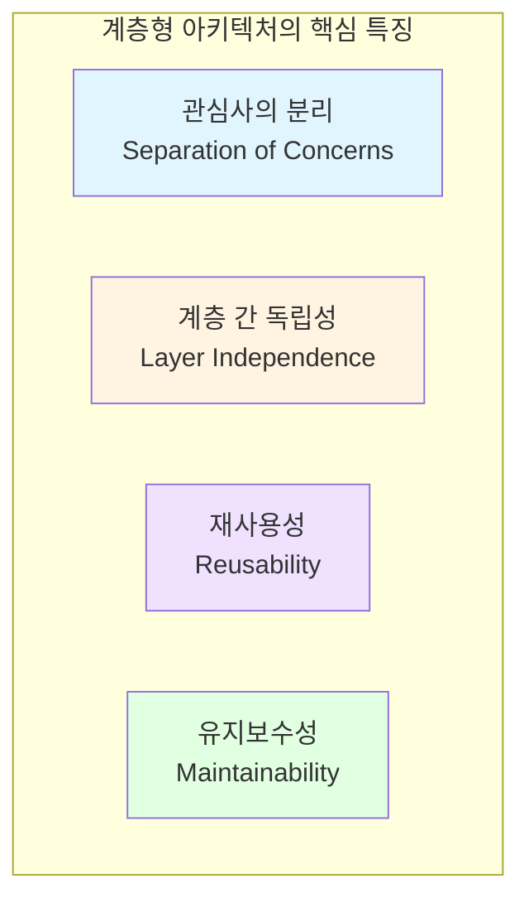
```mermaid
graph TB
    subgraph "계층형 아키텍처의 핵심 특징"
        A[관심사의 분리<br/>Separation of Concerns]
        B[계층 간 독립성<br/>Layer Independence]
        C[재사용성<br/>Reusability]
        D[유지보수성<br/>Maintainability]
    end

    style A fill:#e1f5ff
    style B fill:#fff4e1
    style C fill:#f0e1ff
    style D fill:#e1ffe1
```

---

## 📖 정의

**계층형 아키텍처(Layered Architecture)** 또는 **N-Tier Architecture**는 소프트웨어 시스템을 여러 개의 수평적 계층으로 구성하는 아키텍처 패턴입니다. 각 계층은 특정한 역할과 책임을 가지며, 상위 계층은 하위 계층에만 의존합니다.

### 핵심 원칙

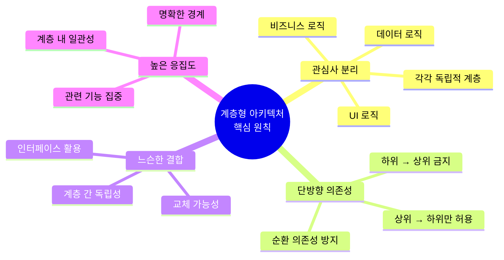
```mermaid
mindmap
  root((계층형 아키텍처<br/>핵심 원칙))
    관심사 분리
      UI 로직
      비즈니스 로직
      데이터 로직
      각각 독립적 계층
    단방향 의존성
      상위 → 하위만 허용
      하위 → 상위 금지
      순환 의존성 방지
    느슨한 결합
      인터페이스 활용
      계층 간 독립성
      교체 가능성
    높은 응집도
      관련 기능 집중
      계층 내 일관성
      명확한 경계
```

---

## 🔑 핵심 용어

### 1. **계층 (Layer)**
특정한 역할과 책임을 가진 논리적인 구분 단위입니다. 각 계층은 독립적으로 개발, 테스트, 유지보수될 수 있습니다.

### 2. **티어 (Tier)**
물리적인 배포 단위를 의미합니다. 하나의 티어는 여러 계층을 포함할 수 있습니다.

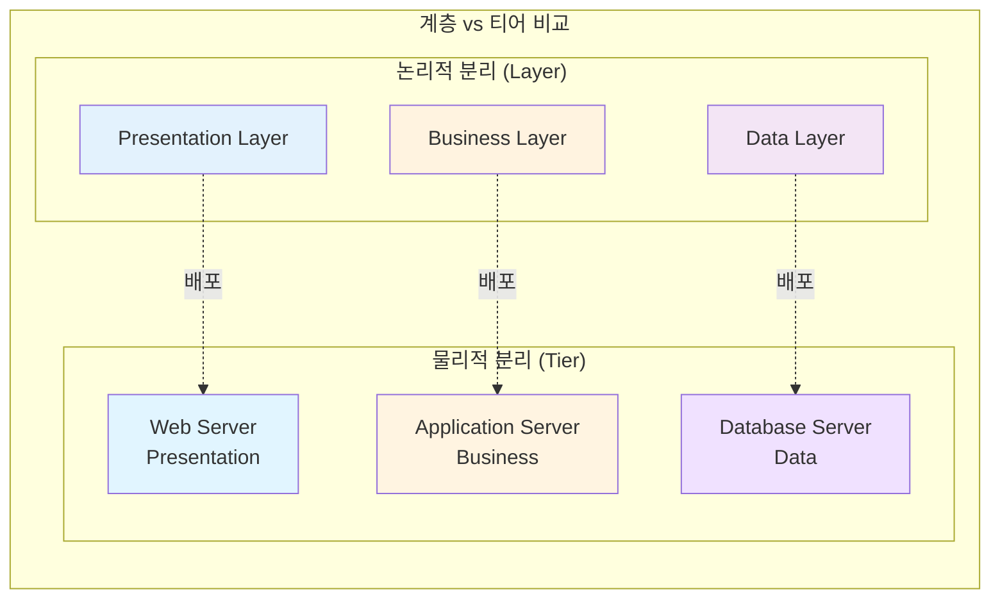
```mermaid
graph LR
    subgraph "계층 vs 티어 비교"
        subgraph "논리적 분리 (Layer)"
            L1[Presentation Layer]
            L2[Business Layer]
            L3[Data Layer]
        end

        subgraph "물리적 분리 (Tier)"
            T1[Web Server<br/>Presentation]
            T2[Application Server<br/>Business]
            T3[Database Server<br/>Data]
        end
    end

    L1 -.->|배포| T1
    L2 -.->|배포| T2
    L3 -.->|배포| T3

    style L1 fill:#e3f2fd
    style L2 fill:#fff3e0
    style L3 fill:#f3e5f5
    style T1 fill:#e1f5ff
    style T2 fill:#fff4e1
    style T3 fill:#f0e1ff
```

### 3. **관심사의 분리 (Separation of Concerns)**
각 계층이 서로 다른 관심사를 처리하도록 분리하는 원칙입니다.

### 4. **폐쇄 계층 (Closed Layer)**
요청이 반드시 거쳐야 하는 계층입니다. 건너뛸 수 없습니다.

### 5. **개방 계층 (Open Layer)**
요청이 건너뛸 수 있는 선택적 계층입니다.

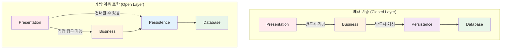
```mermaid
graph TD
    subgraph "폐쇄 계층 (Closed Layer)"
        C1[Presentation] -->|반드시 거침| C2[Business]
        C2 -->|반드시 거침| C3[Persistence]
        C3 --> C4[Database]
    end

    subgraph "개방 계층 포함 (Open Layer)"
        O1[Presentation] -->|직접 접근 가능| O2[Business]
        O1 -.->|건너뛸 수 있음| O3[Persistence]
        O2 --> O3
        O3 --> O4[Database]
    end

    style C1 fill:#ffebee
    style C2 fill:#fff3e0
    style C3 fill:#f3e5f5
    style C4 fill:#e8f5e9
    style O1 fill:#ffebee
    style O2 fill:#fff3e0
    style O3 fill:#e3f2fd
    style O4 fill:#e8f5e9
```

---

## 🏗️ 계층 구조

### 전통적인 3계층 구조

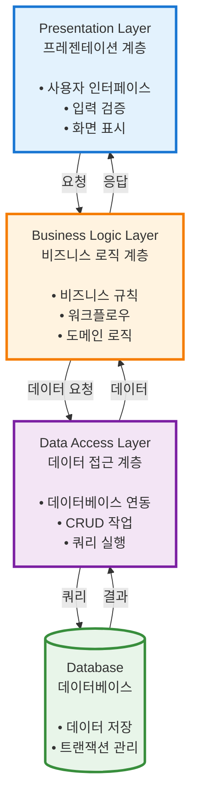
```mermaid
graph TD
    UI[Presentation Layer<br/>프레젠테이션 계층<br/><br/>• 사용자 인터페이스<br/>• 입력 검증<br/>• 화면 표시]

    BL[Business Logic Layer<br/>비즈니스 로직 계층<br/><br/>• 비즈니스 규칙<br/>• 워크플로우<br/>• 도메인 로직]

    DA[Data Access Layer<br/>데이터 접근 계층<br/><br/>• 데이터베이스 연동<br/>• CRUD 작업<br/>• 쿼리 실행]

    DB[(Database<br/>데이터베이스<br/><br/>• 데이터 저장<br/>• 트랜잭션 관리)]

    UI -->|요청| BL
    BL -->|데이터 요청| DA
    DA -->|쿼리| DB
    DB -->|결과| DA
    DA -->|데이터| BL
    BL -->|응답| UI

    style UI fill:#e3f2fd,stroke:#1976d2,stroke-width:3px
    style BL fill:#fff3e0,stroke:#f57c00,stroke-width:3px
    style DA fill:#f3e5f5,stroke:#7b1fa2,stroke-width:3px
    style DB fill:#e8f5e9,stroke:#388e3c,stroke-width:3px
```

### 확장된 4계층 구조

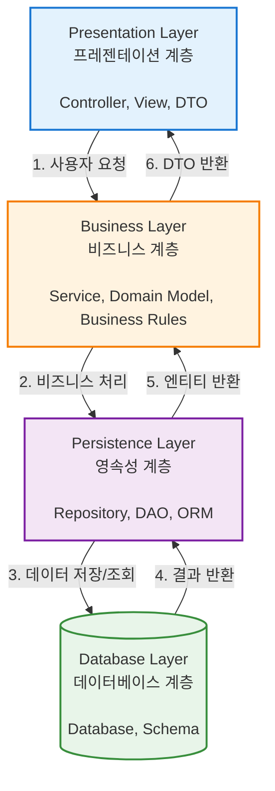
```mermaid
graph TD
    PL[Presentation Layer<br/>프레젠테이션 계층<br/><br/>Controller, View, DTO]

    BL[Business Layer<br/>비즈니스 계층<br/><br/>Service, Domain Model, Business Rules]

    PER[Persistence Layer<br/>영속성 계층<br/><br/>Repository, DAO, ORM]

    DB[(Database Layer<br/>데이터베이스 계층<br/><br/>Database, Schema)]

    PL -->|1. 사용자 요청| BL
    BL -->|2. 비즈니스 처리| PER
    PER -->|3. 데이터 저장/조회| DB
    DB -->|4. 결과 반환| PER
    PER -->|5. 엔티티 반환| BL
    BL -->|6. DTO 반환| PL

    style PL fill:#e3f2fd,stroke:#1976d2,stroke-width:2px
    style BL fill:#fff3e0,stroke:#f57c00,stroke-width:2px
    style PER fill:#f3e5f5,stroke:#7b1fa2,stroke-width:2px
    style DB fill:#e8f5e9,stroke:#388e3c,stroke-width:2px
```

### 더 세밀한 계층 구조

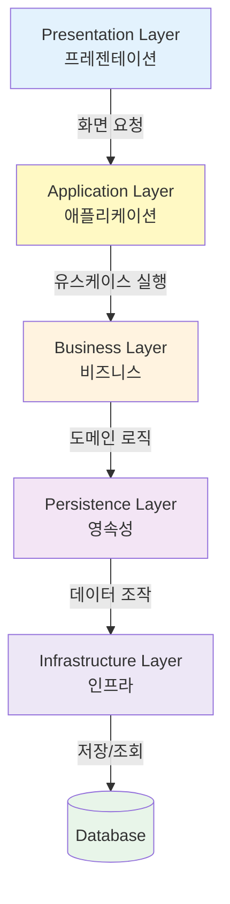
```mermaid
graph TD
    UI[Presentation Layer<br/>프레젠테이션]
    APP[Application Layer<br/>애플리케이션]
    BIZ[Business Layer<br/>비즈니스]
    PERS[Persistence Layer<br/>영속성]
    INFRA[Infrastructure Layer<br/>인프라]
    DB[(Database)]

    UI -->|화면 요청| APP
    APP -->|유스케이스 실행| BIZ
    BIZ -->|도메인 로직| PERS
    PERS -->|데이터 조작| INFRA
    INFRA -->|저장/조회| DB

    style UI fill:#e3f2fd
    style APP fill:#fff9c4
    style BIZ fill:#fff3e0
    style PERS fill:#f3e5f5
    style INFRA fill:#ede7f6
    style DB fill:#e8f5e9
```

---

## 📋 각 계층의 역할과 책임

### 1. Presentation Layer (프레젠테이션 계층)

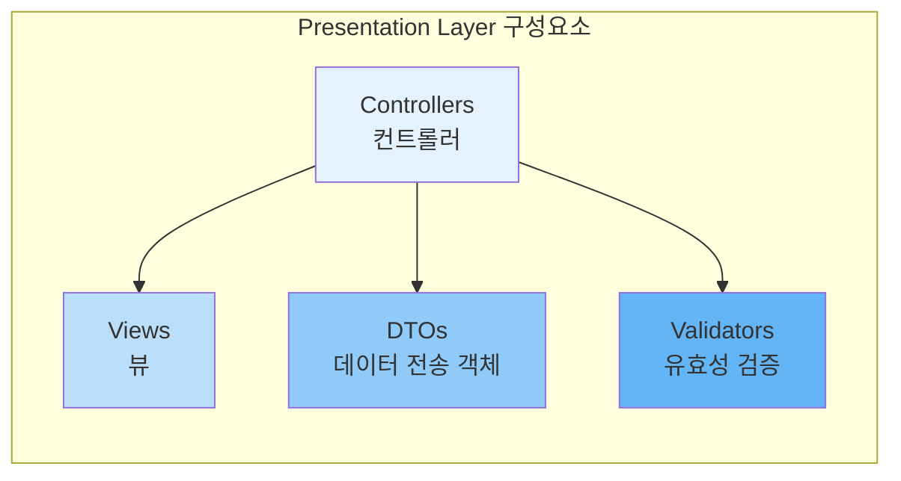
```mermaid
graph LR
    subgraph "Presentation Layer 구성요소"
        CTRL[Controllers<br/>컨트롤러]
        VIEW[Views<br/>뷰]
        DTO[DTOs<br/>데이터 전송 객체]
        VAL[Validators<br/>유효성 검증]
    end

    CTRL --> VIEW
    CTRL --> DTO
    CTRL --> VAL

    style CTRL fill:#e3f2fd
    style VIEW fill:#bbdefb
    style DTO fill:#90caf9
    style VAL fill:#64b5f6
```

**주요 책임:**
- 사용자 입력 수신 및 검증
- 사용자에게 정보 표시
- 사용자 인터랙션 처리
- HTTP 요청/응답 처리
- 세션 관리
- 라우팅

**포함 요소:**
- Controllers
- Views (Templates)
- View Models / DTOs
- Input Validators
- Formatters (JSON, XML, HTML)

**금지 사항:**
- ❌ 비즈니스 로직 포함
- ❌ 데이터베이스 직접 접근
- ❌ 복잡한 계산 수행

---

### 2. Business Layer (비즈니스 계층)

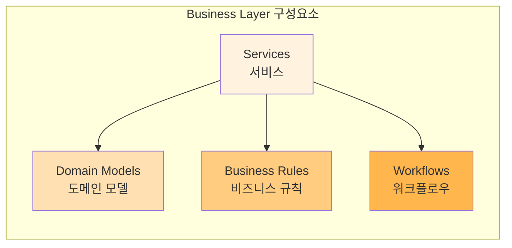
```mermaid
graph LR
    subgraph "Business Layer 구성요소"
        SVC[Services<br/>서비스]
        DM[Domain Models<br/>도메인 모델]
        BR[Business Rules<br/>비즈니스 규칙]
        WF[Workflows<br/>워크플로우]
    end

    SVC --> DM
    SVC --> BR
    SVC --> WF

    style SVC fill:#fff3e0
    style DM fill:#ffe0b2
    style BR fill:#ffcc80
    style WF fill:#ffb74d
```

**주요 책임:**
- 비즈니스 규칙 구현
- 트랜잭션 관리
- 워크플로우 조정
- 도메인 로직 처리
- 계산 및 변환
- 권한 확인

**포함 요소:**
- Service Classes
- Domain Entities
- Business Rules
- Value Objects
- Domain Events
- Use Cases

**금지 사항:**
- ❌ HTTP 요청/응답 직접 처리
- ❌ SQL 쿼리 직접 작성
- ❌ UI 관련 로직

---

### 3. Persistence Layer (영속성 계층)

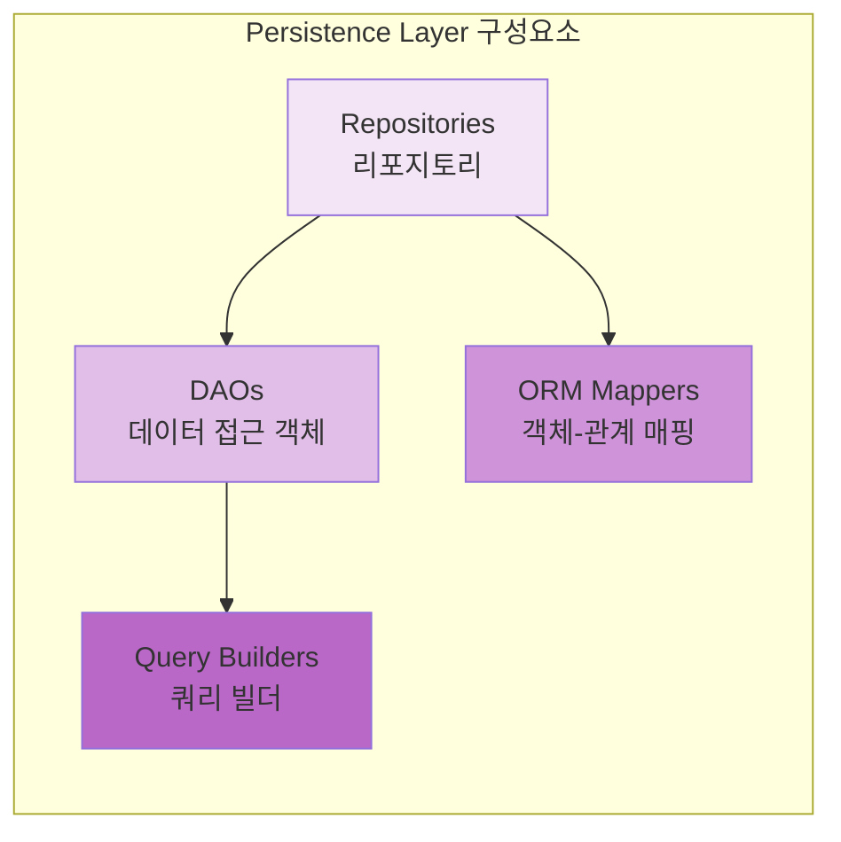
```mermaid
graph LR
    subgraph "Persistence Layer 구성요소"
        REPO[Repositories<br/>리포지토리]
        DAO[DAOs<br/>데이터 접근 객체]
        ORM[ORM Mappers<br/>객체-관계 매핑]
        QB[Query Builders<br/>쿼리 빌더]
    end

    REPO --> DAO
    REPO --> ORM
    DAO --> QB

    style REPO fill:#f3e5f5
    style DAO fill:#e1bee7
    style ORM fill:#ce93d8
    style QB fill:#ba68c8
```

**주요 책임:**
- 데이터베이스 CRUD 작업
- 쿼리 실행 및 최적화
- 트랜잭션 처리
- 데이터 매핑 (객체 ↔ 테이블)
- 캐싱 전략
- 연결 관리

**포함 요소:**
- Repository Interfaces & Implementations
- Data Access Objects (DAO)
- ORM Configurations
- Query Builders
- Database Migrations

**금지 사항:**
- ❌ 비즈니스 로직 포함
- ❌ 화면 표시 로직
- ❌ 복잡한 비즈니스 규칙

---

### 4. Database Layer (데이터베이스 계층)

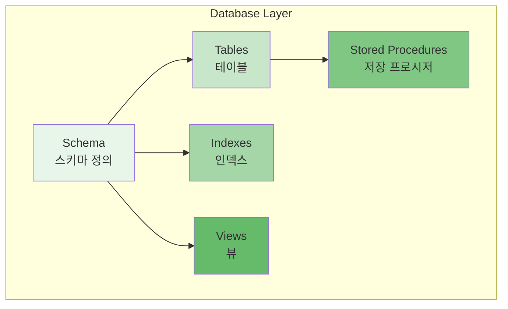
```mermaid
graph TB
    subgraph "Database Layer"
        SCHEMA[Schema<br/>스키마 정의]
        TABLES[Tables<br/>테이블]
        INDEXES[Indexes<br/>인덱스]
        PROCS[Stored Procedures<br/>저장 프로시저]
        VIEWS[Views<br/>뷰]
    end

    SCHEMA --> TABLES
    SCHEMA --> INDEXES
    SCHEMA --> VIEWS
    TABLES --> PROCS

    style SCHEMA fill:#e8f5e9
    style TABLES fill:#c8e6c9
    style INDEXES fill:#a5d6a7
    style PROCS fill:#81c784
    style VIEWS fill:#66bb6a
```

**주요 책임:**
- 데이터 물리적 저장
- 데이터 무결성 보장
- 인덱싱 및 최적화
- 백업 및 복구
- 트랜잭션 ACID 속성 보장

---

## 📁 폴더 구조 (PHP)

### 기본 3계층 구조

```
project-root/
├── public/                          # 웹 루트 (Document Root)
│   ├── index.php                   # 진입점 (Front Controller)
│   ├── assets/                     # 정적 파일
│   │   ├── css/
│   │   ├── js/
│   │   └── images/
│   └── .htaccess                   # Apache 설정
│
├── src/                            # 소스 코드
│   ├── Presentation/               # 프레젠테이션 계층
│   │   ├── Controllers/           # 컨트롤러
│   │   │   ├── UserController.php
│   │   │   ├── ProductController.php
│   │   │   └── OrderController.php
│   │   │
│   │   ├── Views/                 # 뷰 템플릿
│   │   │   ├── users/
│   │   │   │   ├── list.php
│   │   │   │   ├── detail.php
│   │   │   │   └── form.php
│   │   │   ├── products/
│   │   │   └── layouts/
│   │   │       ├── header.php
│   │   │       └── footer.php
│   │   │
│   │   ├── DTOs/                  # 데이터 전송 객체
│   │   │   ├── UserDTO.php
│   │   │   ├── ProductDTO.php
│   │   │   └── OrderDTO.php
│   │   │
│   │   └── Validators/            # 입력 검증
│   │       ├── UserValidator.php
│   │       └── OrderValidator.php
│   │
│   ├── Business/                   # 비즈니스 계층
│   │   ├── Services/              # 서비스 클래스
│   │   │   ├── UserService.php
│   │   │   ├── ProductService.php
│   │   │   └── OrderService.php
│   │   │
│   │   ├── Models/                # 도메인 모델
│   │   │   ├── User.php
│   │   │   ├── Product.php
│   │   │   └── Order.php
│   │   │
│   │   ├── Rules/                 # 비즈니스 규칙
│   │   │   ├── PricingRule.php
│   │   │   └── DiscountRule.php
│   │   │
│   │   └── Exceptions/            # 비즈니스 예외
│   │       ├── InvalidOrderException.php
│   │       └── InsufficientStockException.php
│   │
│   └── Persistence/                # 영속성 계층
│       ├── Repositories/          # 리포지토리
│       │   ├── UserRepository.php
│       │   ├── ProductRepository.php
│       │   └── OrderRepository.php
│       │
│       ├── Entities/              # 데이터베이스 엔티티
│       │   ├── UserEntity.php
│       │   ├── ProductEntity.php
│       │   └── OrderEntity.php
│       │
│       └── Migrations/            # 데이터베이스 마이그레이션
│           ├── 001_create_users_table.php
│           ├── 002_create_products_table.php
│           └── 003_create_orders_table.php
│
├── config/                         # 설정 파일
│   ├── database.php               # 데이터베이스 설정
│   ├── routes.php                 # 라우팅 설정
│   └── app.php                    # 애플리케이션 설정
│
├── tests/                          # 테스트
│   ├── Unit/                      # 단위 테스트
│   │   ├── Services/
│   │   └── Repositories/
│   │
│   └── Integration/               # 통합 테스트
│       └── Controllers/
│
├── vendor/                         # Composer 의존성
├── composer.json                   # Composer 설정
└── .env                           # 환경 변수
```

### 계층별 폴더 매핑

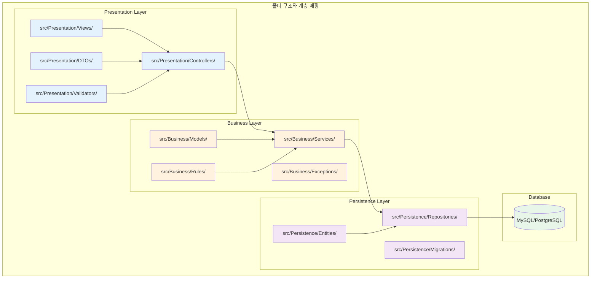
```mermaid
graph TB
    subgraph "폴더 구조와 계층 매핑"
        subgraph "Presentation Layer"
            P1[src/Presentation/Controllers/]
            P2[src/Presentation/Views/]
            P3[src/Presentation/DTOs/]
            P4[src/Presentation/Validators/]
        end

        subgraph "Business Layer"
            B1[src/Business/Services/]
            B2[src/Business/Models/]
            B3[src/Business/Rules/]
            B4[src/Business/Exceptions/]
        end

        subgraph "Persistence Layer"
            D1[src/Persistence/Repositories/]
            D2[src/Persistence/Entities/]
            D3[src/Persistence/Migrations/]
        end

        subgraph "Database"
            DB[(MySQL/PostgreSQL)]
        end
    end

    P1 --> B1
    P2 --> P1
    P3 --> P1
    P4 --> P1

    B1 --> D1
    B2 --> B1
    B3 --> B1

    D1 --> DB
    D2 --> D1

    style P1 fill:#e3f2fd
    style P2 fill:#e3f2fd
    style P3 fill:#e3f2fd
    style P4 fill:#e3f2fd
    style B1 fill:#fff3e0
    style B2 fill:#fff3e0
    style B3 fill:#fff3e0
    style B4 fill:#fff3e0
    style D1 fill:#f3e5f5
    style D2 fill:#f3e5f5
    style D3 fill:#f3e5f5
    style DB fill:#e8f5e9
```

---

## 🔄 계층 간 통신 규칙

### 허용되는 통신 방향

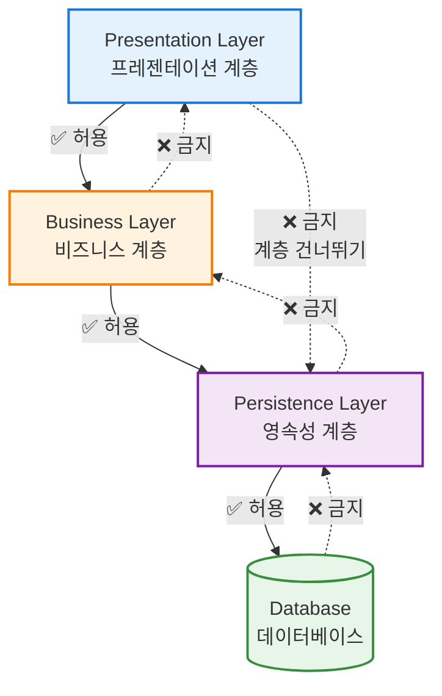
```mermaid
graph TD
    P[Presentation Layer<br/>프레젠테이션 계층]
    B[Business Layer<br/>비즈니스 계층]
    D[Persistence Layer<br/>영속성 계층]
    DB[(Database<br/>데이터베이스)]

    P -->|✅ 허용| B
    B -->|✅ 허용| D
    D -->|✅ 허용| DB

    B -.->|❌ 금지| P
    D -.->|❌ 금지| B
    DB -.->|❌ 금지| D

    P -.->|❌ 금지<br/>계층 건너뛰기| D

    style P fill:#e3f2fd,stroke:#1976d2,stroke-width:2px
    style B fill:#fff3e0,stroke:#f57c00,stroke-width:2px
    style D fill:#f3e5f5,stroke:#7b1fa2,stroke-width:2px
    style DB fill:#e8f5e9,stroke:#388e3c,stroke-width:2px
```

### 통신 시나리오

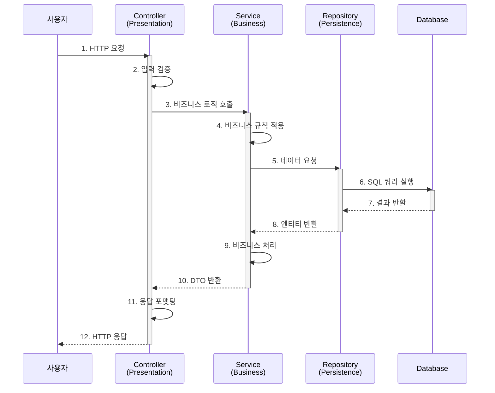
```mermaid
sequenceDiagram
    participant User as 사용자
    participant Controller as Controller<br/>(Presentation)
    participant Service as Service<br/>(Business)
    participant Repository as Repository<br/>(Persistence)
    participant DB as Database

    User->>Controller: 1. HTTP 요청
    activate Controller

    Controller->>Controller: 2. 입력 검증
    Controller->>Service: 3. 비즈니스 로직 호출
    activate Service

    Service->>Service: 4. 비즈니스 규칙 적용
    Service->>Repository: 5. 데이터 요청
    activate Repository

    Repository->>DB: 6. SQL 쿼리 실행
    activate DB
    DB-->>Repository: 7. 결과 반환
    deactivate DB

    Repository-->>Service: 8. 엔티티 반환
    deactivate Repository

    Service->>Service: 9. 비즈니스 처리
    Service-->>Controller: 10. DTO 반환
    deactivate Service

    Controller->>Controller: 11. 응답 포맷팅
    Controller-->>User: 12. HTTP 응답
    deactivate Controller
```

---

## 🎯 의존성 규칙

### 의존성 방향

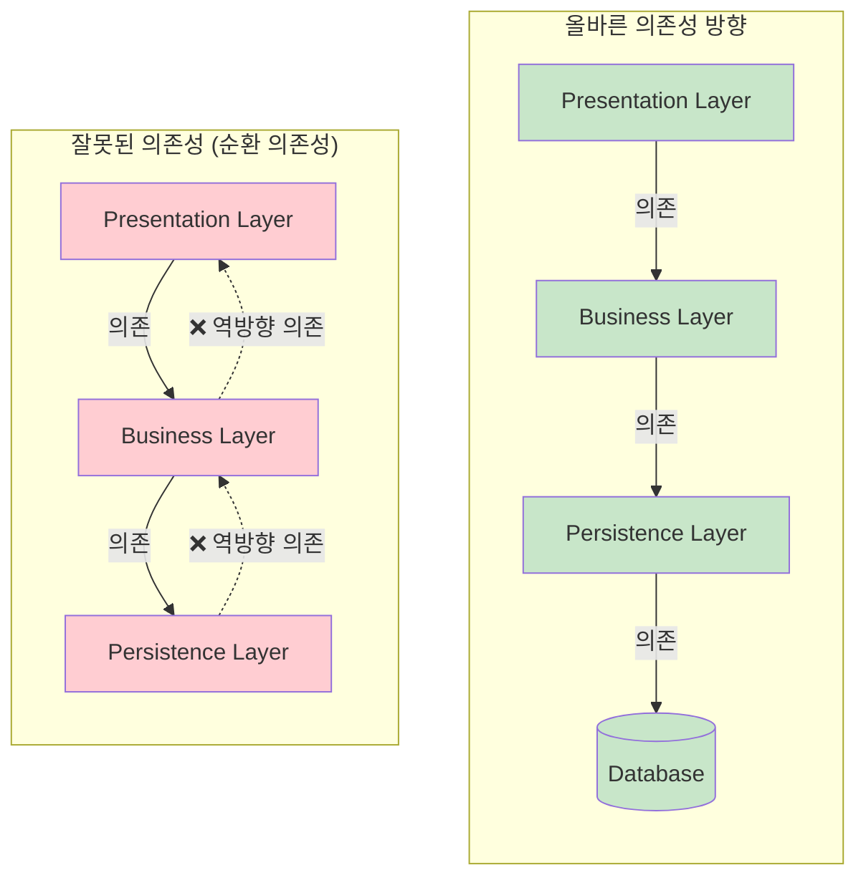
```mermaid
graph TD
    subgraph "올바른 의존성 방향"
        direction TB
        P1[Presentation Layer]
        B1[Business Layer]
        D1[Persistence Layer]
        DB1[(Database)]

        P1 -->|의존| B1
        B1 -->|의존| D1
        D1 -->|의존| DB1
    end

    subgraph "잘못된 의존성 (순환 의존성)"
        direction TB
        P2[Presentation Layer]
        B2[Business Layer]
        D2[Persistence Layer]

        P2 -->|의존| B2
        B2 -->|의존| D2
        D2 -.->|❌ 역방향 의존| B2
        B2 -.->|❌ 역방향 의존| P2
    end

    style P1 fill:#c8e6c9
    style B1 fill:#c8e6c9
    style D1 fill:#c8e6c9
    style DB1 fill:#c8e6c9

    style P2 fill:#ffcdd2
    style B2 fill:#ffcdd2
    style D2 fill:#ffcdd2
```

### 계층 간 인터페이스 사용

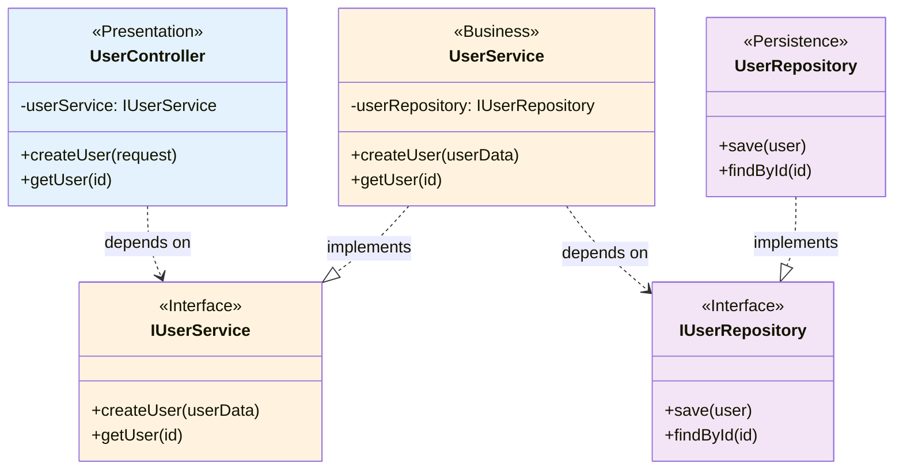
```mermaid
classDiagram
    class UserController {
        <<Presentation>>
        -userService: IUserService
        +createUser(request)
        +getUser(id)
    }

    class IUserService {
        <<Interface>>
        +createUser(userData)
        +getUser(id)
    }

    class UserService {
        <<Business>>
        -userRepository: IUserRepository
        +createUser(userData)
        +getUser(id)
    }

    class IUserRepository {
        <<Interface>>
        +save(user)
        +findById(id)
    }

    class UserRepository {
        <<Persistence>>
        +save(user)
        +findById(id)
    }

    UserController ..> IUserService : depends on
    UserService ..|> IUserService : implements
    UserService ..> IUserRepository : depends on
    UserRepository ..|> IUserRepository : implements

    style UserController fill:#e3f2fd
    style IUserService fill:#fff3e0
    style UserService fill:#fff3e0
    style IUserRepository fill:#f3e5f5
    style UserRepository fill:#f3e5f5
```

---

## 🌊 데이터 흐름

### 사용자 등록 예시

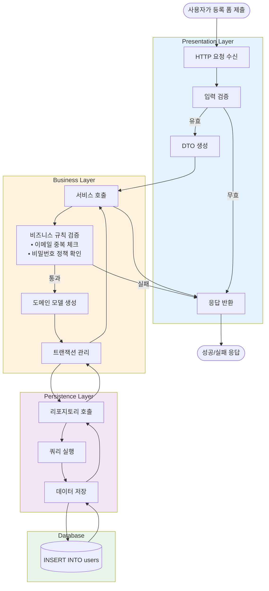
```mermaid
flowchart TD
    START([사용자가 등록 폼 제출])

    subgraph Presentation["Presentation Layer"]
        RECV[HTTP 요청 수신]
        VALID[입력 검증]
        DTO[DTO 생성]
        RESPONSE[응답 반환]
    end

    subgraph Business["Business Layer"]
        SERVICE[서비스 호출]
        BIZRULE[비즈니스 규칙 검증<br/>• 이메일 중복 체크<br/>• 비밀번호 정책 확인]
        DOMAIN[도메인 모델 생성]
        TRANS[트랜잭션 관리]
    end

    subgraph Persistence["Persistence Layer"]
        REPO[리포지토리 호출]
        QUERY[쿼리 실행]
        SAVE[데이터 저장]
    end

    subgraph Database["Database"]
        DB[(INSERT INTO users)]
    end

    START --> RECV
    RECV --> VALID
    VALID -->|유효| DTO
    VALID -->|무효| RESPONSE
    DTO --> SERVICE
    SERVICE --> BIZRULE
    BIZRULE -->|통과| DOMAIN
    BIZRULE -->|실패| RESPONSE
    DOMAIN --> TRANS
    TRANS --> REPO
    REPO --> QUERY
    QUERY --> SAVE
    SAVE --> DB
    DB --> SAVE
    SAVE --> REPO
    REPO --> TRANS
    TRANS --> SERVICE
    SERVICE --> RESPONSE
    RESPONSE --> END([성공/실패 응답])

    style Presentation fill:#e3f2fd
    style Business fill:#fff3e0
    style Persistence fill:#f3e5f5
    style Database fill:#e8f5e9
```

### 데이터 조회 흐름

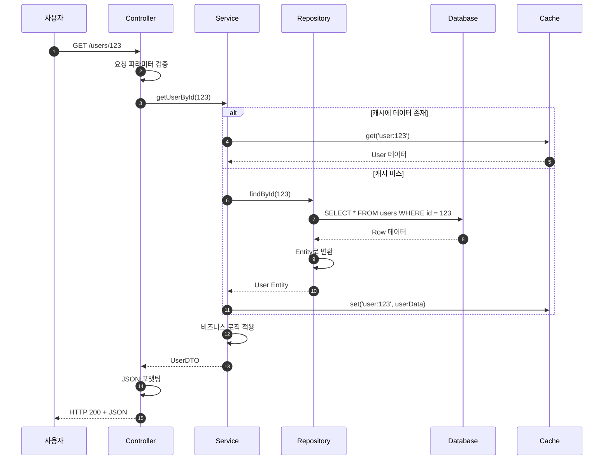
```mermaid
sequenceDiagram
    autonumber
    participant U as 사용자
    participant C as Controller
    participant S as Service
    participant R as Repository
    participant DB as Database
    participant Cache as Cache

    U->>C: GET /users/123
    C->>C: 요청 파라미터 검증
    C->>S: getUserById(123)

    alt 캐시에 데이터 존재
        S->>Cache: get('user:123')
        Cache-->>S: User 데이터
    else 캐시 미스
        S->>R: findById(123)
        R->>DB: SELECT * FROM users WHERE id = 123
        DB-->>R: Row 데이터
        R->>R: Entity로 변환
        R-->>S: User Entity
        S->>Cache: set('user:123', userData)
    end

    S->>S: 비즈니스 로직 적용
    S-->>C: UserDTO
    C->>C: JSON 포맷팅
    C-->>U: HTTP 200 + JSON
```

---

## ⚖️ 장단점

### 장점 (Advantages)

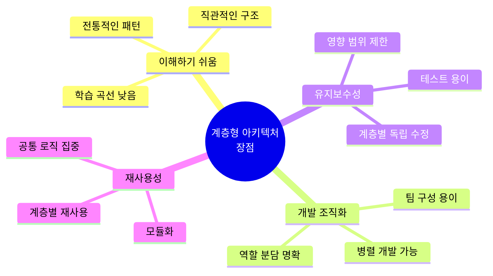
```mermaid
mindmap
  root((계층형 아키텍처<br/>장점))
    이해하기 쉬움
      직관적인 구조
      전통적인 패턴
      학습 곡선 낮음
    개발 조직화
      역할 분담 명확
      병렬 개발 가능
      팀 구성 용이
    유지보수성
      계층별 독립 수정
      영향 범위 제한
      테스트 용이
    재사용성
      계층별 재사용
      공통 로직 집중
      모듈화
```

**✅ 주요 장점:**

1. **단순성과 이해 용이성**
   - 직관적인 구조로 신규 개발자도 쉽게 이해
   - 전통적이고 검증된 패턴

2. **관심사의 명확한 분리**
   - 각 계층이 명확한 역할과 책임을 가짐
   - 코드 중복 감소

3. **테스트 용이성**
   - 각 계층을 독립적으로 테스트 가능
   - Mock 객체 사용 용이

4. **유지보수성**
   - 한 계층의 변경이 다른 계층에 미치는 영향 최소화
   - 버그 추적 및 수정 용이

5. **개발 조직화**
   - 계층별로 팀 분담 가능
   - 병렬 개발 가능

6. **재사용성**
   - 비즈니스 로직을 여러 프레젠테이션에서 재사용
   - 공통 기능 모듈화

### 단점 (Disadvantages)

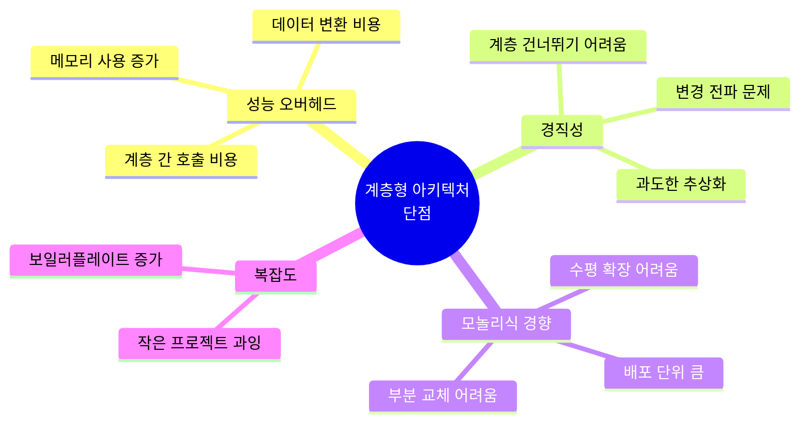
```mermaid
mindmap
  root((계층형 아키텍처<br/>단점))
    성능 오버헤드
      계층 간 호출 비용
      데이터 변환 비용
      메모리 사용 증가
    경직성
      계층 건너뛰기 어려움
      변경 전파 문제
      과도한 추상화
    모놀리식 경향
      수평 확장 어려움
      배포 단위 큼
      부분 교체 어려움
    복잡도
      작은 프로젝트 과잉
      보일러플레이트 증가
```

**❌ 주요 단점:**

1. **성능 오버헤드**
   - 계층 간 데이터 전달로 인한 성능 저하
   - 불필요한 데이터 변환 (Entity → DTO → ViewModel)

2. **경직된 구조**
   - 계층을 건너뛰기 어려움
   - 작은 변경에도 여러 계층 수정 필요

3. **모놀리식 경향**
   - 전체를 하나로 배포해야 함
   - 수평 확장(Scale-out) 어려움

4. **과도한 추상화**
   - 작은 프로젝트에서는 오버엔지니어링
   - 불필요한 복잡도 증가

5. **데이터베이스 중심 설계**
   - 도메인 모델보다 데이터 모델 중심
   - 비즈니스 로직이 여러 계층에 흩어질 위험

---

## 💼 사용 사례

### 적합한 경우

```mermaid
graph LR
    subgraph "계층형 아키텍처가 적합한 프로젝트"
        A[전통적인 웹 애플리케이션<br/>• 게시판<br/>• 쇼핑몰<br/>• 관리 시스템]
        B[중소 규모 프로젝트<br/>• 명확한 요구사항<br/>• 안정적인 도메인<br/>• 팀 규모 적정]
        C[레거시 시스템<br/>• 기존 3-tier 구조<br/>• 점진적 개선<br/>• 리스크 최소화]
    end

    style A fill:#c8e6c9
    style B fill:#c8e6c9
    style C fill:#c8e6c9
```

**✅ 계층형 아키텍처가 적합한 경우:**

1. **전통적인 CRUD 애플리케이션**
   - 게시판, 블로그 시스템
   - 관리자 페이지
   - 백오피스 시스템

2. **비즈니스 로직이 복잡하지 않은 경우**
   - 단순한 워크플로우
   - 명확한 데이터 흐름

3. **팀이 패턴에 익숙한 경우**
   - 전통적인 개발 방식
   - 빠른 개발 필요

4. **프로토타입 또는 MVP**
   - 빠른 시장 출시
   - 검증 목적

### 부적합한 경우

```mermaid
graph LR
    subgraph "계층형 아키텍처가 부적합한 프로젝트"
        A[마이크로서비스<br/>• 독립 배포 필요<br/>• 수평 확장 중요<br/>• 폴리글랏 환경]
        B[복잡한 도메인<br/>• DDD 필요<br/>• 많은 비즈니스 규칙<br/>• 도메인 중심 설계]
        C[실시간 시스템<br/>• 이벤트 주도<br/>• 높은 동시성<br/>• 낮은 지연시간]
    end

    style A fill:#ffcdd2
    style B fill:#ffcdd2
    style C fill:#ffcdd2
```

**❌ 계층형 아키텍처가 부적합한 경우:**

1. **마이크로서비스 아키텍처가 필요한 경우**
   - 독립적인 배포 필요
   - 서비스별 확장 필요

2. **복잡한 도메인 로직**
   - DDD(Domain-Driven Design) 적용 필요
   - 헥사고널 아키텍처가 더 적합

3. **높은 성능과 확장성 요구**
   - 이벤트 주도 아키텍처
   - CQRS 패턴

4. **실시간 시스템**
   - 이벤트 소싱
   - 리액티브 시스템

---

## 🔧 PHP에서의 구현 전략

### 1. 프레임워크 선택

```mermaid
graph TB
    subgraph "PHP 프레임워크별 계층 지원"
        subgraph "Laravel"
            L1[Routes]
            L2[Controllers<br/>Presentation]
            L3[Services<br/>Business]
            L4[Repositories<br/>Persistence]
            L5[Eloquent Models]

            L1 --> L2
            L2 --> L3
            L3 --> L4
            L4 --> L5
        end

        subgraph "Symfony"
            S1[Routes]
            S2[Controllers]
            S3[Services]
            S4[Doctrine Repositories]
            S5[Entities]

            S1 --> S2
            S2 --> S3
            S3 --> S4
            S4 --> S5
        end
    end

    style L2 fill:#e3f2fd
    style L3 fill:#fff3e0
    style L4 fill:#f3e5f5
    style L5 fill:#e8f5e9

    style S2 fill:#e3f2fd
    style S3 fill:#fff3e0
    style S4 fill:#f3e5f5
    style S5 fill:#e8f5e9
```

### 2. 의존성 주입 (Dependency Injection)

```mermaid
graph LR
    subgraph "DI Container를 통한 계층 연결"
        CONTAINER[DI Container<br/>서비스 컨테이너]

        CTRL[Controller]
        SVC[Service]
        REPO[Repository]

        CONTAINER -.->|주입| CTRL
        CONTAINER -.->|주입| SVC
        CONTAINER -.->|주입| REPO

        CTRL --> SVC
        SVC --> REPO
    end

    style CONTAINER fill:#fffde7
    style CTRL fill:#e3f2fd
    style SVC fill:#fff3e0
    style REPO fill:#f3e5f5
```

**핵심 원칙:**
- 인터페이스 기반 프로그래밍
- 생성자 주입 사용
- 서비스 컨테이너 활용

### 3. 네임스페이스 구조

```
App\
├── Presentation\
│   ├── Controllers\
│   ├── DTOs\
│   └── Validators\
│
├── Business\
│   ├── Services\
│   ├── Models\
│   └── Rules\
│
└── Persistence\
    ├── Repositories\
    └── Entities\
```

### 4. Composer 오토로딩

```json
{
    "autoload": {
        "psr-4": {
            "App\\Presentation\\": "src/Presentation/",
            "App\\Business\\": "src/Business/",
            "App\\Persistence\\": "src/Persistence/"
        }
    }
}
```

### 5. 라우팅 전략

```mermaid
graph LR
    REQUEST[HTTP Request] --> ROUTER[Router]
    ROUTER --> MIDDLEWARE[Middleware]
    MIDDLEWARE --> CTRL[Controller]
    CTRL --> RESPONSE[HTTP Response]

    style REQUEST fill:#e1f5ff
    style ROUTER fill:#fff4e1
    style MIDDLEWARE fill:#f0e1ff
    style CTRL fill:#e3f2fd
    style RESPONSE fill:#e1ffe1
```

---

## ⚠️ 안티패턴과 주의사항

### 1. 계층 건너뛰기 (Layer Skipping)

```mermaid
graph TD
    subgraph "❌ 잘못된 예 - 계층 건너뛰기"
        C1[Controller]
        S1[Service]
        R1[Repository]

        C1 -.->|직접 접근| R1
        C1 --> S1
        S1 --> R1
    end

    subgraph "✅ 올바른 예 - 순차적 접근"
        C2[Controller]
        S2[Service]
        R2[Repository]

        C2 --> S2
        S2 --> R2
    end

    style C1 fill:#ffcdd2
    style S1 fill:#ffcdd2
    style R1 fill:#ffcdd2
    style C2 fill:#c8e6c9
    style S2 fill:#c8e6c9
    style R2 fill:#c8e6c9
```

### 2. 비즈니스 로직 누수

```mermaid
graph TB
    subgraph "❌ 비즈니스 로직이 흩어진 경우"
        direction TB
        P1[Controller<br/>일부 비즈니스 로직 포함]
        B1[Service<br/>핵심 비즈니스 로직]
        D1[Repository<br/>일부 비즈니스 로직 포함]
    end

    subgraph "✅ 비즈니스 로직이 집중된 경우"
        direction TB
        P2[Controller<br/>요청/응답 처리만]
        B2[Service<br/>모든 비즈니스 로직]
        D2[Repository<br/>데이터 접근만]
    end

    style P1 fill:#ffcdd2
    style B1 fill:#ffcdd2
    style D1 fill:#ffcdd2
    style P2 fill:#c8e6c9
    style B2 fill:#c8e6c9
    style D2 fill:#c8e6c9
```

### 3. 과도한 계층

```mermaid
graph TD
    subgraph "❌ 불필요하게 많은 계층"
        L1[Presentation] --> L2[Application]
        L2 --> L3[Business]
        L3 --> L4[Domain]
        L4 --> L5[Service]
        L5 --> L6[Repository]
        L6 --> L7[DAO]
        L7 --> L8[Database]
    end

    subgraph "✅ 적절한 계층 수"
        R1[Presentation] --> R2[Business]
        R2 --> R3[Persistence]
        R3 --> R4[Database]
    end

    style L1 fill:#ffcdd2
    style L2 fill:#ffcdd2
    style L3 fill:#ffcdd2
    style L4 fill:#ffcdd2
    style L5 fill:#ffcdd2
    style L6 fill:#ffcdd2
    style L7 fill:#ffcdd2
    style L8 fill:#ffcdd2

    style R1 fill:#c8e6c9
    style R2 fill:#c8e6c9
    style R3 fill:#c8e6c9
    style R4 fill:#c8e6c9
```

### 주의사항 체크리스트

```mermaid
graph LR
    subgraph "피해야 할 것"
        A1[❌ 순환 의존성]
        A2[❌ 계층 건너뛰기]
        A3[❌ 비즈니스 로직 분산]
        A4[❌ 과도한 DTO 변환]
        A5[❌ 트랜잭션 분산]
    end

    subgraph "지켜야 할 것"
        B1[✅ 단방향 의존성]
        B2[✅ 계층 순차 접근]
        B3[✅ 비즈니스 로직 집중]
        B4[✅ 필요한 만큼만 변환]
        B5[✅ 서비스 계층에서 트랜잭션 관리]
    end

    style A1 fill:#ffcdd2
    style A2 fill:#ffcdd2
    style A3 fill:#ffcdd2
    style A4 fill:#ffcdd2
    style A5 fill:#ffcdd2

    style B1 fill:#c8e6c9
    style B2 fill:#c8e6c9
    style B3 fill:#c8e6c9
    style B4 fill:#c8e6c9
    style B5 fill:#c8e6c9
```

---

## 📚 참고 자료

### 추천 도서
- 📕 **"Patterns of Enterprise Application Architecture"** - Martin Fowler
- 📗 **"Clean Architecture"** - Robert C. Martin
- 📘 **"Building Microservices"** - Sam Newman (비교 관점)
- 📙 **"Domain-Driven Design"** - Eric Evans

### 온라인 리소스
- 🌐 [Martin Fowler - PresentationDomainDataLayering](https://martinfowler.com/bliki/PresentationDomainDataLayering.html)
- 🌐 [Microsoft - Layered Architecture](https://docs.microsoft.com/en-us/azure/architecture/guide/architecture-styles/n-tier)
- 🌐 [PHP The Right Way](https://phptherightway.com/) - PHP 모범 사례

### PHP 프레임워크 문서
- [Laravel - Service Container](https://laravel.com/docs/container)
- [Symfony - Service Container](https://symfony.com/doc/current/service_container.html)
- [Doctrine ORM](https://www.doctrine-project.org/projects/orm.html)

---

## 📊 요약

```mermaid
mindmap
  root((계층형 아키텍처<br/>핵심 요약))
    구조
      3~4개 계층
      수평적 분리
      명확한 경계
    원칙
      관심사 분리
      단방향 의존성
      계층별 책임
    장점
      이해 용이
      유지보수 쉬움
      테스트 용이
    단점
      성능 오버헤드
      경직성
      모놀리식
    적용
      전통적 웹앱
      CRUD 중심
      중소 규모
```

계층형 아키텍처는 **단순하고 이해하기 쉬운** 구조로, 많은 프로젝트에서 검증된 아키텍처 패턴입니다. 하지만 모든 상황에 적합한 것은 아니므로, **프로젝트의 특성과 요구사항**을 고려하여 신중하게 선택해야 합니다.

---

**다음 단계:** [PHP 구현 예제 보기](./php/README.md)
