# 계층형 아키텍처 (Layered Architecture) - Laravel

> Laravel 프레임워크를 사용하여 계층형 아키텍처를 구현하는 완전 가이드

---

## 📑 목차

1. [개요](#-개요)
2. [정의](#-정의)
3. [핵심 용어](#-핵심-용어)
4. [Laravel의 기본 구조](#-laravel의-기본-구조)
5. [계층 구조](#-계층-구조)
6. [각 계층의 역할과 책임](#-각-계층의-역할과-책임)
7. [Laravel 폴더 구조](#-laravel-폴더-구조)
8. [계층 간 통신 규칙](#-계층-간-통신-규칙)
9. [의존성 규칙과 Service Container](#-의존성-규칙과-service-container)
10. [데이터 흐름](#-데이터-흐름)
11. [장단점](#-장단점)
12. [사용 사례](#-사용-사례)
13. [Laravel 구현 전략](#-laravel-구현-전략)
14. [안티패턴과 주의사항](#-안티패턴과-주의사항)
15. [참고 자료](#-참고-자료)

---

## 🎯 개요

계층형 아키텍처는 Laravel 애플리케이션을 수평적인 계층으로 나누어 각 계층이 특정한 역할과 책임을 갖도록 구성하는 패턴입니다. Laravel은 기본적으로 MVC 패턴을 제공하지만, 비즈니스 로직이 복잡해질수록 계층형 아키텍처를 통해 더 나은 구조를 만들 수 있습니다.

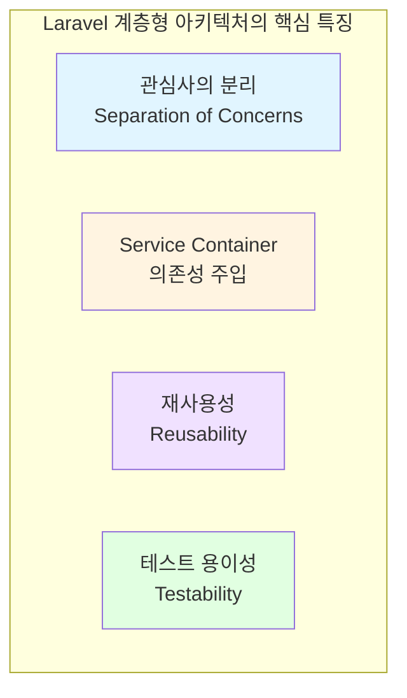

---

## 📖 정의

**계층형 아키텍처(Layered Architecture)** 는 Laravel 애플리케이션을 여러 개의 수평적 계층으로 구성하는 아키텍처 패턴입니다. Laravel의 기본 MVC 구조를 확장하여 Service Layer, Repository Layer를 추가함으로써 비즈니스 로직과 데이터 접근 로직을 분리합니다.

### Laravel에서의 핵심 원칙

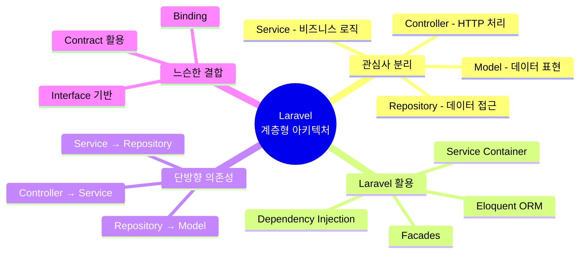

---

## 🔑 핵심 용어

### 1. **계층 (Layer)**
특정한 역할과 책임을 가진 논리적인 구분 단위입니다. Laravel에서는 다음과 같이 구성됩니다:
- **Presentation Layer**: Controllers, Requests, Resources, Views
- **Business Layer**: Services, Actions, Domain Models
- **Persistence Layer**: Repositories, Eloquent Models

### 2. **Service Container (서비스 컨테이너)**
Laravel의 강력한 의존성 주입 도구로, 클래스 간의 의존성을 관리하고 자동으로 주입합니다.

### 3. **Repository Pattern (리포지토리 패턴)**
데이터 접근 로직을 추상화하여 Eloquent Model과 비즈니스 로직을 분리하는 패턴입니다.

### 4. **Service Layer (서비스 계층)**
비즈니스 로직을 캡슐화하는 계층으로, Controller와 Repository 사이에 위치합니다.

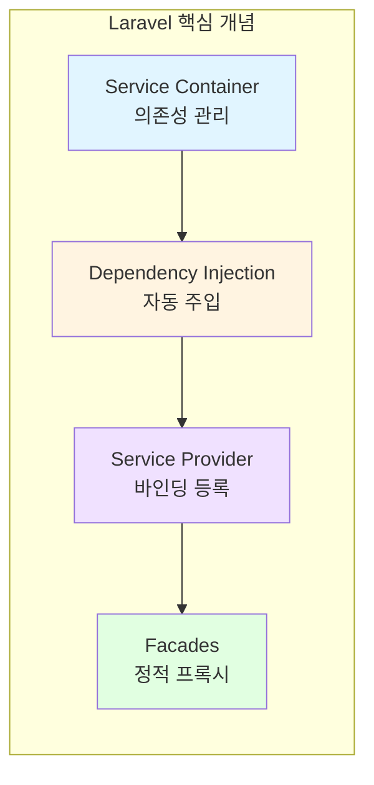

---

## 🏗️ Laravel의 기본 구조

### Laravel MVC vs 계층형 아키텍처

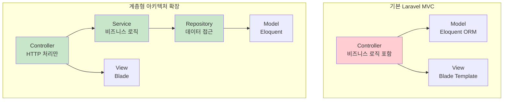

---

## 🏛️ 계층 구조

### Laravel 계층형 아키텍처 (4계층)

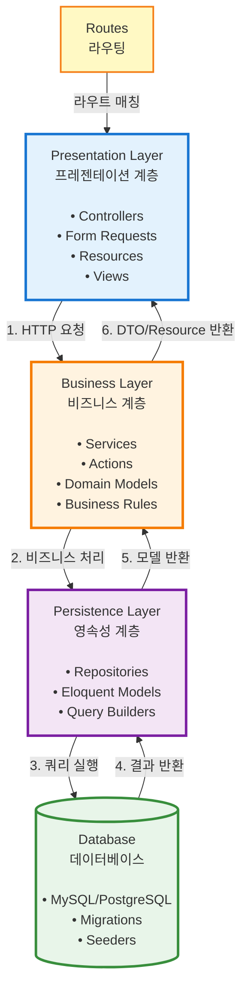

### 확장된 계층 구조 (Middleware 포함)

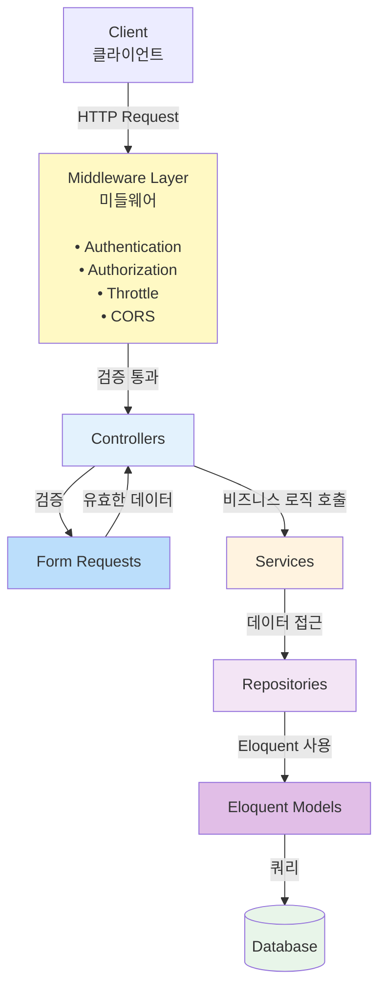

---

## 📋 각 계층의 역할과 책임

### 1. Presentation Layer (프레젠테이션 계층)

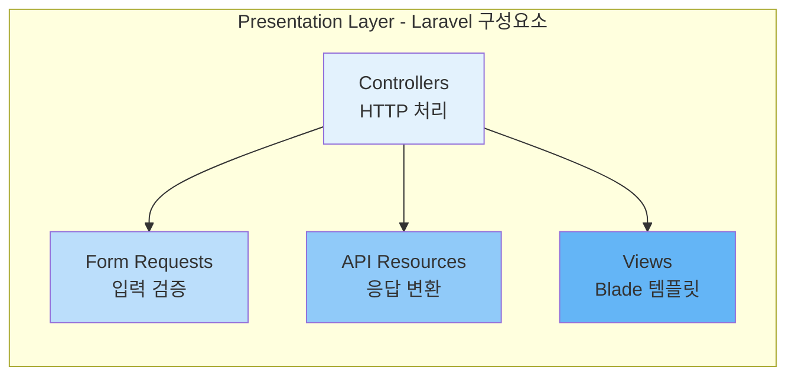

**주요 책임:**
- HTTP 요청/응답 처리
- 라우팅
- 사용자 입력 검증 (Form Request)
- 응답 포맷팅 (API Resource)
- 뷰 렌더링 (Blade)
- 세션 관리

**Laravel 구성요소:**
- **Controllers** (`app/Http/Controllers/`)
  - 얇은 컨트롤러 유지 (Thin Controllers)
  - 비즈니스 로직은 Service로 위임

- **Form Requests** (`app/Http/Requests/`)
  - 입력 검증 규칙 정의
  - 권한 확인 (authorization)

- **Resources** (`app/Http/Resources/`)
  - API 응답 변환
  - JSON 구조 정의

- **Views** (`resources/views/`)
  - Blade 템플릿
  - 화면 표시 로직

**예시 구조:**
```php
// app/Http/Controllers/ProductController.php
class ProductController extends Controller
{
    public function __construct(
        private ProductService $productService
    ) {}

    public function store(CreateProductRequest $request)
    {
        $product = $this->productService->createProduct(
            $request->validated()
        );

        return new ProductResource($product);
    }
}
```

**금지 사항:**
- ❌ Controller에서 직접 Eloquent Model 사용
- ❌ 비즈니스 로직 포함
- ❌ 데이터베이스 쿼리 직접 작성
- ❌ 복잡한 데이터 변환

---

### 2. Business Layer (비즈니스 계층)

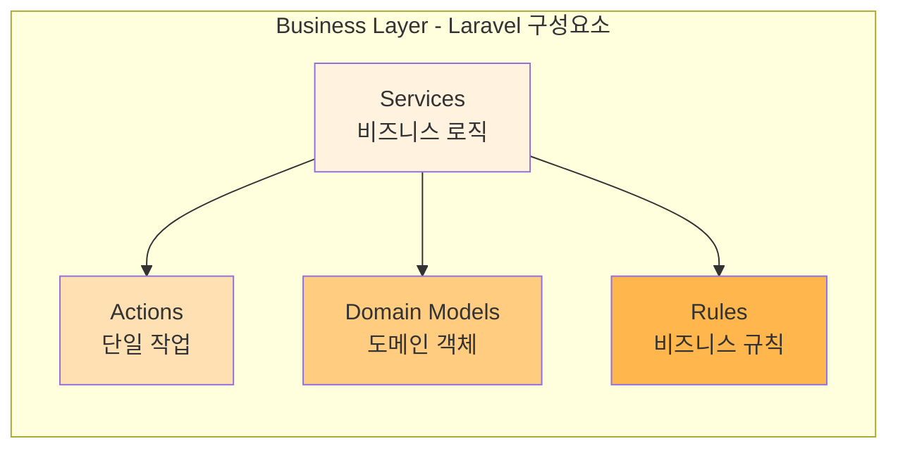

**주요 책임:**
- 비즈니스 규칙 구현
- 유스케이스 조율
- 트랜잭션 관리
- 도메인 로직 처리
- 여러 Repository 조합
- Event 발행

**Laravel 구성요소:**
- **Services** (`app/Services/`)
  - 핵심 비즈니스 로직
  - 여러 Repository 조율
  - DB 트랜잭션 관리

- **Actions** (`app/Actions/`)
  - 단일 책임 작업
  - 재사용 가능한 비즈니스 액션

- **Domain Models** (`app/Domain/Models/`)
  - Eloquent Model과 분리된 순수 도메인 객체
  - 비즈니스 메서드 포함

- **Policies** (`app/Policies/`)
  - 권한 부여 로직

- **Events** (`app/Events/`)
  - 도메인 이벤트

**예시 구조:**
```php
// app/Services/ProductService.php
class ProductService
{
    public function __construct(
        private ProductRepository $productRepository,
        private InventoryRepository $inventoryRepository
    ) {}

    public function createProduct(array $data): Product
    {
        return DB::transaction(function () use ($data) {
            // 비즈니스 로직
            $product = $this->productRepository->create($data);

            // 재고 초기화
            $this->inventoryRepository->initialize($product);

            // 이벤트 발행
            event(new ProductCreated($product));

            return $product;
        });
    }
}
```

**금지 사항:**
- ❌ HTTP 요청/응답 직접 처리
- ❌ Eloquent Model 직접 사용 (Repository를 통해 접근)
- ❌ View 렌더링
- ❌ 입력 검증 (Form Request가 담당)

---

### 3. Persistence Layer (영속성 계층)

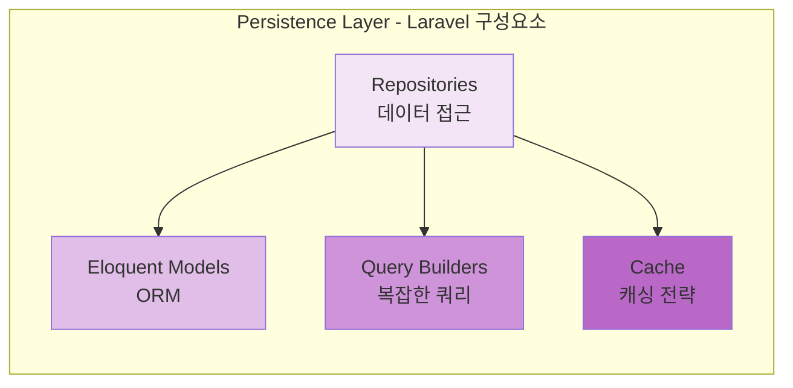

**주요 책임:**
- 데이터 CRUD 작업
- Eloquent ORM 활용
- 쿼리 최적화
- 캐싱 전략
- 데이터 변환 (Model ↔ Domain Object)

**Laravel 구성요소:**
- **Repositories** (`app/Repositories/`)
  - 인터페이스와 구현 분리
  - Eloquent 캡슐화
  - 쿼리 로직 중앙 관리

- **Eloquent Models** (`app/Models/`)
  - 데이터베이스 테이블 매핑
  - Relationships 정의
  - Accessors/Mutators
  - Scopes

- **Database** (`database/`)
  - Migrations
  - Seeders
  - Factories

**예시 구조:**
```php
// app/Repositories/Contracts/ProductRepositoryInterface.php
interface ProductRepositoryInterface
{
    public function find(int $id): ?Product;
    public function create(array $data): Product;
    public function update(Product $product, array $data): Product;
}

// app/Repositories/ProductRepository.php
class ProductRepository implements ProductRepositoryInterface
{
    public function find(int $id): ?Product
    {
        return Cache::remember(
            "product.{$id}",
            3600,
            fn () => Product::find($id)
        );
    }

    public function create(array $data): Product
    {
        return Product::create($data);
    }
}
```

**금지 사항:**
- ❌ 비즈니스 로직 포함
- ❌ HTTP 요청/응답 처리
- ❌ 트랜잭션 관리 (Service가 담당)
- ❌ 복잡한 비즈니스 규칙

---

### 4. Database Layer (데이터베이스 계층)

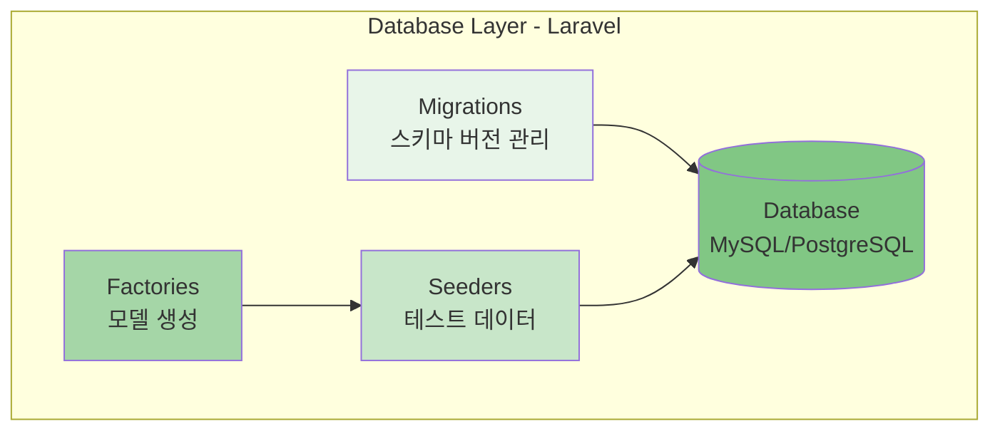

---

## 📁 Laravel 폴더 구조

### 기본 Laravel 구조 확장

```
laravel-project/
│
├── app/
│   ├── Http/                           # Presentation Layer
│   │   ├── Controllers/               # 컨트롤러
│   │   │   ├── Api/                   # API 컨트롤러
│   │   │   │   └── V1/
│   │   │   │       ├── ProductController.php
│   │   │   │       ├── OrderController.php
│   │   │   │       └── UserController.php
│   │   │   │
│   │   │   ├── Web/                   # 웹 컨트롤러
│   │   │   │   ├── HomeController.php
│   │   │   │   ├── ProductController.php
│   │   │   │   └── CartController.php
│   │   │   │
│   │   │   └── Admin/                 # 관리자 컨트롤러
│   │   │       ├── DashboardController.php
│   │   │       └── ProductController.php
│   │   │
│   │   ├── Requests/                  # Form Request (입력 검증)
│   │   │   ├── Product/
│   │   │   │   ├── StoreProductRequest.php
│   │   │   │   └── UpdateProductRequest.php
│   │   │   │
│   │   │   └── Order/
│   │   │       └── PlaceOrderRequest.php
│   │   │
│   │   ├── Resources/                 # API Resources (응답 변환)
│   │   │   ├── ProductResource.php
│   │   │   ├── ProductCollection.php
│   │   │   ├── OrderResource.php
│   │   │   └── UserResource.php
│   │   │
│   │   └── Middleware/                # 미들웨어
│   │       ├── EnsureUserIsAdmin.php
│   │       └── CheckProductOwnership.php
│   │
│   ├── Services/                       # Business Layer - 비즈니스 로직
│   │   ├── ProductService.php
│   │   ├── OrderService.php
│   │   ├── CartService.php
│   │   ├── PaymentService.php
│   │   └── NotificationService.php
│   │
│   ├── Actions/                        # Business Layer - 단일 액션
│   │   ├── Product/
│   │   │   ├── CreateProductAction.php
│   │   │   └── UpdateProductStockAction.php
│   │   │
│   │   └── Order/
│   │       └── ProcessOrderAction.php
│   │
│   ├── Repositories/                   # Persistence Layer
│   │   ├── Contracts/                 # Repository 인터페이스
│   │   │   ├── ProductRepositoryInterface.php
│   │   │   ├── OrderRepositoryInterface.php
│   │   │   └── UserRepositoryInterface.php
│   │   │
│   │   └── Eloquent/                  # Repository 구현체
│   │       ├── ProductRepository.php
│   │       ├── OrderRepository.php
│   │       └── UserRepository.php
│   │
│   ├── Models/                         # Eloquent Models
│   │   ├── Product.php
│   │   ├── Order.php
│   │   ├── OrderItem.php
│   │   ├── User.php
│   │   └── Category.php
│   │
│   ├── Domain/                         # Domain Layer (선택적)
│   │   ├── Models/                    # 도메인 모델 (Eloquent와 분리)
│   │   │   ├── Product.php
│   │   │   └── Order.php
│   │   │
│   │   ├── ValueObjects/              # 값 객체
│   │   │   ├── Money.php
│   │   │   ├── Email.php
│   │   │   └── Address.php
│   │   │
│   │   └── Exceptions/                # 도메인 예외
│   │       ├── InsufficientStockException.php
│   │       └── InvalidPriceException.php
│   │
│   ├── Policies/                       # 권한 정책
│   │   ├── ProductPolicy.php
│   │   └── OrderPolicy.php
│   │
│   ├── Events/                         # 이벤트
│   │   ├── ProductCreated.php
│   │   ├── OrderPlaced.php
│   │   └── PaymentProcessed.php
│   │
│   ├── Listeners/                      # 이벤트 리스너
│   │   ├── SendOrderConfirmation.php
│   │   └── UpdateProductStock.php
│   │
│   ├── Providers/                      # 서비스 프로바이더
│   │   ├── AppServiceProvider.php
│   │   ├── RepositoryServiceProvider.php # Repository 바인딩
│   │   └── EventServiceProvider.php
│   │
│   └── Helpers/                        # 헬퍼 함수
│       └── helpers.php
│
├── bootstrap/
│   └── app.php
│
├── config/                             # 설정 파일
│   ├── app.php
│   ├── database.php
│   ├── services.php
│   └── cache.php
│
├── database/
│   ├── migrations/                    # 마이그레이션
│   │   ├── 2024_01_01_create_products_table.php
│   │   ├── 2024_01_02_create_orders_table.php
│   │   └── 2024_01_03_create_order_items_table.php
│   │
│   ├── seeders/                       # 시더
│   │   ├── DatabaseSeeder.php
│   │   ├── ProductSeeder.php
│   │   └── UserSeeder.php
│   │
│   └── factories/                     # 팩토리
│       ├── ProductFactory.php
│       └── UserFactory.php
│
├── routes/                             # 라우트
│   ├── web.php                        # 웹 라우트
│   ├── api.php                        # API 라우트
│   └── console.php                    # Artisan 명령어
│
├── resources/
│   ├── views/                         # Blade 템플릿
│   │   ├── layouts/
│   │   │   ├── app.blade.php
│   │   │   └── admin.blade.php
│   │   │
│   │   ├── products/
│   │   │   ├── index.blade.php
│   │   │   ├── show.blade.php
│   │   │   └── create.blade.php
│   │   │
│   │   └── components/                # Blade 컴포넌트
│   │       ├── button.blade.php
│   │       └── card.blade.php
│   │
│   └── lang/                          # 다국어
│       └── ko/
│           └── messages.php
│
├── tests/
│   ├── Unit/                          # 단위 테스트
│   │   ├── Services/
│   │   │   └── ProductServiceTest.php
│   │   │
│   │   └── Repositories/
│   │       └── ProductRepositoryTest.php
│   │
│   ├── Feature/                       # 기능 테스트
│   │   ├── Api/
│   │   │   └── ProductControllerTest.php
│   │   │
│   │   └── Web/
│   │       └── ProductControllerTest.php
│   │
│   └── TestCase.php
│
├── storage/
│   ├── app/
│   ├── framework/
│   └── logs/
│
├── vendor/                            # Composer 의존성
│
├── .env                               # 환경 변수
├── .env.example
├── artisan                            # Artisan CLI
├── composer.json
├── phpunit.xml
└── README.md
```

### 계층별 폴더 매핑

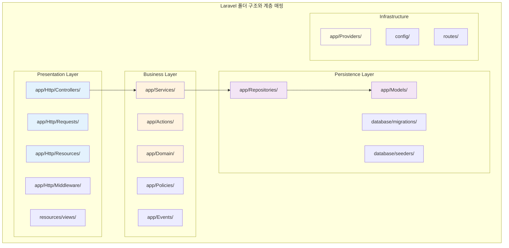

---

## 🔄 계층 간 통신 규칙

### Laravel에서의 통신 흐름

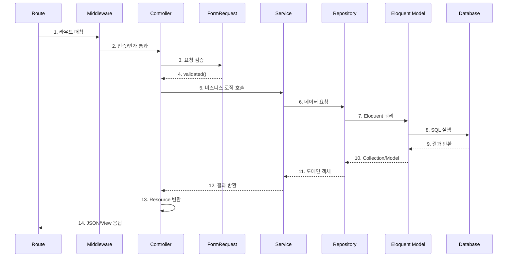

### 허용되는 의존성 방향

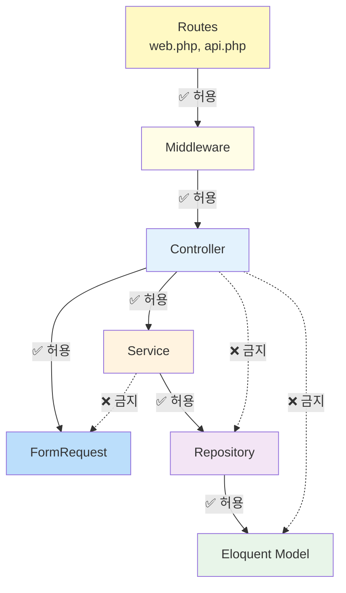

---

## 🎯 의존성 규칙과 Service Container

### Laravel Service Container 활용

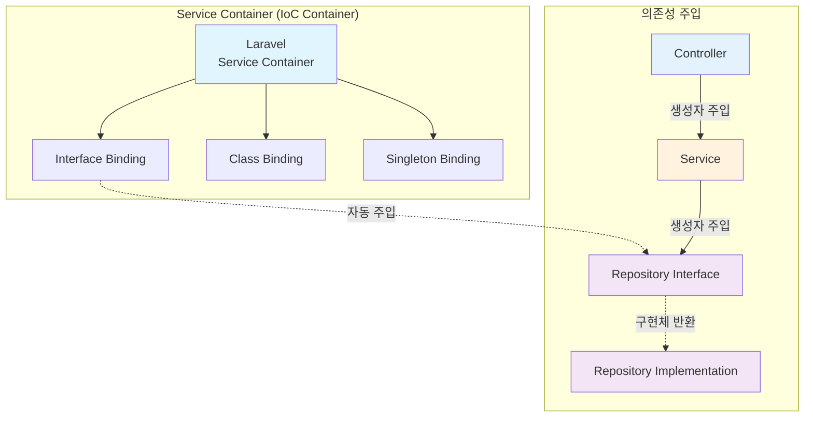

### Repository 바인딩 예시

```php
// app/Providers/RepositoryServiceProvider.php
namespace App\Providers;

use Illuminate\Support\ServiceProvider;
use App\Repositories\Contracts\ProductRepositoryInterface;
use App\Repositories\Eloquent\ProductRepository;

class RepositoryServiceProvider extends ServiceProvider
{
    public function register(): void
    {
        // Repository 인터페이스와 구현체 바인딩
        $this->app->bind(
            ProductRepositoryInterface::class,
            ProductRepository::class
        );

        $this->app->bind(
            OrderRepositoryInterface::class,
            OrderRepository::class
        );
    }
}
```

### 자동 의존성 주입

```php
// Controller에서 자동 주입
class ProductController extends Controller
{
    public function __construct(
        private ProductService $productService
    ) {
        // Laravel Service Container가 자동으로 주입
    }
}

// Service에서 자동 주입
class ProductService
{
    public function __construct(
        private ProductRepositoryInterface $productRepository,
        private InventoryRepositoryInterface $inventoryRepository
    ) {
        // Interface를 주입받지만, 실제 구현체가 자동으로 주입됨
    }
}
```

---

## 🌊 데이터 흐름

### 상품 생성 플로우

```mermaid
flowchart TD
    START([POST /api/products])

    subgraph "1. Routing & Middleware"
        ROUTE[api.php<br/>라우트 매칭]
        AUTH[Auth Middleware<br/>인증 확인]
    end

    subgraph "2. Presentation Layer"
        CTRL[ProductController]
        FR[StoreProductRequest<br/>입력 검증]
    end

    subgraph "3. Business Layer"
        SVC[ProductService]
        TRANS[DB::transaction]
        EVENT[ProductCreated Event]
    end

    subgraph "4. Persistence Layer"
        REPO[ProductRepository]
        MODEL[Product Model]
        CACHE[Cache::forget]
    end

    subgraph "5. Database"
        DB[(MySQL/PostgreSQL)]
    end

    subgraph "6. Response"
        RES[ProductResource<br/>JSON 변환]
        RESP[HTTP 201 Created]
    end

    START --> ROUTE
    ROUTE --> AUTH
    AUTH -->|인증 성공| CTRL
    CTRL --> FR
    FR -->|validated()| CTRL
    CTRL --> SVC
    SVC --> TRANS
    TRANS --> REPO
    REPO --> MODEL
    MODEL --> DB
    DB --> MODEL
    MODEL --> REPO
    REPO --> CACHE
    CACHE --> TRANS
    TRANS --> EVENT
    EVENT --> SVC
    SVC --> CTRL
    CTRL --> RES
    RES --> RESP
    RESP --> END([JSON Response])

    style ROUTE fill:#fff9c4
    style AUTH fill:#fffde7
    style CTRL fill:#e3f2fd
    style FR fill:#bbdefb
    style SVC fill:#fff3e0
    style TRANS fill:#ffe0b2
    style REPO fill:#f3e5f5
    style MODEL fill:#e1bee7
    style DB fill:#e8f5e9
    style RES fill:#90caf9
```

### 실제 Laravel 코드 플로우

```php
// 1. routes/api.php
Route::middleware('auth:sanctum')->group(function () {
    Route::post('/products', [ProductController::class, 'store']);
});

// 2. app/Http/Controllers/Api/V1/ProductController.php
class ProductController extends Controller
{
    public function __construct(
        private ProductService $productService
    ) {}

    public function store(StoreProductRequest $request): JsonResponse
    {
        $product = $this->productService->createProduct(
            $request->validated()
        );

        return (new ProductResource($product))
            ->response()
            ->setStatusCode(201);
    }
}

// 3. app/Http/Requests/Product/StoreProductRequest.php
class StoreProductRequest extends FormRequest
{
    public function rules(): array
    {
        return [
            'name' => 'required|string|max:255',
            'price' => 'required|numeric|min:0',
            'stock' => 'required|integer|min:0',
        ];
    }
}

// 4. app/Services/ProductService.php
class ProductService
{
    public function __construct(
        private ProductRepositoryInterface $productRepository
    ) {}

    public function createProduct(array $data): Product
    {
        return DB::transaction(function () use ($data) {
            $product = $this->productRepository->create($data);

            event(new ProductCreated($product));

            return $product;
        });
    }
}

// 5. app/Repositories/Eloquent/ProductRepository.php
class ProductRepository implements ProductRepositoryInterface
{
    public function create(array $data): Product
    {
        $product = Product::create($data);

        Cache::forget('products.all');

        return $product;
    }
}

// 6. app/Http/Resources/ProductResource.php
class ProductResource extends JsonResource
{
    public function toArray($request): array
    {
        return [
            'id' => $this->id,
            'name' => $this->name,
            'price' => $this->price,
            'stock' => $this->stock,
            'created_at' => $this->created_at,
        ];
    }
}
```

---

## ⚖️ 장단점

### 장점

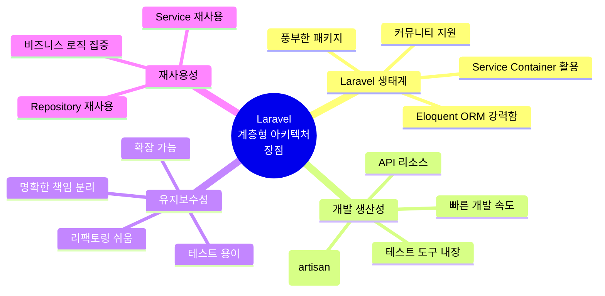

**✅ 주요 장점:**

1. **Laravel의 강력한 기능 활용**
   - Service Container로 자동 의존성 주입
   - Eloquent ORM으로 생산성 향상
   - Form Request로 깔끔한 검증
   - API Resource로 일관된 응답

2. **테스트 용이성**
   - Mock 객체 쉽게 생성
   - Repository 교체 가능
   - 각 계층 독립 테스트

3. **비즈니스 로직 분리**
   - Controller가 얇아짐 (Thin Controllers)
   - Service에 로직 집중
   - 재사용 가능한 코드

4. **Eloquent와의 분리**
   - Repository 패턴으로 ORM 추상화
   - 나중에 다른 ORM으로 교체 가능
   - 테스트 시 DB 없이 가능

### 단점

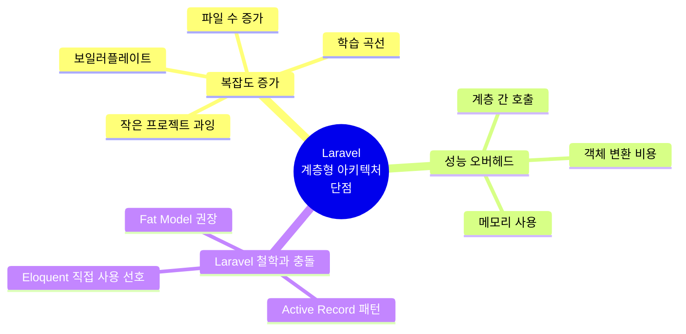

**❌ 주요 단점:**

1. **보일러플레이트 코드 증가**
   - Repository Interface + Implementation
   - Service 클래스
   - DTO/Resource 변환

2. **작은 프로젝트에 과잉**
   - CRUD 위주 앱에는 불필요
   - Laravel의 RAD (Rapid Application Development) 장점 감소

3. **Laravel 철학과 일부 충돌**
   - Laravel은 Active Record (Eloquent) 권장
   - "Fat Model, Skinny Controller" 철학과 다름
   - Repository가 Eloquent를 감싸는 것은 때로 불필요

4. **팀 컨벤션 필요**
   - 일관된 구조 유지 필요
   - 신규 개발자 온보딩 시간 증가

---

## 💼 사용 사례

### Laravel 계층형 아키텍처가 적합한 경우

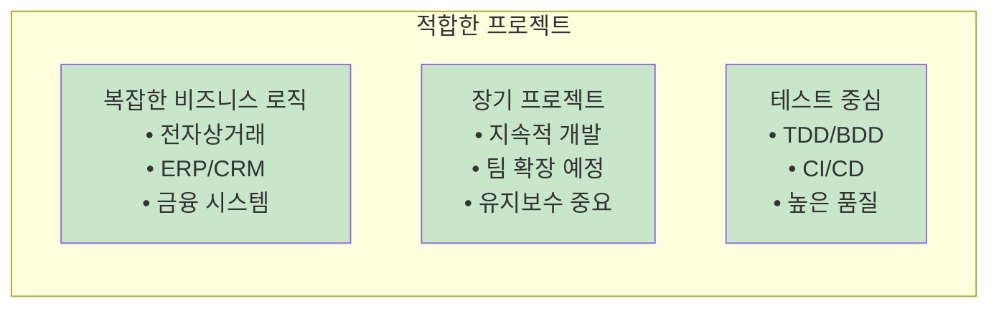

**✅ 적합한 경우:**

1. **복잡한 비즈니스 로직**
   - 다양한 비즈니스 규칙
   - 여러 엔티티 간 복잡한 관계
   - 트랜잭션 처리가 많은 경우

2. **대규모 팀 프로젝트**
   - 여러 개발자가 협업
   - 명확한 역할 분담 필요
   - 코드 리뷰가 중요

3. **API 중심 애플리케이션**
   - RESTful API
   - GraphQL API
   - 모바일 앱 백엔드

4. **테스트가 중요한 프로젝트**
   - TDD/BDD 개발
   - 높은 테스트 커버리지 요구
   - CI/CD 파이프라인

### Laravel 계층형 아키텍처가 부적합한 경우

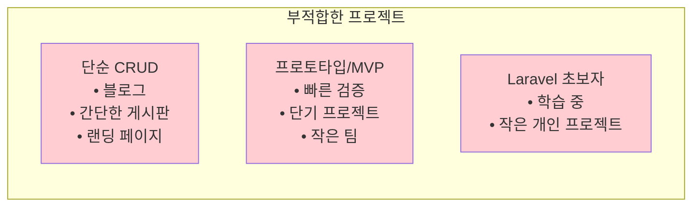

**❌ 부적합한 경우:**

1. **단순 CRUD 애플리케이션**
   - 블로그, 뉴스 사이트
   - 간단한 게시판
   - Eloquent만으로 충분

2. **프로토타입 또는 MVP**
   - 빠른 시장 검증
   - 자주 변경되는 요구사항
   - Laravel의 빠른 개발 속도 활용

3. **소규모 프로젝트**
   - 1-2명 개발
   - 단기 프로젝트
   - 유지보수 부담 적음

---

## 🔧 Laravel 구현 전략

### 1. Service Provider 설정

```php
// app/Providers/RepositoryServiceProvider.php
namespace App\Providers;

use Illuminate\Support\ServiceProvider;

class RepositoryServiceProvider extends ServiceProvider
{
    public array $bindings = [
        \App\Repositories\Contracts\ProductRepositoryInterface::class =>
            \App\Repositories\Eloquent\ProductRepository::class,

        \App\Repositories\Contracts\OrderRepositoryInterface::class =>
            \App\Repositories\Eloquent\OrderRepository::class,
    ];

    public function register(): void
    {
        // Singleton으로 바인딩이 필요한 경우
        $this->app->singleton(
            \App\Services\CacheService::class
        );
    }
}

// config/app.php에 등록
'providers' => [
    // ...
    App\Providers\RepositoryServiceProvider::class,
],
```

### 2. Artisan 명령어로 파일 생성

```bash
# Service 생성
php artisan make:service ProductService

# Repository Interface 생성
php artisan make:repository ProductRepository --interface

# Repository Implementation 생성
php artisan make:repository ProductRepository

# Action 생성
php artisan make:action CreateProductAction
```

**사용자 정의 Artisan 명령어 생성:**

```php
// app/Console/Commands/MakeServiceCommand.php
namespace App\Console\Commands;

use Illuminate\Console\GeneratorCommand;

class MakeServiceCommand extends GeneratorCommand
{
    protected $name = 'make:service';
    protected $description = 'Create a new service class';
    protected $type = 'Service';

    protected function getStub()
    {
        return __DIR__ . '/stubs/service.stub';
    }

    protected function getDefaultNamespace($rootNamespace)
    {
        return $rootNamespace . '\Services';
    }
}
```

### 3. Repository 패턴 구현

```php
// app/Repositories/Contracts/ProductRepositoryInterface.php
namespace App\Repositories\Contracts;

use App\Models\Product;
use Illuminate\Database\Eloquent\Collection;

interface ProductRepositoryInterface
{
    public function all(): Collection;
    public function find(int $id): ?Product;
    public function create(array $data): Product;
    public function update(Product $product, array $data): Product;
    public function delete(Product $product): bool;
    public function findByCategory(int $categoryId): Collection;
}

// app/Repositories/Eloquent/ProductRepository.php
namespace App\Repositories\Eloquent;

use App\Models\Product;
use App\Repositories\Contracts\ProductRepositoryInterface;
use Illuminate\Database\Eloquent\Collection;
use Illuminate\Support\Facades\Cache;

class ProductRepository implements ProductRepositoryInterface
{
    public function all(): Collection
    {
        return Cache::remember('products.all', 3600, function () {
            return Product::with('category')->get();
        });
    }

    public function find(int $id): ?Product
    {
        return Cache::remember("products.{$id}", 3600, function () use ($id) {
            return Product::with('category')->find($id);
        });
    }

    public function create(array $data): Product
    {
        $product = Product::create($data);
        Cache::forget('products.all');

        return $product;
    }

    public function update(Product $product, array $data): Product
    {
        $product->update($data);

        Cache::forget('products.all');
        Cache::forget("products.{$product->id}");

        return $product->fresh();
    }

    public function delete(Product $product): bool
    {
        Cache::forget('products.all');
        Cache::forget("products.{$product->id}");

        return $product->delete();
    }

    public function findByCategory(int $categoryId): Collection
    {
        return Product::where('category_id', $categoryId)->get();
    }
}
```

### 4. Service Layer 구현

```php
// app/Services/ProductService.php
namespace App\Services;

use App\Models\Product;
use App\Repositories\Contracts\ProductRepositoryInterface;
use App\Events\ProductCreated;
use Illuminate\Support\Facades\DB;
use Illuminate\Database\Eloquent\Collection;

class ProductService
{
    public function __construct(
        private ProductRepositoryInterface $productRepository
    ) {}

    public function getAllProducts(): Collection
    {
        return $this->productRepository->all();
    }

    public function getProduct(int $id): ?Product
    {
        return $this->productRepository->find($id);
    }

    public function createProduct(array $data): Product
    {
        return DB::transaction(function () use ($data) {
            // 비즈니스 규칙 검증
            $this->validateBusinessRules($data);

            // 상품 생성
            $product = $this->productRepository->create($data);

            // 이벤트 발행
            event(new ProductCreated($product));

            return $product;
        });
    }

    public function updateProduct(int $id, array $data): Product
    {
        $product = $this->getProduct($id);

        if (!$product) {
            throw new \Exception('Product not found');
        }

        return DB::transaction(function () use ($product, $data) {
            return $this->productRepository->update($product, $data);
        });
    }

    public function deleteProduct(int $id): bool
    {
        $product = $this->getProduct($id);

        if (!$product) {
            throw new \Exception('Product not found');
        }

        return $this->productRepository->delete($product);
    }

    private function validateBusinessRules(array $data): void
    {
        // 비즈니스 규칙 검증
        if ($data['price'] < 0) {
            throw new \Exception('Price cannot be negative');
        }
    }
}
```

### 5. Controller 구현 (Thin Controller)

```php
// app/Http/Controllers/Api/V1/ProductController.php
namespace App\Http\Controllers\Api\V1;

use App\Http\Controllers\Controller;
use App\Http\Requests\Product\StoreProductRequest;
use App\Http\Requests\Product\UpdateProductRequest;
use App\Http\Resources\ProductResource;
use App\Http\Resources\ProductCollection;
use App\Services\ProductService;
use Illuminate\Http\JsonResponse;

class ProductController extends Controller
{
    public function __construct(
        private ProductService $productService
    ) {}

    public function index(): ProductCollection
    {
        $products = $this->productService->getAllProducts();

        return new ProductCollection($products);
    }

    public function show(int $id): ProductResource
    {
        $product = $this->productService->getProduct($id);

        if (!$product) {
            abort(404, 'Product not found');
        }

        return new ProductResource($product);
    }

    public function store(StoreProductRequest $request): JsonResponse
    {
        $product = $this->productService->createProduct(
            $request->validated()
        );

        return (new ProductResource($product))
            ->response()
            ->setStatusCode(201);
    }

    public function update(UpdateProductRequest $request, int $id): ProductResource
    {
        $product = $this->productService->updateProduct(
            $id,
            $request->validated()
        );

        return new ProductResource($product);
    }

    public function destroy(int $id): JsonResponse
    {
        $this->productService->deleteProduct($id);

        return response()->json(null, 204);
    }
}
```

### 6. 계층별 테스트 전략

```php
// tests/Unit/Services/ProductServiceTest.php
namespace Tests\Unit\Services;

use Tests\TestCase;
use App\Services\ProductService;
use App\Repositories\Contracts\ProductRepositoryInterface;
use App\Models\Product;
use Mockery;

class ProductServiceTest extends TestCase
{
    public function test_can_create_product()
    {
        // Repository Mock 생성
        $repositoryMock = Mockery::mock(ProductRepositoryInterface::class);

        $productData = [
            'name' => 'Test Product',
            'price' => 1000,
            'stock' => 10,
        ];

        $product = new Product($productData);
        $product->id = 1;

        $repositoryMock->shouldReceive('create')
            ->once()
            ->with($productData)
            ->andReturn($product);

        // Service 생성 (Mock 주입)
        $service = new ProductService($repositoryMock);

        // 테스트 실행
        $result = $service->createProduct($productData);

        // 검증
        $this->assertEquals('Test Product', $result->name);
        $this->assertEquals(1000, $result->price);
    }
}

// tests/Feature/Api/ProductControllerTest.php
namespace Tests\Feature\Api;

use Tests\TestCase;
use App\Models\Product;
use App\Models\User;
use Laravel\Sanctum\Sanctum;

class ProductControllerTest extends TestCase
{
    public function test_can_list_products()
    {
        Product::factory()->count(3)->create();

        $response = $this->getJson('/api/v1/products');

        $response->assertStatus(200)
            ->assertJsonCount(3, 'data');
    }

    public function test_can_create_product()
    {
        $user = User::factory()->create();
        Sanctum::actingAs($user);

        $productData = [
            'name' => 'New Product',
            'price' => 2000,
            'stock' => 20,
        ];

        $response = $this->postJson('/api/v1/products', $productData);

        $response->assertStatus(201)
            ->assertJson([
                'data' => [
                    'name' => 'New Product',
                    'price' => 2000,
                ]
            ]);

        $this->assertDatabaseHas('products', $productData);
    }
}
```

---

## ⚠️ 안티패턴과 주의사항

### 1. Fat Controller (비대한 컨트롤러)

```php
// ❌ 잘못된 예 - Fat Controller
class ProductController extends Controller
{
    public function store(Request $request)
    {
        // 검증 로직
        $validated = $request->validate([...]);

        // 비즈니스 로직이 Controller에 있음
        if ($validated['price'] < 0) {
            return response()->json(['error' => 'Invalid price'], 400);
        }

        // 직접 Eloquent 사용
        $product = Product::create($validated);

        // 재고 업데이트
        Inventory::create([
            'product_id' => $product->id,
            'stock' => $validated['stock'],
        ]);

        // 이벤트 발행
        event(new ProductCreated($product));

        return new ProductResource($product);
    }
}

// ✅ 올바른 예 - Thin Controller
class ProductController extends Controller
{
    public function __construct(
        private ProductService $productService
    ) {}

    public function store(StoreProductRequest $request)
    {
        $product = $this->productService->createProduct(
            $request->validated()
        );

        return new ProductResource($product);
    }
}
```

### 2. Service에서 Eloquent Model 직접 사용

```php
// ❌ 잘못된 예
class ProductService
{
    public function getProducts()
    {
        // Service에서 직접 Eloquent 사용
        return Product::where('active', true)->get();
    }
}

// ✅ 올바른 예
class ProductService
{
    public function __construct(
        private ProductRepositoryInterface $productRepository
    ) {}

    public function getProducts()
    {
        return $this->productRepository->findActive();
    }
}
```

### 3. 불필요한 Repository 래핑

```php
// ❌ 잘못된 예 - 단순 위임만 하는 Repository
class ProductRepository implements ProductRepositoryInterface
{
    public function all()
    {
        return Product::all(); // 단순 위임만 함
    }

    public function find($id)
    {
        return Product::find($id); // 단순 위임만 함
    }
}

// ✅ 올바른 예 - 추가 로직이 있는 Repository
class ProductRepository implements ProductRepositoryInterface
{
    public function all()
    {
        // 캐싱 로직 추가
        return Cache::remember('products.all', 3600, function () {
            return Product::with('category')->active()->get();
        });
    }

    public function find($id)
    {
        // 관계 로딩 및 캐싱
        return Cache::remember("products.{$id}", 3600, function () use ($id) {
            return Product::with(['category', 'reviews'])->find($id);
        });
    }
}
```

### 4. 순환 의존성

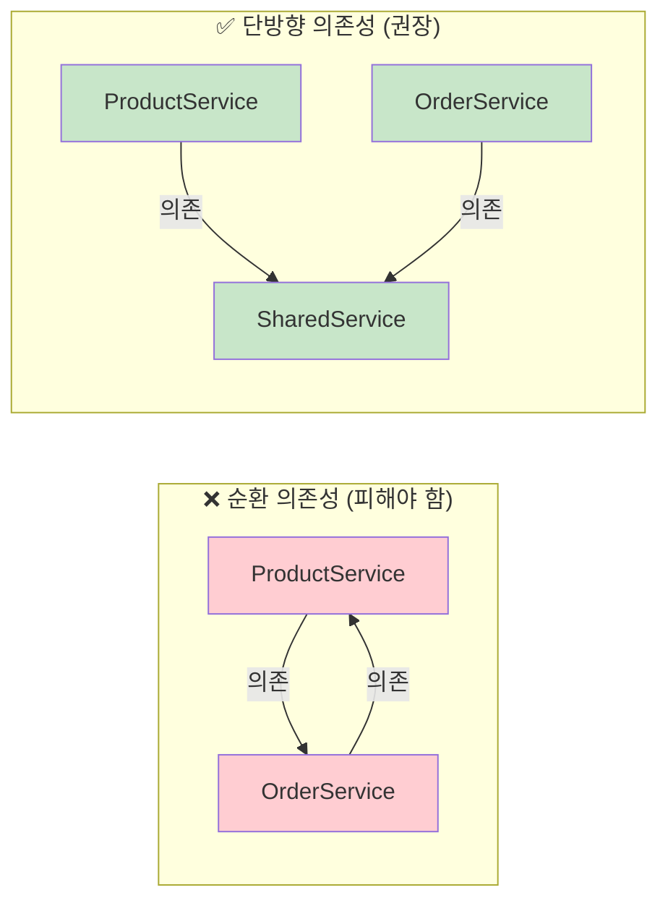

### 주의사항 체크리스트

```mermaid
graph TB
    subgraph "피해야 할 것"
        A1[❌ Controller에 비즈니스 로직]
        A2[❌ Service에서 Eloquent 직접 사용]
        A3[❌ Repository에서 비즈니스 규칙]
        A4[❌ 순환 의존성]
        A5[❌ God Service 생성]
    end

    subgraph "지켜야 할 것"
        B1[✅ Thin Controllers]
        B2[✅ Service Container 활용]
        B3[✅ Repository 추상화]
        B4[✅ 단방향 의존성]
        B5[✅ Single Responsibility]
    end

    style A1 fill:#ffcdd2
    style A2 fill:#ffcdd2
    style A3 fill:#ffcdd2
    style A4 fill:#ffcdd2
    style A5 fill:#ffcdd2

    style B1 fill:#c8e6c9
    style B2 fill:#c8e6c9
    style B3 fill:#c8e6c9
    style B4 fill:#c8e6c9
    style B5 fill:#c8e6c9
```

---

## 📚 참고 자료

### Laravel 공식 문서
- 🌐 [Laravel Service Container](https://laravel.com/docs/container)
- 🌐 [Laravel Service Providers](https://laravel.com/docs/providers)
- 🌐 [Laravel Eloquent ORM](https://laravel.com/docs/eloquent)
- 🌐 [Laravel Repository Pattern (Community)](https://github.com/andersao/l5-repository)

### 추천 도서
- 📕 **"Laravel: Up & Running"** - Matt Stauffer
- 📗 **"Domain-Driven Design with Laravel"** - Jesse Griffin
- 📘 **"Laravel Design Patterns and Best Practices"** - Arda Kılıçdağı
- 📙 **"Clean Architecture"** - Robert C. Martin

### 온라인 리소스
- 🌐 [Laravel Beyond CRUD](https://laravel-beyond-crud.com/) - Brent Roose
- 🌐 [Laracasts](https://laracasts.com/) - Laravel 튜토리얼
- 🌐 [Laravel Daily](https://laraveldaily.com/) - Laravel 팁과 트릭
- 🌐 [Spatie Guidelines](https://guidelines.spatie.be/code-style/laravel-php) - Laravel 코딩 표준

### 커뮤니티 패키지
- [spatie/laravel-query-builder](https://github.com/spatie/laravel-query-builder) - API 쿼리 빌더
- [spatie/laravel-fractal](https://github.com/spatie/laravel-fractal) - API Transformer
- [prettus/l5-repository](https://github.com/andersao/l5-repository) - Repository 패턴 구현

---

## 📊 요약

```mermaid
mindmap
  root((Laravel<br/>계층형 아키텍처<br/>핵심 요약))
    구조
      Presentation
        Controllers
        Requests
        Resources
      Business
        Services
        Actions
        Events
      Persistence
        Repositories
        Eloquent Models
    Laravel 활용
      Service Container
      Dependency Injection
      Eloquent ORM
      Form Requests
      API Resources
    원칙
      Thin Controllers
      Service 중심
      Repository 추상화
      단방향 의존성
    장점
      테스트 용이
      유지보수 쉬움
      확장 가능
      재사용성
    적용 시기
      복잡한 비즈니스
      장기 프로젝트
      대규모 팀
      테스트 중심
```

Laravel에서 계층형 아키텍처는 **비즈니스 로직이 복잡하고 장기적인 유지보수가 중요한 프로젝트**에 적합합니다. Laravel의 강력한 기능(Service Container, Eloquent, Form Request 등)을 활용하면서도 명확한 책임 분리를 통해 테스트 가능하고 유지보수하기 쉬운 코드를 작성할 수 있습니다.

다만, 단순 CRUD 애플리케이션이나 프로토타입에는 과도한 복잡성을 추가할 수 있으므로 프로젝트의 특성과 요구사항을 고려하여 적용해야 합니다.

---

**다음 단계:** [Laravel 폴더 구조 상세 가이드 보기](./php/README.md)
