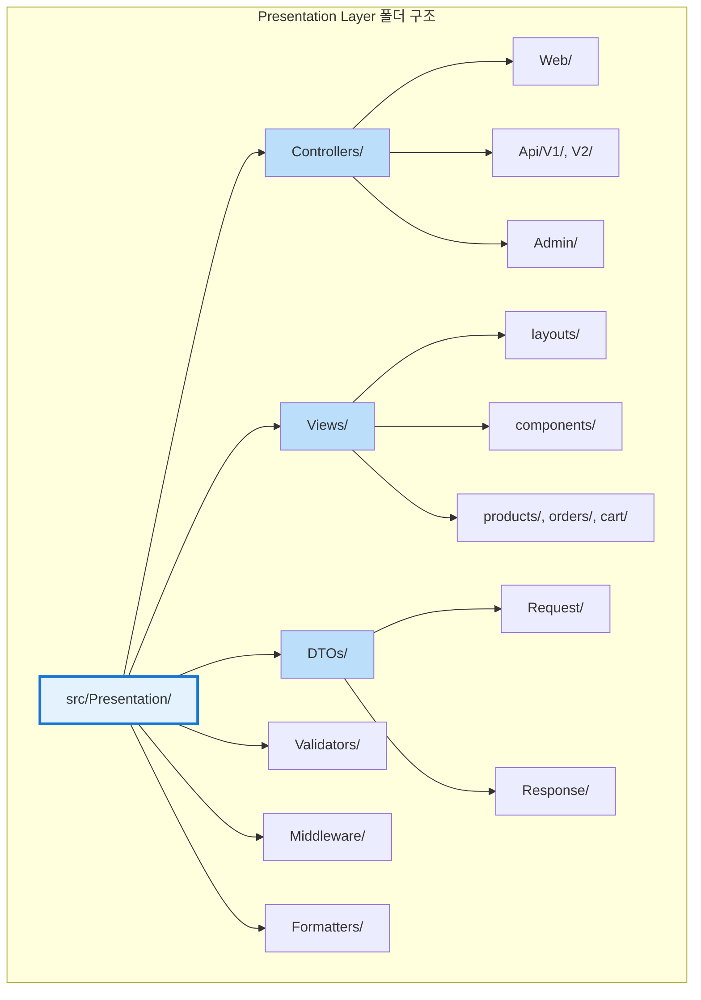
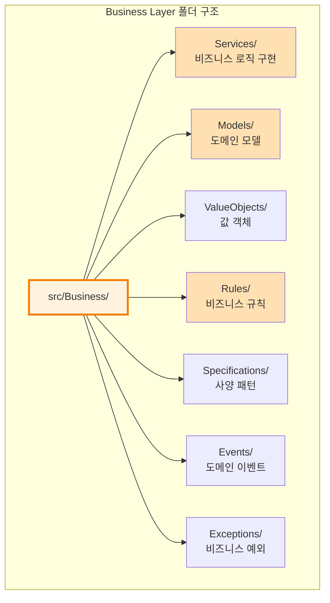
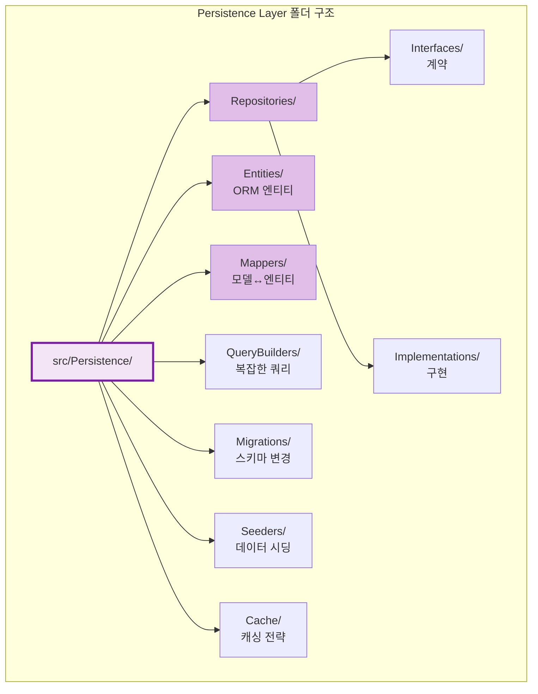
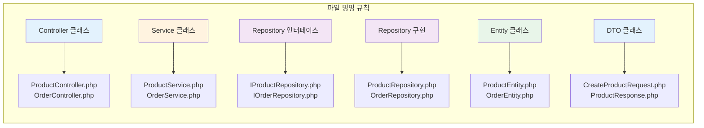
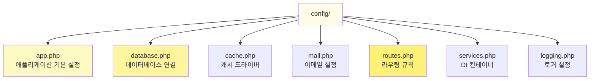
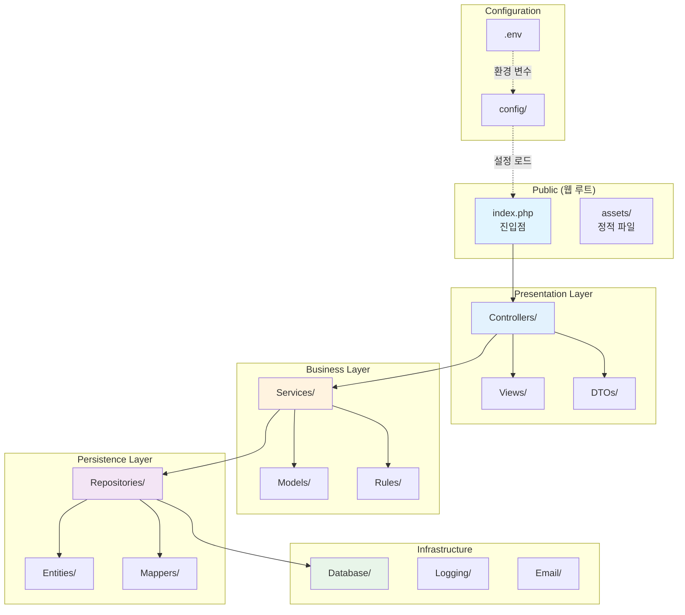

# PHP 계층형 아키텍처 - 폴더 구조 가이드

> PHP 프로젝트에서 계층형 아키텍처를 구현하기 위한 상세한 폴더 구조와 파일 조직 방법

---

## 📑 목차

1. [전체 폴더 구조](#-전체-폴더-구조)
2. [계층별 상세 구조](#-계층별-상세-구조)
3. [파일 명명 규칙](#-파일-명명-규칙)
4. [네임스페이스 구성](#-네임스페이스-구성)
5. [설정 파일 구조](#-설정-파일-구조)
6. [의존성 관리](#-의존성-관리)
7. [환경별 구성](#-환경별-구성)

---

## 🗂️ 전체 폴더 구조

### 완전한 프로젝트 구조

```
ecommerce-app/                          # 프로젝트 루트
│
├── public/                             # 웹 서버 Document Root
│   ├── index.php                      # 애플리케이션 진입점 (Front Controller)
│   ├── .htaccess                      # Apache 리라이트 규칙
│   │
│   ├── assets/                        # 정적 리소스
│   │   ├── css/
│   │   │   ├── app.css
│   │   │   └── admin.css
│   │   ├── js/
│   │   │   ├── app.js
│   │   │   └── validation.js
│   │   ├── images/
│   │   │   ├── logo.png
│   │   │   └── icons/
│   │   └── fonts/
│   │
│   └── uploads/                       # 사용자 업로드 파일
│       ├── products/
│       └── avatars/
│
├── src/                               # 애플리케이션 소스 코드
│   │
│   ├── Presentation/                  # 📱 프레젠테이션 계층
│   │   │
│   │   ├── Controllers/              # HTTP 요청 처리
│   │   │   ├── Web/                  # 웹 컨트롤러
│   │   │   │   ├── HomeController.php
│   │   │   │   ├── ProductController.php
│   │   │   │   ├── CartController.php
│   │   │   │   └── OrderController.php
│   │   │   │
│   │   │   ├── Api/                  # API 컨트롤러
│   │   │   │   ├── V1/
│   │   │   │   │   ├── ProductApiController.php
│   │   │   │   │   └── OrderApiController.php
│   │   │   │   └── V2/
│   │   │   │
│   │   │   └── Admin/                # 관리자 컨트롤러
│   │   │       ├── DashboardController.php
│   │   │       ├── ProductManagementController.php
│   │   │       └── OrderManagementController.php
│   │   │
│   │   ├── Views/                    # 뷰 템플릿 (Presentation Layer)
│   │   │   ├── layouts/              # 레이아웃 템플릿
│   │   │   │   ├── main.php
│   │   │   │   ├── admin.php
│   │   │   │   └── email.php
│   │   │   │
│   │   │   ├── components/           # 재사용 가능한 컴포넌트
│   │   │   │   ├── header.php
│   │   │   │   ├── footer.php
│   │   │   │   ├── pagination.php
│   │   │   │   └── breadcrumb.php
│   │   │   │
│   │   │   ├── products/             # 상품 관련 뷰
│   │   │   │   ├── index.php         # 상품 목록
│   │   │   │   ├── detail.php        # 상품 상세
│   │   │   │   └── search.php        # 상품 검색
│   │   │   │
│   │   │   ├── cart/                 # 장바구니 뷰
│   │   │   │   ├── index.php
│   │   │   │   └── checkout.php
│   │   │   │
│   │   │   ├── orders/               # 주문 관련 뷰
│   │   │   │   ├── list.php
│   │   │   │   ├── detail.php
│   │   │   │   └── confirmation.php
│   │   │   │
│   │   │   └── errors/               # 에러 페이지
│   │   │       ├── 404.php
│   │   │       ├── 500.php
│   │   │       └── maintenance.php
│   │   │
│   │   ├── DTOs/                     # 데이터 전송 객체
│   │   │   ├── Request/              # 요청 DTO
│   │   │   │   ├── CreateProductRequest.php
│   │   │   │   ├── UpdateProductRequest.php
│   │   │   │   ├── PlaceOrderRequest.php
│   │   │   │   └── SearchProductRequest.php
│   │   │   │
│   │   │   └── Response/             # 응답 DTO
│   │   │       ├── ProductResponse.php
│   │   │       ├── OrderResponse.php
│   │   │       ├── PaginatedResponse.php
│   │   │       └── ApiErrorResponse.php
│   │   │
│   │   ├── Validators/               # 입력 검증
│   │   │   ├── ProductValidator.php
│   │   │   ├── OrderValidator.php
│   │   │   ├── UserValidator.php
│   │   │   └── ValidationRule.php
│   │   │
│   │   ├── Middleware/               # HTTP 미들웨어
│   │   │   ├── AuthenticationMiddleware.php
│   │   │   ├── AuthorizationMiddleware.php
│   │   │   ├── CorsMiddleware.php
│   │   │   ├── RateLimitMiddleware.php
│   │   │   └── LoggingMiddleware.php
│   │   │
│   │   └── Formatters/               # 응답 포맷터
│   │       ├── JsonFormatter.php
│   │       ├── XmlFormatter.php
│   │       └── HtmlFormatter.php
│   │
│   ├── Business/                      # 💼 비즈니스 계층
│   │   │
│   │   ├── Services/                 # 비즈니스 서비스
│   │   │   ├── ProductService.php
│   │   │   ├── OrderService.php
│   │   │   ├── CartService.php
│   │   │   ├── PaymentService.php
│   │   │   ├── ShippingService.php
│   │   │   ├── NotificationService.php
│   │   │   └── InventoryService.php
│   │   │
│   │   ├── Models/                   # 도메인 모델 (비즈니스 엔티티)
│   │   │   ├── Product.php
│   │   │   ├── Order.php
│   │   │   ├── OrderItem.php
│   │   │   ├── Cart.php
│   │   │   ├── User.php
│   │   │   ├── Category.php
│   │   │   └── Payment.php
│   │   │
│   │   ├── ValueObjects/             # 값 객체 (불변 객체)
│   │   │   ├── Money.php
│   │   │   ├── Email.php
│   │   │   ├── Address.php
│   │   │   ├── PhoneNumber.php
│   │   │   └── ProductSku.php
│   │   │
│   │   ├── Rules/                    # 비즈니스 규칙
│   │   │   ├── PricingRule.php
│   │   │   ├── DiscountRule.php
│   │   │   ├── ShippingRule.php
│   │   │   ├── StockRule.php
│   │   │   └── PromotionRule.php
│   │   │
│   │   ├── Specifications/           # 사양 패턴 (비즈니스 조건)
│   │   │   ├── ProductSpecification.php
│   │   │   ├── OrderSpecification.php
│   │   │   └── UserSpecification.php
│   │   │
│   │   ├── Events/                   # 도메인 이벤트
│   │   │   ├── OrderPlacedEvent.php
│   │   │   ├── ProductStockChangedEvent.php
│   │   │   ├── PaymentProcessedEvent.php
│   │   │   └── UserRegisteredEvent.php
│   │   │
│   │   └── Exceptions/               # 비즈니스 예외
│   │       ├── InsufficientStockException.php
│   │       ├── InvalidOrderException.php
│   │       ├── PaymentFailedException.php
│   │       └── ProductNotFoundException.php
│   │
│   ├── Persistence/                   # 💾 영속성 계층
│   │   │
│   │   ├── Repositories/             # 리포지토리 인터페이스 및 구현
│   │   │   ├── Interfaces/           # 리포지토리 계약
│   │   │   │   ├── IProductRepository.php
│   │   │   │   ├── IOrderRepository.php
│   │   │   │   ├── IUserRepository.php
│   │   │   │   └── ICategoryRepository.php
│   │   │   │
│   │   │   └── Implementations/      # 실제 구현
│   │   │       ├── ProductRepository.php
│   │   │       ├── OrderRepository.php
│   │   │       ├── UserRepository.php
│   │   │       └── CategoryRepository.php
│   │   │
│   │   ├── Entities/                 # 데이터베이스 엔티티 (ORM 모델)
│   │   │   ├── ProductEntity.php
│   │   │   ├── OrderEntity.php
│   │   │   ├── OrderItemEntity.php
│   │   │   ├── UserEntity.php
│   │   │   └── CategoryEntity.php
│   │   │
│   │   ├── Mappers/                  # 도메인 모델 ↔ 엔티티 매핑
│   │   │   ├── ProductMapper.php
│   │   │   ├── OrderMapper.php
│   │   │   └── UserMapper.php
│   │   │
│   │   ├── QueryBuilders/            # 복잡한 쿼리 빌더
│   │   │   ├── ProductQueryBuilder.php
│   │   │   └── OrderQueryBuilder.php
│   │   │
│   │   ├── Migrations/               # 데이터베이스 마이그레이션
│   │   │   ├── 20250101_create_users_table.php
│   │   │   ├── 20250102_create_products_table.php
│   │   │   ├── 20250103_create_categories_table.php
│   │   │   ├── 20250104_create_orders_table.php
│   │   │   └── 20250105_create_order_items_table.php
│   │   │
│   │   ├── Seeders/                  # 데이터 시딩
│   │   │   ├── UserSeeder.php
│   │   │   ├── ProductSeeder.php
│   │   │   └── CategorySeeder.php
│   │   │
│   │   └── Cache/                    # 캐시 전략
│   │       ├── CacheManager.php
│   │       └── ProductCache.php
│   │
│   ├── Infrastructure/                # 🔧 인프라 계층 (선택적)
│   │   ├── Database/                 # 데이터베이스 연결
│   │   │   ├── Connection.php
│   │   │   ├── ConnectionPool.php
│   │   │   └── QueryLogger.php
│   │   │
│   │   ├── Logging/                  # 로깅
│   │   │   ├── Logger.php
│   │   │   └── FileLogger.php
│   │   │
│   │   ├── Email/                    # 이메일 전송
│   │   │   ├── EmailSender.php
│   │   │   └── SmtpEmailSender.php
│   │   │
│   │   ├── Payment/                  # 외부 결제 게이트웨이
│   │   │   ├── PaymentGateway.php
│   │   │   ├── StripeGateway.php
│   │   │   └── PaypalGateway.php
│   │   │
│   │   └── Storage/                  # 파일 저장소
│   │       ├── FileStorage.php
│   │       ├── LocalStorage.php
│   │       └── S3Storage.php
│   │
│   └── Shared/                        # 🔄 공유 유틸리티
│       ├── Helpers/                  # 헬퍼 함수
│       │   ├── StringHelper.php
│       │   ├── DateHelper.php
│       │   └── ArrayHelper.php
│       │
│       ├── Constants/                # 상수 정의
│       │   ├── OrderStatus.php
│       │   ├── PaymentStatus.php
│       │   └── UserRole.php
│       │
│       └── Traits/                   # 재사용 가능한 트레이트
│           ├── Timestampable.php
│           └── SoftDeletable.php
│
├── config/                            # ⚙️ 설정 파일
│   ├── app.php                       # 애플리케이션 설정
│   ├── database.php                  # 데이터베이스 설정
│   ├── cache.php                     # 캐시 설정
│   ├── mail.php                      # 이메일 설정
│   ├── routes.php                    # 라우팅 설정
│   ├── services.php                  # 서비스 컨테이너 설정
│   └── logging.php                   # 로깅 설정
│
├── tests/                             # 🧪 테스트
│   ├── Unit/                         # 단위 테스트
│   │   ├── Business/
│   │   │   ├── Services/
│   │   │   │   ├── ProductServiceTest.php
│   │   │   │   └── OrderServiceTest.php
│   │   │   └── Rules/
│   │   │       └── PricingRuleTest.php
│   │   │
│   │   └── Persistence/
│   │       └── Repositories/
│   │           └── ProductRepositoryTest.php
│   │
│   ├── Integration/                  # 통합 테스트
│   │   ├── Controllers/
│   │   │   └── ProductControllerTest.php
│   │   │
│   │   └── Repositories/
│   │       └── ProductRepositoryIntegrationTest.php
│   │
│   └── E2E/                          # E2E 테스트
│       └── OrderFlowTest.php
│
├── storage/                           # 📦 저장소
│   ├── logs/                         # 로그 파일
│   │   ├── app.log
│   │   ├── error.log
│   │   └── query.log
│   │
│   ├── cache/                        # 캐시 파일
│   ├── sessions/                     # 세션 파일
│   └── temp/                         # 임시 파일
│
├── vendor/                            # 📚 Composer 의존성
│
├── .env                              # 환경 변수 (Git 제외)
├── .env.example                      # 환경 변수 예시
├── .gitignore                        # Git 제외 목록
├── composer.json                     # Composer 설정
├── composer.lock                     # 의존성 잠금 파일
├── phpunit.xml                       # PHPUnit 설정
└── README.md                         # 프로젝트 문서
```

---

## 🎨 계층별 상세 구조

### 1. Presentation Layer 폴더 구조



**Controllers/** - 요청 라우팅별 분리
- `Web/` - 웹 페이지용 컨트롤러
- `Api/` - RESTful API 컨트롤러 (버전별 폴더)
- `Admin/` - 관리자 패널용 컨트롤러

**Views/** - 기능별 뷰 그룹화
- `layouts/` - 공통 레이아웃 (header, footer 포함)
- `components/` - 재사용 가능한 UI 컴포넌트
- 각 기능별 폴더 (products, orders 등)

**DTOs/** - 요청/응답 분리
- `Request/` - 입력 데이터 구조
- `Response/` - 출력 데이터 구조

---

### 2. Business Layer 폴더 구조



**Services/** - 핵심 비즈니스 로직
- 유스케이스별로 서비스 클래스 생성
- 트랜잭션 경계 관리
- 여러 리포지토리 조율

**Models/** - 도메인 모델
- 비즈니스 엔티티 (Product, Order, User 등)
- 비즈니스 메서드 포함
- 데이터베이스와 독립적

**ValueObjects/** - 불변 값 객체
- Money, Email, Address 등
- 비즈니스 개념 표현
- 불변성 보장

**Rules/** - 독립적인 비즈니스 규칙
- 가격 계산, 할인 정책
- 재사용 가능한 규칙
- 단위 테스트 용이

---

### 3. Persistence Layer 폴더 구조



**Repositories/** - 데이터 접근 추상화
- `Interfaces/` - 리포지토리 계약 (Business Layer가 의존)
- `Implementations/` - 실제 구현 (PDO, Eloquent 등)

**Entities/** - ORM 엔티티
- 데이터베이스 테이블과 매핑
- Doctrine, Eloquent 등 ORM 사용

**Mappers/** - 변환 로직
- 도메인 모델 ↔ 데이터베이스 엔티티
- 계층 간 데이터 변환

**Migrations/** - 스키마 버전 관리
- 시간 순 파일명 (YYYYMMDD_description.php)
- Up/Down 메서드

---

## 📝 파일 명명 규칙

### 클래스 파일 명명



### 규칙

1. **PascalCase 사용**
   - 모든 클래스 파일: `UserController.php`, `ProductService.php`

2. **접미사 사용**
   - Controller: `*Controller.php`
   - Service: `*Service.php`
   - Repository: `*Repository.php`
   - Entity: `*Entity.php`
   - DTO: `*Request.php`, `*Response.php`
   - Validator: `*Validator.php`
   - Exception: `*Exception.php`

3. **인터페이스 접두사**
   - `I` 또는 `Interface` 사용: `IProductRepository.php`

4. **뷰 파일**
   - snake_case 또는 kebab-case: `product_list.php`, `order-detail.php`

5. **마이그레이션**
   - 타임스탬프 + 설명: `20250101_create_users_table.php`

---

## 🏷️ 네임스페이스 구성

### 네임스페이스 계층 구조

```php
// 루트 네임스페이스: App

App\
├── Presentation\
│   ├── Controllers\
│   │   ├── Web\
│   │   ├── Api\V1\
│   │   └── Admin\
│   ├── DTOs\
│   │   ├── Request\
│   │   └── Response\
│   └── Validators\
│
├── Business\
│   ├── Services\
│   ├── Models\
│   ├── ValueObjects\
│   ├── Rules\
│   └── Exceptions\
│
├── Persistence\
│   ├── Repositories\
│   │   ├── Interfaces\
│   │   └── Implementations\
│   ├── Entities\
│   └── Mappers\
│
└── Infrastructure\
    ├── Database\
    ├── Logging\
    └── Email\
```

### Composer autoload 설정

```json
{
    "autoload": {
        "psr-4": {
            "App\\Presentation\\": "src/Presentation/",
            "App\\Business\\": "src/Business/",
            "App\\Persistence\\": "src/Persistence/",
            "App\\Infrastructure\\": "src/Infrastructure/",
            "App\\Shared\\": "src/Shared/"
        },
        "files": [
            "src/Shared/Helpers/helpers.php"
        ]
    },
    "autoload-dev": {
        "psr-4": {
            "Tests\\": "tests/"
        }
    }
}
```

### 네임스페이스 사용 예시

```php
<?php
// src/Presentation/Controllers/Web/ProductController.php
namespace App\Presentation\Controllers\Web;

use App\Business\Services\ProductService;
use App\Presentation\DTOs\Request\CreateProductRequest;
use App\Presentation\DTOs\Response\ProductResponse;

class ProductController
{
    private ProductService $productService;

    public function __construct(ProductService $productService)
    {
        $this->productService = $productService;
    }

    public function create(CreateProductRequest $request): ProductResponse
    {
        // ...
    }
}
```

```php
<?php
// src/Business/Services/ProductService.php
namespace App\Business\Services;

use App\Business\Models\Product;
use App\Persistence\Repositories\Interfaces\IProductRepository;
use App\Business\Exceptions\InvalidProductException;

class ProductService
{
    private IProductRepository $productRepository;

    public function __construct(IProductRepository $productRepository)
    {
        $this->productRepository = $productRepository;
    }

    public function createProduct(array $data): Product
    {
        // 비즈니스 로직
    }
}
```

```php
<?php
// src/Persistence/Repositories/Implementations/ProductRepository.php
namespace App\Persistence\Repositories\Implementations;

use App\Persistence\Repositories\Interfaces\IProductRepository;
use App\Business\Models\Product;
use App\Persistence\Entities\ProductEntity;
use App\Persistence\Mappers\ProductMapper;

class ProductRepository implements IProductRepository
{
    public function save(Product $product): void
    {
        $entity = ProductMapper::toEntity($product);
        // 저장 로직
    }

    public function findById(int $id): ?Product
    {
        // 조회 로직
    }
}
```

---

## ⚙️ 설정 파일 구조

### config/ 폴더



### 각 설정 파일의 역할

**app.php** - 애플리케이션 전역 설정
```php
return [
    'name' => env('APP_NAME', 'E-Commerce'),
    'env' => env('APP_ENV', 'production'),
    'debug' => env('APP_DEBUG', false),
    'url' => env('APP_URL', 'http://localhost'),
    'timezone' => 'Asia/Seoul',
    'locale' => 'ko',
];
```

**database.php** - 데이터베이스 연결 설정
```php
return [
    'default' => env('DB_CONNECTION', 'mysql'),
    'connections' => [
        'mysql' => [
            'driver' => 'mysql',
            'host' => env('DB_HOST', '127.0.0.1'),
            'port' => env('DB_PORT', '3306'),
            'database' => env('DB_DATABASE', 'ecommerce'),
            'username' => env('DB_USERNAME', 'root'),
            'password' => env('DB_PASSWORD', ''),
            'charset' => 'utf8mb4',
            'collation' => 'utf8mb4_unicode_ci',
        ],
    ],
];
```

**routes.php** - 라우팅 정의
```php
use App\Presentation\Controllers\Web\ProductController;
use App\Presentation\Controllers\Api\V1\ProductApiController;

return [
    // Web Routes
    ['GET', '/', [HomeController::class, 'index']],
    ['GET', '/products', [ProductController::class, 'index']],
    ['GET', '/products/{id}', [ProductController::class, 'show']],
    ['POST', '/products', [ProductController::class, 'store']],

    // API Routes
    ['GET', '/api/v1/products', [ProductApiController::class, 'index']],
    ['GET', '/api/v1/products/{id}', [ProductApiController::class, 'show']],
];
```

**services.php** - 의존성 주입 설정
```php
use App\Business\Services\ProductService;
use App\Persistence\Repositories\Interfaces\IProductRepository;
use App\Persistence\Repositories\Implementations\ProductRepository;

return [
    // Repository Bindings
    IProductRepository::class => ProductRepository::class,
    IOrderRepository::class => OrderRepository::class,

    // Service Bindings
    ProductService::class => function ($container) {
        return new ProductService(
            $container->get(IProductRepository::class)
        );
    },
];
```

---

## 📦 의존성 관리

### composer.json 예시

```json
{
    "name": "company/ecommerce-app",
    "description": "E-Commerce Application with Layered Architecture",
    "type": "project",
    "require": {
        "php": "^8.1",
        "ext-pdo": "*",
        "ext-json": "*",
        "vlucas/phpdotenv": "^5.5",
        "symfony/http-foundation": "^6.0",
        "doctrine/orm": "^2.14",
        "monolog/monolog": "^3.0"
    },
    "require-dev": {
        "phpunit/phpunit": "^10.0",
        "mockery/mockery": "^1.5",
        "phpstan/phpstan": "^1.10"
    },
    "autoload": {
        "psr-4": {
            "App\\Presentation\\": "src/Presentation/",
            "App\\Business\\": "src/Business/",
            "App\\Persistence\\": "src/Persistence/",
            "App\\Infrastructure\\": "src/Infrastructure/",
            "App\\Shared\\": "src/Shared/"
        },
        "files": [
            "src/Shared/Helpers/helpers.php"
        ]
    },
    "autoload-dev": {
        "psr-4": {
            "Tests\\": "tests/"
        }
    },
    "scripts": {
        "test": "phpunit",
        "analyse": "phpstan analyse src",
        "migrate": "php bin/migrate.php"
    }
}
```

---

## 🌍 환경별 구성

### .env 파일 구조

```bash
# .env (개발 환경)

# Application
APP_NAME="E-Commerce App"
APP_ENV=development
APP_DEBUG=true
APP_URL=http://localhost:8000

# Database
DB_CONNECTION=mysql
DB_HOST=127.0.0.1
DB_PORT=3306
DB_DATABASE=ecommerce_dev
DB_USERNAME=root
DB_PASSWORD=secret

# Cache
CACHE_DRIVER=file
CACHE_PREFIX=ecommerce

# Session
SESSION_DRIVER=file
SESSION_LIFETIME=120

# Mail
MAIL_DRIVER=smtp
MAIL_HOST=smtp.mailtrap.io
MAIL_PORT=2525
MAIL_USERNAME=null
MAIL_PASSWORD=null

# Logging
LOG_CHANNEL=daily
LOG_LEVEL=debug
```

### 환경별 폴더 분리 (선택적)

```
config/
├── app.php              # 공통 설정
├── database.php         # 공통 DB 설정
│
└── environments/        # 환경별 오버라이드
    ├── development.php  # 개발 환경
    ├── staging.php      # 스테이징 환경
    └── production.php   # 운영 환경
```

---

## 📊 폴더 구조 다이어그램

### 계층별 의존성 흐름



---

## 📋 요약

이 폴더 구조는 다음 원칙을 따릅니다:

1. **계층별 명확한 분리** - 각 계층이 독립적인 폴더에 위치
2. **기능별 그룹화** - 관련 파일들을 기능 단위로 조직
3. **확장 가능성** - 새로운 기능 추가 시 일관된 패턴 적용
4. **테스트 용이성** - 각 계층을 독립적으로 테스트 가능
5. **PSR-4 준수** - PHP 표준 오토로딩 규칙 준수

이 구조를 프로젝트 규모와 팀 상황에 맞게 조정하여 사용하시기 바랍니다.
