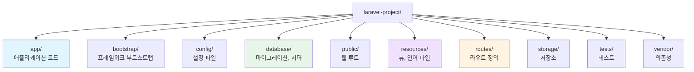
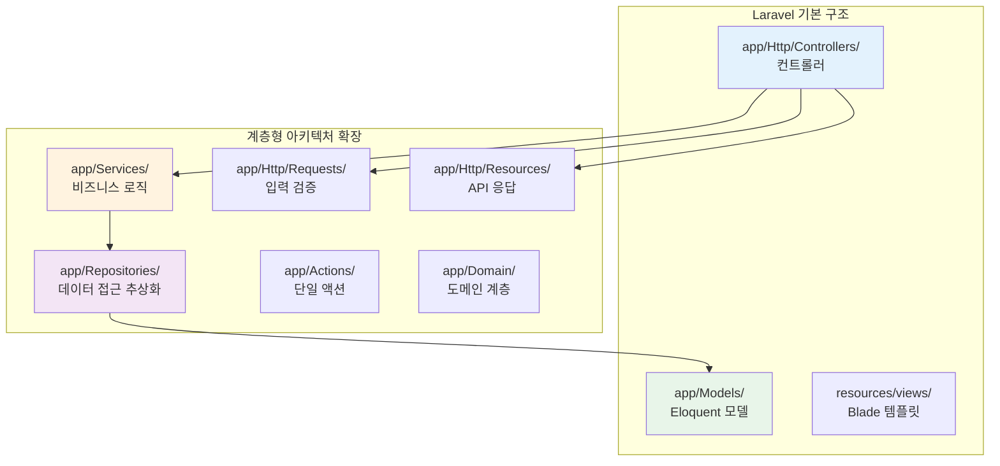
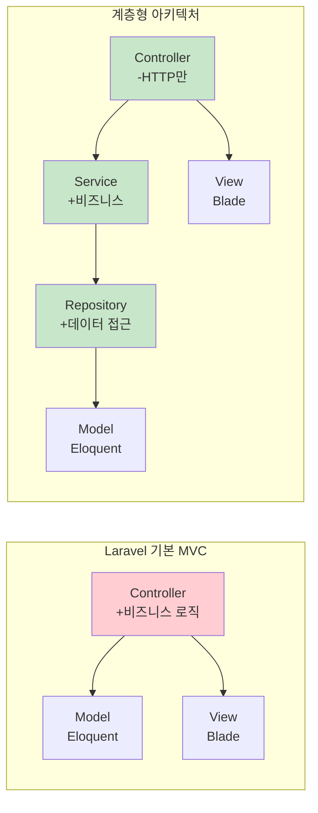
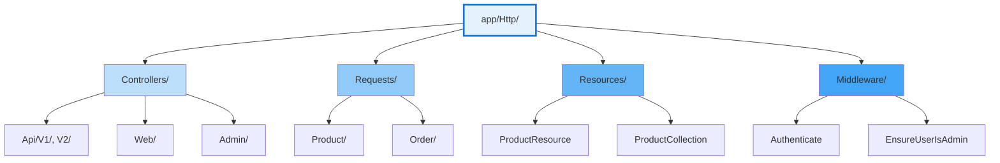
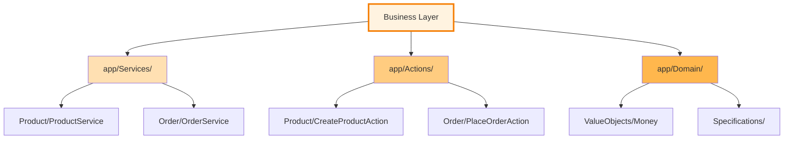
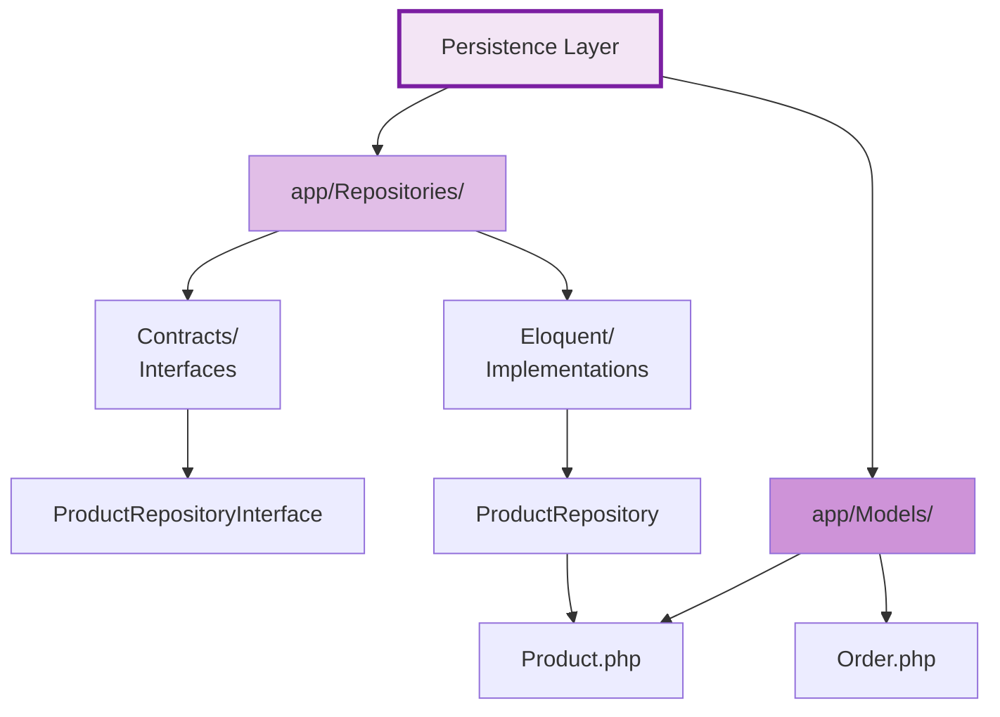
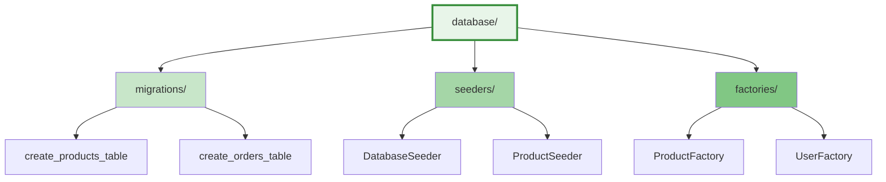
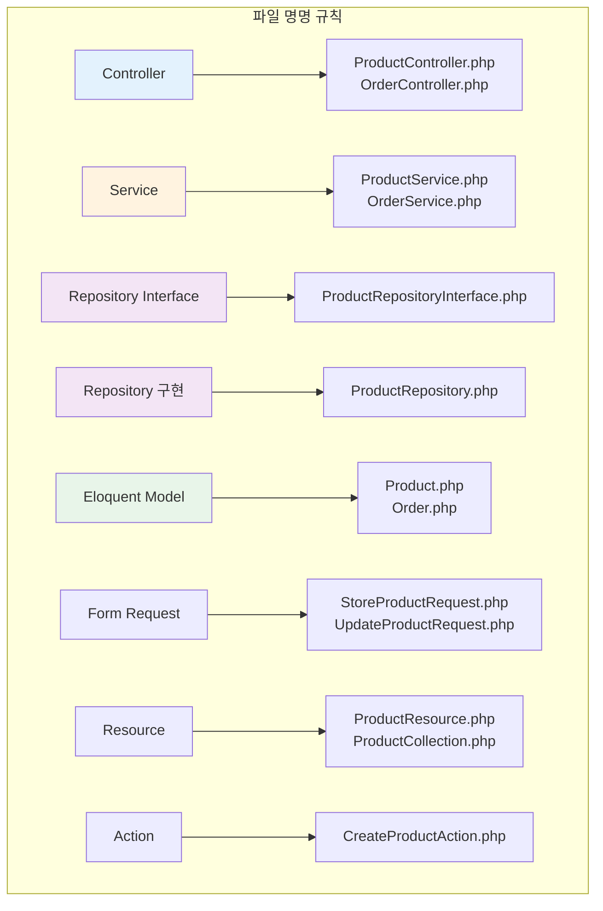
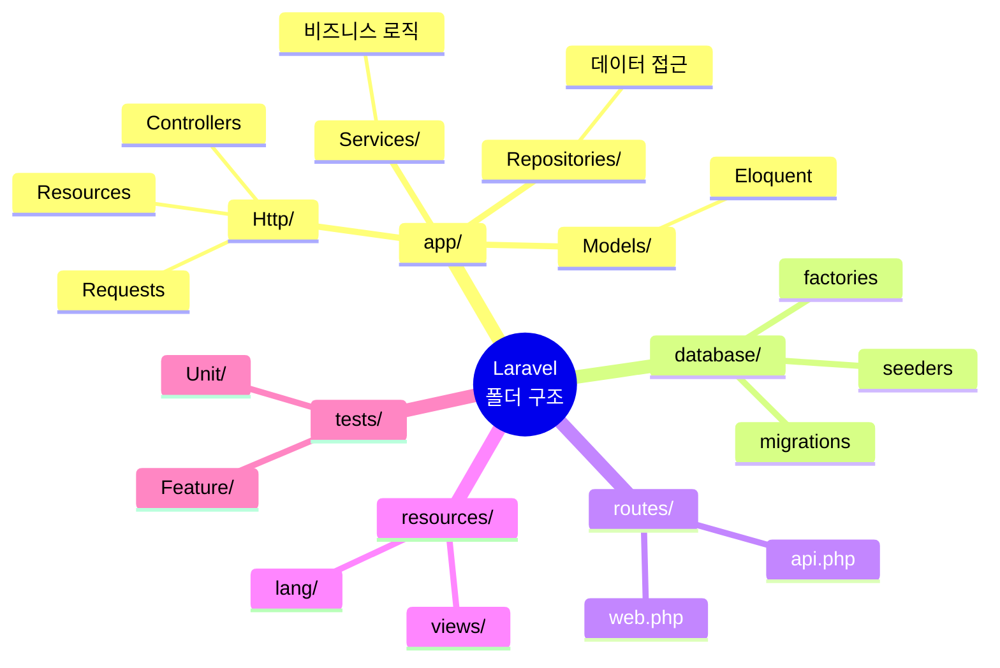

# Laravel 계층형 아키텍처 - 폴더 구조 완전 가이드

> Laravel 프레임워크에서 계층형 아키텍처를 구현하기 위한 상세한 폴더 구조와 파일 조직 방법

---

## 📑 목차

1. [Laravel 기본 구조](#-laravel-기본-구조)
2. [계층형 아키텍처 적용](#-계층형-아키텍처-적용)
3. [전체 폴더 구조](#-전체-폴더-구조)
4. [계층별 상세 구조](#-계층별-상세-구조)
5. [파일 명명 규칙](#-파일-명명-규칙)
6. [네임스페이스 구성](#-네임스페이스-구성)
7. [Artisan 명령어 활용](#-artisan-명령어-활용)
8. [설정 및 환경](#-설정-및-환경)

---

## 🏗️ Laravel 기본 구조

### Laravel의 기본 폴더 구조



### 계층형 아키텍처를 위한 확장



---

## 🎯 계층형 아키텍처 적용

### Laravel 표준 vs 계층형 아키텍처

| 계층 | Laravel 기본 | 계층형 아키텍처 확장 |
|------|--------------|---------------------|
| **Presentation** | Controllers, Views | Controllers, Requests, Resources, Middleware |
| **Business** | Controller 내부 | Services, Actions, Domain Models, Events |
| **Persistence** | Eloquent Models | Repositories, Eloquent Models, Mappers |
| **Database** | Migrations, Seeders | Migrations, Seeders, Factories |



---

## 📁 전체 폴더 구조

### 전자상거래 프로젝트 예시

```
laravel-ecommerce/
│
├── app/
│   │
│   ├── Console/                         # Artisan 명령어
│   │   ├── Commands/
│   │   │   ├── MakeServiceCommand.php
│   │   │   ├── MakeRepositoryCommand.php
│   │   │   └── MakeActionCommand.php
│   │   └── Kernel.php
│   │
│   ├── Exceptions/                      # 예외 처리
│   │   └── Handler.php
│   │
│   ├── Http/                            # 🎨 Presentation Layer
│   │   │
│   │   ├── Controllers/                # 컨트롤러
│   │   │   │
│   │   │   ├── Api/                    # API 컨트롤러
│   │   │   │   ├── V1/
│   │   │   │   │   ├── Auth/
│   │   │   │   │   │   ├── LoginController.php
│   │   │   │   │   │   ├── RegisterController.php
│   │   │   │   │   │   └── LogoutController.php
│   │   │   │   │   │
│   │   │   │   │   ├── ProductController.php
│   │   │   │   │   ├── CategoryController.php
│   │   │   │   │   ├── CartController.php
│   │   │   │   │   ├── OrderController.php
│   │   │   │   │   └── UserController.php
│   │   │   │   │
│   │   │   │   └── V2/                # API v2
│   │   │   │       └── ProductController.php
│   │   │   │
│   │   │   ├── Web/                    # 웹 컨트롤러
│   │   │   │   ├── HomeController.php
│   │   │   │   ├── ProductController.php
│   │   │   │   ├── CartController.php
│   │   │   │   ├── CheckoutController.php
│   │   │   │   └── OrderController.php
│   │   │   │
│   │   │   └── Admin/                  # 관리자 컨트롤러
│   │   │       ├── DashboardController.php
│   │   │       ├── ProductController.php
│   │   │       ├── OrderController.php
│   │   │       ├── CategoryController.php
│   │   │       └── UserController.php
│   │   │
│   │   ├── Middleware/                 # 미들웨어
│   │   │   ├── Authenticate.php
│   │   │   ├── EnsureUserIsAdmin.php
│   │   │   ├── CheckCartOwnership.php
│   │   │   ├── LogApiRequests.php
│   │   │   └── ThrottleRequests.php
│   │   │
│   │   ├── Requests/                   # Form Requests (입력 검증)
│   │   │   │
│   │   │   ├── Auth/
│   │   │   │   ├── LoginRequest.php
│   │   │   │   └── RegisterRequest.php
│   │   │   │
│   │   │   ├── Product/
│   │   │   │   ├── StoreProductRequest.php
│   │   │   │   ├── UpdateProductRequest.php
│   │   │   │   └── SearchProductRequest.php
│   │   │   │
│   │   │   ├── Order/
│   │   │   │   ├── PlaceOrderRequest.php
│   │   │   │   └── UpdateOrderRequest.php
│   │   │   │
│   │   │   └── Cart/
│   │   │       ├── AddItemRequest.php
│   │   │       └── UpdateItemRequest.php
│   │   │
│   │   ├── Resources/                  # API Resources (응답 변환)
│   │   │   │
│   │   │   ├── ProductResource.php
│   │   │   ├── ProductCollection.php
│   │   │   ├── CategoryResource.php
│   │   │   ├── OrderResource.php
│   │   │   ├── OrderItemResource.php
│   │   │   ├── CartResource.php
│   │   │   ├── UserResource.php
│   │   │   └── PaginatedResourceResponse.php
│   │   │
│   │   └── Kernel.php
│   │
│   ├── Services/                        # 💼 Business Layer - 서비스
│   │   │
│   │   ├── Auth/
│   │   │   ├── AuthService.php
│   │   │   └── TokenService.php
│   │   │
│   │   ├── Product/
│   │   │   ├── ProductService.php
│   │   │   └── ProductSearchService.php
│   │   │
│   │   ├── Order/
│   │   │   ├── OrderService.php
│   │   │   └── OrderCancellationService.php
│   │   │
│   │   ├── Cart/
│   │   │   └── CartService.php
│   │   │
│   │   ├── Payment/
│   │   │   ├── PaymentService.php
│   │   │   └── PaymentGatewayService.php
│   │   │
│   │   ├── Notification/
│   │   │   ├── NotificationService.php
│   │   │   ├── EmailNotificationService.php
│   │   │   └── SmsNotificationService.php
│   │   │
│   │   └── Inventory/
│   │       └── InventoryService.php
│   │
│   ├── Actions/                         # 💼 Business Layer - 단일 액션
│   │   │
│   │   ├── Product/
│   │   │   ├── CreateProductAction.php
│   │   │   ├── UpdateProductAction.php
│   │   │   ├── DeleteProductAction.php
│   │   │   └── UpdateProductStockAction.php
│   │   │
│   │   ├── Order/
│   │   │   ├── PlaceOrderAction.php
│   │   │   ├── CancelOrderAction.php
│   │   │   ├── ProcessPaymentAction.php
│   │   │   └── ShipOrderAction.php
│   │   │
│   │   └── Cart/
│   │       ├── AddToCartAction.php
│   │       ├── RemoveFromCartAction.php
│   │       └── ClearCartAction.php
│   │
│   ├── Repositories/                    # 💾 Persistence Layer - 리포지토리
│   │   │
│   │   ├── Contracts/                  # Repository 인터페이스
│   │   │   ├── ProductRepositoryInterface.php
│   │   │   ├── CategoryRepositoryInterface.php
│   │   │   ├── OrderRepositoryInterface.php
│   │   │   ├── OrderItemRepositoryInterface.php
│   │   │   ├── UserRepositoryInterface.php
│   │   │   ├── CartRepositoryInterface.php
│   │   │   └── PaymentRepositoryInterface.php
│   │   │
│   │   └── Eloquent/                   # Repository 구현체
│   │       ├── ProductRepository.php
│   │       ├── CategoryRepository.php
│   │       ├── OrderRepository.php
│   │       ├── OrderItemRepository.php
│   │       ├── UserRepository.php
│   │       ├── CartRepository.php
│   │       └── PaymentRepository.php
│   │
│   ├── Models/                          # 💾 Eloquent Models
│   │   ├── Product.php
│   │   ├── Category.php
│   │   ├── Order.php
│   │   ├── OrderItem.php
│   │   ├── User.php
│   │   ├── Cart.php
│   │   ├── CartItem.php
│   │   ├── Payment.php
│   │   ├── Address.php
│   │   └── Review.php
│   │
│   ├── Domain/                          # 🎯 Domain Layer (선택적 - DDD 적용 시)
│   │   │
│   │   ├── Models/                     # 도메인 모델 (Eloquent와 분리)
│   │   │   ├── Product.php
│   │   │   ├── Order.php
│   │   │   └── Cart.php
│   │   │
│   │   ├── ValueObjects/               # 값 객체
│   │   │   ├── Money.php
│   │   │   ├── Price.php
│   │   │   ├── Email.php
│   │   │   ├── PhoneNumber.php
│   │   │   ├── Address.php
│   │   │   ├── ProductSku.php
│   │   │   └── OrderNumber.php
│   │   │
│   │   ├── Aggregates/                 # 애그리게잇 루트
│   │   │   ├── OrderAggregate.php
│   │   │   └── CartAggregate.php
│   │   │
│   │   ├── Specifications/             # 사양 패턴
│   │   │   ├── ProductSpecification.php
│   │   │   ├── AvailableProductSpec.php
│   │   │   └── InStockSpec.php
│   │   │
│   │   └── Exceptions/                 # 도메인 예외
│   │       ├── InsufficientStockException.php
│   │       ├── InvalidPriceException.php
│   │       ├── OrderNotFoundException.php
│   │       └── PaymentFailedException.php
│   │
│   ├── Rules/                           # 💼 비즈니스 규칙 (Validation Rules)
│   │   ├── UniqueSku.php
│   │   ├── ValidStock.php
│   │   ├── ValidPrice.php
│   │   └── ValidCoupon.php
│   │
│   ├── Policies/                        # 🔒 권한 정책
│   │   ├── ProductPolicy.php
│   │   ├── OrderPolicy.php
│   │   ├── CartPolicy.php
│   │   └── UserPolicy.php
│   │
│   ├── Events/                          # 📢 이벤트
│   │   ├── Product/
│   │   │   ├── ProductCreated.php
│   │   │   ├── ProductUpdated.php
│   │   │   └── ProductStockChanged.php
│   │   │
│   │   ├── Order/
│   │   │   ├── OrderPlaced.php
│   │   │   ├── OrderPaid.php
│   │   │   ├── OrderShipped.php
│   │   │   └── OrderCancelled.php
│   │   │
│   │   └── User/
│   │       ├── UserRegistered.php
│   │       └── UserLoggedIn.php
│   │
│   ├── Listeners/                       # 👂 이벤트 리스너
│   │   ├── Order/
│   │   │   ├── SendOrderConfirmationEmail.php
│   │   │   ├── UpdateProductStock.php
│   │   │   ├── CreateInvoice.php
│   │   │   └── NotifyAdmin.php
│   │   │
│   │   └── User/
│   │       └── SendWelcomeEmail.php
│   │
│   ├── Observers/                       # 👀 Model Observers
│   │   ├── ProductObserver.php
│   │   ├── OrderObserver.php
│   │   └── UserObserver.php
│   │
│   ├── Notifications/                   # 📧 알림
│   │   ├── OrderConfirmation.php
│   │   ├── PaymentReceived.php
│   │   ├── OrderShipped.php
│   │   └── WelcomeEmail.php
│   │
│   ├── Jobs/                            # ⚙️ 큐 작업
│   │   ├── ProcessOrderPayment.php
│   │   ├── SendOrderNotification.php
│   │   ├── UpdateInventory.php
│   │   └── GenerateInvoice.php
│   │
│   ├── Mail/                            # 📬 메일 클래스
│   │   ├── OrderConfirmation.php
│   │   ├── OrderShipped.php
│   │   └── WelcomeEmail.php
│   │
│   ├── Providers/                       # 🔧 서비스 프로바이더
│   │   ├── AppServiceProvider.php
│   │   ├── AuthServiceProvider.php
│   │   ├── EventServiceProvider.php
│   │   ├── RouteServiceProvider.php
│   │   ├── RepositoryServiceProvider.php   # Repository 바인딩
│   │   └── ObserverServiceProvider.php     # Observer 등록
│   │
│   ├── Traits/                          # 🔄 재사용 가능한 트레이트
│   │   ├── HasUuid.php
│   │   ├── Sluggable.php
│   │   ├── Searchable.php
│   │   └── Cacheable.php
│   │
│   └── Helpers/                         # 🛠️ 헬퍼 함수
│       └── helpers.php
│
├── bootstrap/
│   ├── app.php
│   └── cache/
│
├── config/                              # ⚙️ 설정 파일
│   ├── app.php                         # 애플리케이션 설정
│   ├── auth.php                        # 인증 설정
│   ├── cache.php                       # 캐시 설정
│   ├── database.php                    # 데이터베이스 설정
│   ├── mail.php                        # 이메일 설정
│   ├── queue.php                       # 큐 설정
│   ├── services.php                    # 외부 서비스 설정
│   ├── sanctum.php                     # API 토큰 설정
│   └── logging.php                     # 로깅 설정
│
├── database/                            # 🗄️ 데이터베이스
│   │
│   ├── migrations/                     # 마이그레이션
│   │   ├── 2024_01_01_000000_create_users_table.php
│   │   ├── 2024_01_02_000000_create_categories_table.php
│   │   ├── 2024_01_03_000000_create_products_table.php
│   │   ├── 2024_01_04_000000_create_orders_table.php
│   │   ├── 2024_01_05_000000_create_order_items_table.php
│   │   ├── 2024_01_06_000000_create_carts_table.php
│   │   ├── 2024_01_07_000000_create_cart_items_table.php
│   │   └── 2024_01_08_000000_create_payments_table.php
│   │
│   ├── seeders/                        # 시더
│   │   ├── DatabaseSeeder.php
│   │   ├── UserSeeder.php
│   │   ├── CategorySeeder.php
│   │   ├── ProductSeeder.php
│   │   └── TestDataSeeder.php
│   │
│   └── factories/                      # 팩토리
│       ├── UserFactory.php
│       ├── ProductFactory.php
│       ├── CategoryFactory.php
│       ├── OrderFactory.php
│       └── ReviewFactory.php
│
├── public/                              # 🌐 웹 루트 (Document Root)
│   ├── index.php                       # 진입점
│   ├── .htaccess
│   │
│   ├── css/
│   │   └── app.css
│   │
│   ├── js/
│   │   └── app.js
│   │
│   └── images/
│       └── logo.png
│
├── resources/                           # 📦 리소스
│   │
│   ├── views/                          # Blade 템플릿
│   │   │
│   │   ├── layouts/                    # 레이아웃
│   │   │   ├── app.blade.php
│   │   │   ├── admin.blade.php
│   │   │   └── guest.blade.php
│   │   │
│   │   ├── components/                 # Blade 컴포넌트
│   │   │   ├── alert.blade.php
│   │   │   ├── button.blade.php
│   │   │   ├── card.blade.php
│   │   │   ├── modal.blade.php
│   │   │   └── pagination.blade.php
│   │   │
│   │   ├── auth/                       # 인증 관련 뷰
│   │   │   ├── login.blade.php
│   │   │   ├── register.blade.php
│   │   │   └── forgot-password.blade.php
│   │   │
│   │   ├── products/                   # 상품 관련 뷰
│   │   │   ├── index.blade.php
│   │   │   ├── show.blade.php
│   │   │   ├── create.blade.php
│   │   │   └── edit.blade.php
│   │   │
│   │   ├── cart/                       # 장바구니 뷰
│   │   │   ├── index.blade.php
│   │   │   └── checkout.blade.php
│   │   │
│   │   ├── orders/                     # 주문 관련 뷰
│   │   │   ├── index.blade.php
│   │   │   ├── show.blade.php
│   │   │   └── confirmation.blade.php
│   │   │
│   │   ├── admin/                      # 관리자 뷰
│   │   │   ├── dashboard.blade.php
│   │   │   ├── products/
│   │   │   ├── orders/
│   │   │   └── users/
│   │   │
│   │   └── emails/                     # 이메일 템플릿
│   │       ├── order-confirmation.blade.php
│   │       ├── order-shipped.blade.php
│   │       └── welcome.blade.php
│   │
│   ├── css/
│   │   └── app.css
│   │
│   ├── js/
│   │   ├── app.js
│   │   └── bootstrap.js
│   │
│   └── lang/                           # 다국어
│       ├── en/
│       │   ├── auth.php
│       │   ├── pagination.php
│       │   └── validation.php
│       │
│       └── ko/
│           ├── auth.php
│           ├── pagination.php
│           └── validation.php
│
├── routes/                              # 🛣️ 라우트
│   ├── web.php                         # 웹 라우트
│   ├── api.php                         # API 라우트
│   ├── console.php                     # Artisan 명령어 라우트
│   └── channels.php                    # 브로드캐스트 채널
│
├── storage/                             # 📦 저장소
│   ├── app/
│   │   ├── public/                     # 공개 저장소
│   │   └── private/                    # 비공개 저장소
│   │
│   ├── framework/
│   │   ├── cache/
│   │   ├── sessions/
│   │   ├── testing/
│   │   └── views/
│   │
│   └── logs/                           # 로그 파일
│       ├── laravel.log
│       └── api.log
│
├── tests/                               # 🧪 테스트
│   │
│   ├── Feature/                        # 기능 테스트
│   │   ├── Api/
│   │   │   ├── Auth/
│   │   │   │   ├── LoginTest.php
│   │   │   │   └── RegisterTest.php
│   │   │   │
│   │   │   ├── ProductControllerTest.php
│   │   │   ├── OrderControllerTest.php
│   │   │   └── CartControllerTest.php
│   │   │
│   │   └── Web/
│   │       ├── ProductControllerTest.php
│   │       └── CheckoutTest.php
│   │
│   ├── Unit/                           # 단위 테스트
│   │   │
│   │   ├── Services/
│   │   │   ├── ProductServiceTest.php
│   │   │   ├── OrderServiceTest.php
│   │   │   └── CartServiceTest.php
│   │   │
│   │   ├── Repositories/
│   │   │   ├── ProductRepositoryTest.php
│   │   │   └── OrderRepositoryTest.php
│   │   │
│   │   ├── Actions/
│   │   │   └── PlaceOrderActionTest.php
│   │   │
│   │   └── Models/
│   │       ├── ProductTest.php
│   │       └── OrderTest.php
│   │
│   ├── Integration/                    # 통합 테스트
│   │   └── OrderFlowTest.php
│   │
│   └── TestCase.php
│
├── vendor/                              # 📚 Composer 의존성
│
├── .env                                # 환경 변수 (Git 제외)
├── .env.example                        # 환경 변수 예시
├── .gitignore
├── .editorconfig
├── artisan                             # Artisan CLI
├── composer.json                       # Composer 설정
├── composer.lock
├── package.json                        # NPM 설정
├── phpunit.xml                         # PHPUnit 설정
├── vite.config.js                      # Vite 설정
└── README.md
```

---

## 🎨 계층별 상세 구조

### 1. Presentation Layer (`app/Http/`)



**Controllers/** - HTTP 요청 처리
- `Api/V1/` - RESTful API v1
- `Api/V2/` - RESTful API v2 (버전 관리)
- `Web/` - 전통적인 웹 페이지
- `Admin/` - 관리자 패널

**Requests/** - 입력 검증
- Form Request 클래스
- `rules()` 메서드로 검증 규칙 정의
- `authorize()` 메서드로 권한 확인

**Resources/** - API 응답 변환
- `Resource` - 단일 엔티티 변환
- `Collection` - 여러 엔티티 변환
- `toArray()` 메서드로 JSON 구조 정의

**Middleware/** - HTTP 미들웨어
- 인증, 인가, 로깅, CORS 등

---

### 2. Business Layer (`app/Services/`, `app/Actions/`)



**Services/** - 비즈니스 로직 조율
- 복잡한 비즈니스 프로세스
- 여러 Repository 조합
- 트랜잭션 관리
- 이벤트 발행

**Actions/** - 단일 책임 액션
- 하나의 작업만 수행
- 재사용 가능
- 테스트 용이

**Domain/** - 도메인 계층 (선택적)
- DDD 적용 시 사용
- 순수한 도메인 로직
- ValueObjects, Specifications

---

### 3. Persistence Layer (`app/Repositories/`, `app/Models/`)



**Repositories/Contracts/** - Repository 인터페이스
- 데이터 접근 계약 정의
- Business Layer가 의존

**Repositories/Eloquent/** - Repository 구현체
- Eloquent ORM 사용
- 쿼리 로직 캡슐화
- 캐싱 전략 적용

**Models/** - Eloquent Models
- 데이터베이스 테이블 매핑
- Relationships 정의
- Accessors/Mutators
- Scopes

---

### 4. Database Layer (`database/`)



---

## 📝 파일 명명 규칙

### Laravel 컨벤션



### 규칙 상세

| 타입 | 명명 규칙 | 예시 |
|------|----------|------|
| **Controller** | `{Entity}Controller` | `ProductController.php` |
| **API Controller** | `{Entity}ApiController` 또는 `{Entity}Controller` | `Api/V1/ProductController.php` |
| **Service** | `{Entity}Service` | `ProductService.php` |
| **Action** | `{Verb}{Entity}Action` | `CreateProductAction.php` |
| **Repository Interface** | `{Entity}RepositoryInterface` | `ProductRepositoryInterface.php` |
| **Repository 구현** | `{Entity}Repository` | `ProductRepository.php` |
| **Eloquent Model** | `{Entity}` (단수형) | `Product.php`, `Order.php` |
| **Form Request** | `{Action}{Entity}Request` | `StoreProductRequest.php` |
| **API Resource** | `{Entity}Resource` | `ProductResource.php` |
| **Collection** | `{Entity}Collection` | `ProductCollection.php` |
| **Event** | `{Entity}{Action}` | `ProductCreated.php` |
| **Listener** | `{Action}{Description}` | `SendOrderConfirmation.php` |
| **Job** | `{Action}{Description}` | `ProcessOrderPayment.php` |
| **Middleware** | `{Description}` | `EnsureUserIsAdmin.php` |
| **Policy** | `{Entity}Policy` | `ProductPolicy.php` |
| **Migration** | `{action}_{table}_table` | `create_products_table.php` |

---

## 🏷️ 네임스페이스 구성

### Laravel 네임스페이스 구조

```php
// 기본 네임스페이스: App

App\                                    # 루트 네임스페이스
├── Http\                              # Presentation Layer
│   ├── Controllers\
│   │   ├── Api\V1\
│   │   ├── Web\
│   │   └── Admin\
│   ├── Requests\
│   ├── Resources\
│   └── Middleware\
│
├── Services\                          # Business Layer
│   ├── Product\
│   ├── Order\
│   └── Cart\
│
├── Actions\                           # Business Layer
│   ├── Product\
│   └── Order\
│
├── Repositories\                      # Persistence Layer
│   ├── Contracts\
│   └── Eloquent\
│
├── Models\                            # Eloquent Models
│
├── Domain\                            # Domain Layer
│   ├── Models\
│   ├── ValueObjects\
│   └── Specifications\
│
├── Events\
├── Listeners\
├── Jobs\
├── Mail\
└── Policies\
```

### 실제 네임스페이스 예시

```php
<?php
// app/Http/Controllers/Api/V1/ProductController.php
namespace App\Http\Controllers\Api\V1;

use App\Http\Controllers\Controller;
use App\Http\Requests\Product\StoreProductRequest;
use App\Http\Resources\ProductResource;
use App\Services\Product\ProductService;

class ProductController extends Controller
{
    public function __construct(
        private ProductService $productService
    ) {}
}

// app/Services/Product/ProductService.php
namespace App\Services\Product;

use App\Repositories\Contracts\ProductRepositoryInterface;
use App\Models\Product;
use App\Events\Product\ProductCreated;

class ProductService
{
    public function __construct(
        private ProductRepositoryInterface $productRepository
    ) {}
}

// app/Repositories/Contracts/ProductRepositoryInterface.php
namespace App\Repositories\Contracts;

use App\Models\Product;
use Illuminate\Database\Eloquent\Collection;

interface ProductRepositoryInterface
{
    public function find(int $id): ?Product;
    public function create(array $data): Product;
}

// app/Repositories/Eloquent/ProductRepository.php
namespace App\Repositories\Eloquent;

use App\Models\Product;
use App\Repositories\Contracts\ProductRepositoryInterface;
use Illuminate\Support\Facades\Cache;

class ProductRepository implements ProductRepositoryInterface
{
    public function find(int $id): ?Product
    {
        return Cache::remember("products.{$id}", 3600, fn() => Product::find($id));
    }
}
```

### Composer autoload 설정 (이미 구성됨)

```json
{
    "autoload": {
        "psr-4": {
            "App\\": "app/",
            "Database\\Factories\\": "database/factories/",
            "Database\\Seeders\\": "database/seeders/"
        },
        "files": [
            "app/Helpers/helpers.php"
        ]
    },
    "autoload-dev": {
        "psr-4": {
            "Tests\\": "tests/"
        }
    }
}
```

---

## 🛠️ Artisan 명령어 활용

### Laravel 기본 명령어

```bash
# Controller 생성
php artisan make:controller Api/V1/ProductController --api
php artisan make:controller Web/ProductController --resource

# Model 생성 (마이그레이션, 팩토리, 시더 포함)
php artisan make:model Product -mfs

# Form Request 생성
php artisan make:request Product/StoreProductRequest

# Resource 생성
php artisan make:resource ProductResource
php artisan make:resource ProductCollection --collection

# Middleware 생성
php artisan make:middleware EnsureUserIsAdmin

# Policy 생성
php artisan make:policy ProductPolicy --model=Product

# Event 생성
php artisan make:event Product/ProductCreated

# Listener 생성
php artisan make:listener SendOrderConfirmation --event=OrderPlaced

# Job 생성
php artisan make:job ProcessOrderPayment

# Migration 생성
php artisan make:migration create_products_table

# Seeder 생성
php artisan make:seeder ProductSeeder

# Factory 생성
php artisan make:factory ProductFactory --model=Product
```

### 사용자 정의 Artisan 명령어

#### Service 생성 명령어

```php
// app/Console/Commands/MakeServiceCommand.php
namespace App\Console\Commands;

use Illuminate\Console\GeneratorCommand;
use Symfony\Component\Console\Input\InputOption;

class MakeServiceCommand extends GeneratorCommand
{
    protected $name = 'make:service';
    protected $description = 'Create a new service class';
    protected $type = 'Service';

    protected function getStub()
    {
        return $this->resolveStubPath('/stubs/service.stub');
    }

    protected function resolveStubPath($stub)
    {
        return file_exists($customPath = $this->laravel->basePath(trim($stub, '/')))
            ? $customPath
            : __DIR__.$stub;
    }

    protected function getDefaultNamespace($rootNamespace)
    {
        return $rootNamespace.'\Services';
    }

    protected function getOptions()
    {
        return [
            ['folder', 'f', InputOption::VALUE_OPTIONAL, 'Create service in subfolder'],
        ];
    }

    protected function getPath($name)
    {
        $name = str_replace($this->laravel->getNamespace(), '', $name);

        if ($folder = $this->option('folder')) {
            $name = str_replace('Services\\', "Services\\{$folder}\\", $name);
        }

        return $this->laravel['path'].'/'.str_replace('\\', '/', $name).'.php';
    }
}

// stubs/service.stub
<?php

namespace {{ namespace }};

class {{ class }}
{
    public function __construct()
    {
        //
    }
}
```

#### Repository 생성 명령어

```php
// app/Console/Commands/MakeRepositoryCommand.php
namespace App\Console\Commands;

use Illuminate\Console\Command;
use Illuminate\Support\Str;

class MakeRepositoryCommand extends Command
{
    protected $signature = 'make:repository {name} {--interface}';
    protected $description = 'Create a new repository class';

    public function handle()
    {
        $name = $this->argument('name');
        $interface = $this->option('interface');

        if ($interface) {
            $this->createInterface($name);
        } else {
            $this->createRepository($name);
        }
    }

    protected function createInterface($name)
    {
        $stubPath = base_path('stubs/repository-interface.stub');
        $stub = file_get_contents($stubPath);

        $stub = str_replace('{{ class }}', "{$name}Interface", $stub);
        $stub = str_replace('{{ namespace }}', 'App\Repositories\Contracts', $stub);

        $path = app_path("Repositories/Contracts/{$name}Interface.php");

        if (!is_dir(dirname($path))) {
            mkdir(dirname($path), 0755, true);
        }

        file_put_contents($path, $stub);

        $this->info("Repository interface created: {$path}");
    }

    protected function createRepository($name)
    {
        $stubPath = base_path('stubs/repository.stub');
        $stub = file_get_contents($stubPath);

        $stub = str_replace('{{ class }}', $name, $stub);
        $stub = str_replace('{{ interface }}', "{$name}Interface", $stub);
        $stub = str_replace('{{ namespace }}', 'App\Repositories\Eloquent', $stub);

        $path = app_path("Repositories/Eloquent/{$name}.php");

        if (!is_dir(dirname($path))) {
            mkdir(dirname($path), 0755, true);
        }

        file_put_contents($path, $stub);

        $this->info("Repository created: {$path}");
    }
}
```

#### Action 생성 명령어

```php
// app/Console/Commands/MakeActionCommand.php
namespace App\Console\Commands;

use Illuminate\Console\GeneratorCommand;

class MakeActionCommand extends GeneratorCommand
{
    protected $name = 'make:action';
    protected $description = 'Create a new action class';
    protected $type = 'Action';

    protected function getStub()
    {
        return __DIR__.'/stubs/action.stub';
    }

    protected function getDefaultNamespace($rootNamespace)
    {
        return $rootNamespace.'\Actions';
    }
}
```

### 사용 예시

```bash
# Service 생성
php artisan make:service ProductService
php artisan make:service ProductService --folder=Product

# Repository Interface 생성
php artisan make:repository ProductRepository --interface

# Repository 구현체 생성
php artisan make:repository ProductRepository

# Action 생성
php artisan make:action CreateProductAction
```

---

## ⚙️ 설정 및 환경

### .env 파일 구성

```bash
# Application
APP_NAME="Laravel E-Commerce"
APP_ENV=local
APP_KEY=base64:...
APP_DEBUG=true
APP_URL=http://localhost

# Database
DB_CONNECTION=mysql
DB_HOST=127.0.0.1
DB_PORT=3306
DB_DATABASE=laravel_ecommerce
DB_USERNAME=root
DB_PASSWORD=secret

# Cache
CACHE_DRIVER=redis
CACHE_PREFIX=laravel_

# Session
SESSION_DRIVER=redis
SESSION_LIFETIME=120

# Queue
QUEUE_CONNECTION=redis

# Redis
REDIS_HOST=127.0.0.1
REDIS_PASSWORD=null
REDIS_PORT=6379

# Mail
MAIL_MAILER=smtp
MAIL_HOST=smtp.mailtrap.io
MAIL_PORT=2525
MAIL_USERNAME=null
MAIL_PASSWORD=null
MAIL_ENCRYPTION=null
MAIL_FROM_ADDRESS=hello@example.com
MAIL_FROM_NAME="${APP_NAME}"

# AWS (파일 저장소)
AWS_ACCESS_KEY_ID=
AWS_SECRET_ACCESS_KEY=
AWS_DEFAULT_REGION=us-east-1
AWS_BUCKET=

# Payment Gateway
STRIPE_KEY=
STRIPE_SECRET=
```

### Service Provider 등록

```php
// config/app.php
'providers' => [
    // Laravel Framework Service Providers...
    Illuminate\Auth\AuthServiceProvider::class,
    // ...

    // Application Service Providers
    App\Providers\AppServiceProvider::class,
    App\Providers\AuthServiceProvider::class,
    App\Providers\EventServiceProvider::class,
    App\Providers\RouteServiceProvider::class,

    // Custom Service Providers
    App\Providers\RepositoryServiceProvider::class,  // Repository 바인딩
    App\Providers\ObserverServiceProvider::class,    // Observer 등록
],
```

### Repository 바인딩 (RepositoryServiceProvider)

```php
// app/Providers/RepositoryServiceProvider.php
namespace App\Providers;

use Illuminate\Support\ServiceProvider;

class RepositoryServiceProvider extends ServiceProvider
{
    public function register(): void
    {
        $this->app->bind(
            \App\Repositories\Contracts\ProductRepositoryInterface::class,
            \App\Repositories\Eloquent\ProductRepository::class
        );

        $this->app->bind(
            \App\Repositories\Contracts\OrderRepositoryInterface::class,
            \App\Repositories\Eloquent\OrderRepository::class
        );

        $this->app->bind(
            \App\Repositories\Contracts\CartRepositoryInterface::class,
            \App\Repositories\Eloquent\CartRepository::class
        );

        $this->app->bind(
            \App\Repositories\Contracts\UserRepositoryInterface::class,
            \App\Repositories\Eloquent\UserRepository::class
        );
    }
}
```

---

## 📊 요약



Laravel의 계층형 아키텍처 폴더 구조는 프레임워크의 기본 구조를 유지하면서 **Services**, **Repositories**, **Actions** 등을 추가하여 명확한 책임 분리를 구현합니다.

- **app/Http/** - Presentation Layer
- **app/Services/** - Business Layer
- **app/Repositories/** - Persistence Layer
- **app/Models/** - Eloquent Models
- **database/** - Database Layer

이 구조는 Laravel의 강력한 기능(Service Container, Eloquent, Form Request)을 최대한 활용하면서도 테스트 가능하고 유지보수하기 쉬운 코드를 작성할 수 있게 합니다.

---

**이전 단계:** [계층형 아키텍처 개념 보기](../README.md)
