# MVC 패턴 (Model-View-Controller)

> Spring Boot와 Kotlin을 사용하여 MVC 패턴을 구현하는 완전 가이드

---

## 📑 목차

1. [개요](#-개요)
2. [정의](#-정의)
3. [핵심 용어](#-핵심-용어)
4. [MVC 아키텍처 구조](#-mvc-아키텍처-구조)
5. [각 컴포넌트의 역할](#-각-컴포넌트의-역할)
6. [데이터 흐름](#-데이터-흐름)
7. [Spring Boot에서의 MVC](#-spring-boot에서의-mvc)
8. [장단점](#-장단점)
9. [사용 사례](#-사용-사례)
10. [MVC vs 레이어드 아키텍처](#-mvc-vs-레이어드-아키텍처)
11. [안티패턴](#-안티패턴)
12. [참고 자료](#-참고-자료)

---

## 🎯 개요

MVC(Model-View-Controller)는 소프트웨어 설계 패턴 중 하나로, 애플리케이션을 세 가지 주요 컴포넌트로 분리하여 개발하는 방법입니다. 이 패턴은 사용자 인터페이스, 비즈니스 로직, 데이터 처리를 분리하여 각 부분을 독립적으로 개발하고 유지보수할 수 있게 합니다.

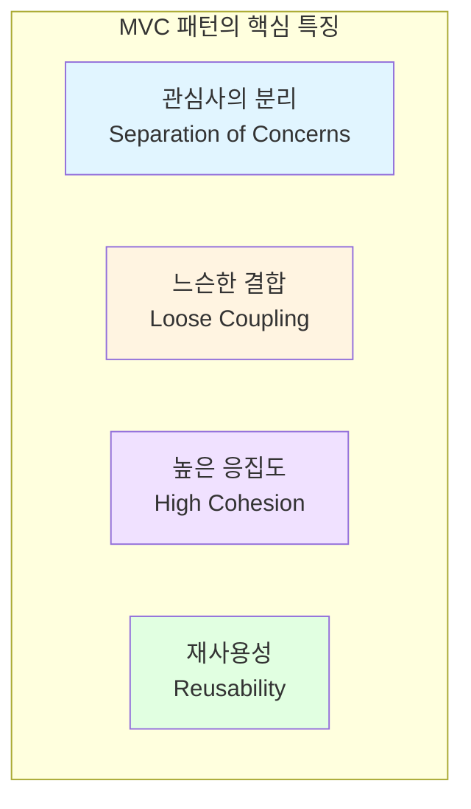

---

## 📖 정의

**MVC(Model-View-Controller)** 는 애플리케이션을 다음 세 가지 상호 연결된 컴포넌트로 분리하는 소프트웨어 디자인 패턴입니다:

- **Model (모델)**: 애플리케이션의 데이터와 비즈니스 로직을 담당
- **View (뷰)**: 사용자에게 정보를 표시하는 UI를 담당
- **Controller (컨트롤러)**: 사용자 입력을 처리하고 Model과 View 사이를 중재

### MVC의 핵심 원칙

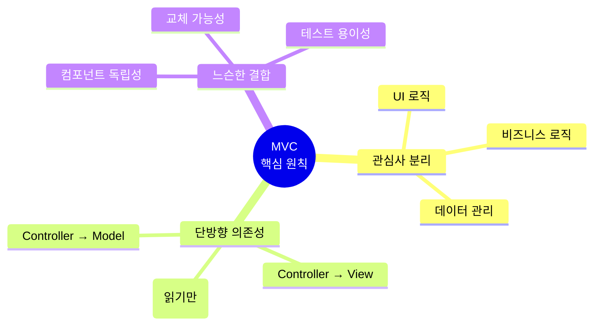

---

## 🔑 핵심 용어

### 1. **Model (모델)**
애플리케이션의 데이터 구조와 비즈니스 로직을 정의합니다. 데이터베이스와 상호작용하고, 데이터의 유효성을 검증하며, 비즈니스 규칙을 구현합니다.

### 2. **View (뷰)**
사용자에게 데이터를 표시하는 프레젠테이션 계층입니다. Model의 데이터를 사용자가 볼 수 있는 형태로 렌더링합니다.

### 3. **Controller (컨트롤러)**
사용자의 입력을 받아 처리하고, 적절한 Model을 호출하며, 결과를 View에 전달합니다. Model과 View 사이의 중재자 역할을 합니다.

### 4. **DTO (Data Transfer Object)**
계층 간 데이터 전송을 위한 객체로, 불필요한 데이터 노출을 방지합니다.

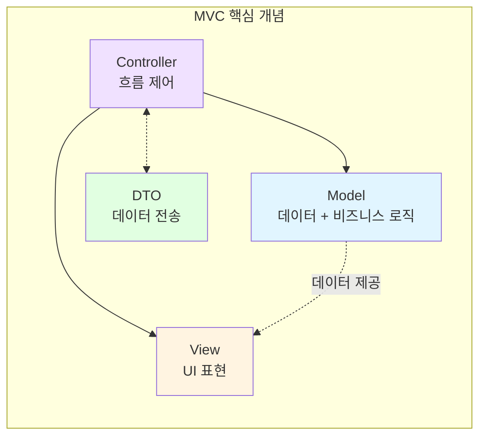

---

## 🏛️ MVC 아키텍처 구조

### 기본 MVC 구조

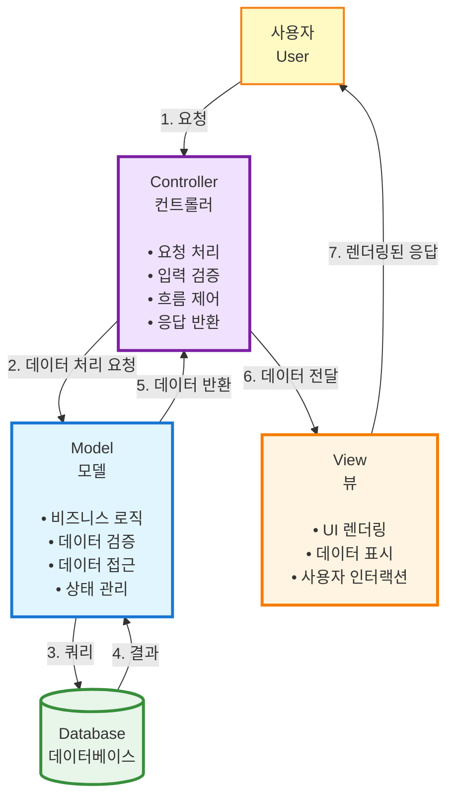

### Spring Boot MVC 상세 구조

```mermaid
graph TB
    CLIENT[Client<br/>클라이언트<br/>브라우저/API]

    subgraph "Spring MVC Framework"
        DS[DispatcherServlet<br/>Front Controller]
        HM[Handler Mapping<br/>요청 매핑]
        HA[Handler Adapter<br/>컨트롤러 실행]
        VR[View Resolver<br/>뷰 리졸버]
    end

    CTRL[Controller<br/>@RestController/@Controller]
    SERVICE[Service<br/>@Service<br/>비즈니스 로직]
    REPO[Repository<br/>@Repository<br/>데이터 접근]
    ENTITY[Entity<br/>JPA Entity]
    VIEW[View<br/>Thymeleaf/JSON]
    DB[(Database)]

    CLIENT -->|HTTP Request| DS
    DS -->|찾기| HM
    HM -->|매핑| HA
    HA -->|실행| CTRL
    CTRL -->|비즈니스 로직 호출| SERVICE
    SERVICE -->|데이터 접근| REPO
    REPO -->|ORM 매핑| ENTITY
    ENTITY -->|SQL| DB
    DB -->|결과| ENTITY
    ENTITY -->|Entity| REPO
    REPO -->|Data| SERVICE
    SERVICE -->|DTO| CTRL
    CTRL -->|Model| VR
    VR -->|템플릿 처리| VIEW
    VIEW -->|HTTP Response| CLIENT

    style CLIENT fill:#fff9c4
    style DS fill:#e1bee7
    style CTRL fill:#f0e1ff
    style SERVICE fill:#e1f5ff
    style REPO fill:#bbdefb
    style ENTITY fill:#90caf9
    style VIEW fill:#fff4e1
    style DB fill:#e8f5e9
```

---

## 📋 각 컴포넌트의 역할

### 1. Model (모델)

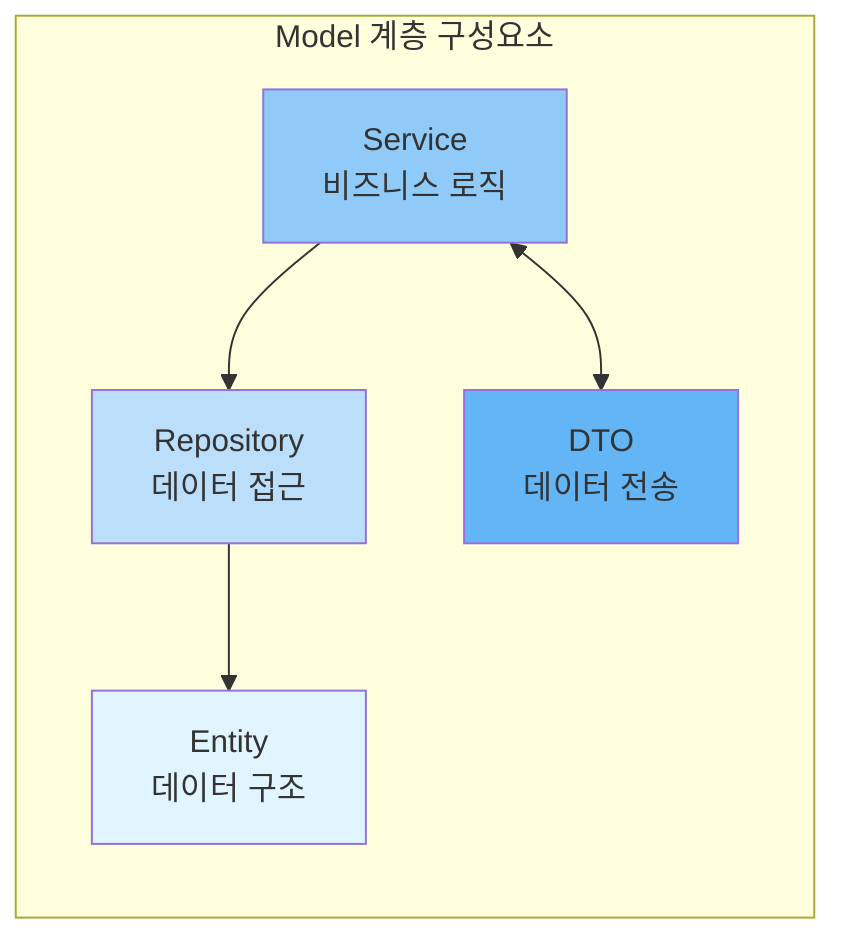

**주요 책임:**
- 애플리케이션 데이터 관리
- 비즈니스 로직 구현
- 데이터 유효성 검증
- 데이터베이스 CRUD 작업
- 비즈니스 규칙 적용

**Spring Boot 구성요소:**

1. **Entity (엔티티)**
   - JPA 엔티티로 데이터베이스 테이블 매핑
   - `@Entity`, `@Table` 어노테이션 사용
   - 데이터 구조 정의

2. **Repository (리포지토리)**
   - 데이터 접근 계층
   - `@Repository` 또는 `JpaRepository` 사용
   - CRUD 메서드 제공

3. **Service (서비스)**
   - 비즈니스 로직 구현
   - `@Service` 어노테이션 사용
   - 트랜잭션 관리 (`@Transactional`)

**예시 (Kotlin):**
```kotlin
// Entity
@Entity
@Table(name = "products")
data class Product(
    @Id
    @GeneratedValue(strategy = GenerationType.IDENTITY)
    val id: Long? = null,

    @Column(nullable = false)
    var name: String,

    @Column(nullable = false)
    var price: BigDecimal,

    @Column(nullable = false)
    var stock: Int
)

// Repository
@Repository
interface ProductRepository : JpaRepository<Product, Long> {
    fun findByNameContaining(name: String): List<Product>
}

// Service
@Service
class ProductService(
    private val productRepository: ProductRepository
) {
    @Transactional
    fun createProduct(dto: CreateProductDto): Product {
        val product = Product(
            name = dto.name,
            price = dto.price,
            stock = dto.stock
        )
        return productRepository.save(product)
    }

    fun getAllProducts(): List<Product> {
        return productRepository.findAll()
    }
}
```

**금지 사항:**
- ❌ UI 렌더링 로직 포함
- ❌ HTTP 요청/응답 직접 처리
- ❌ View에 대한 의존성

---

### 2. View (뷰)

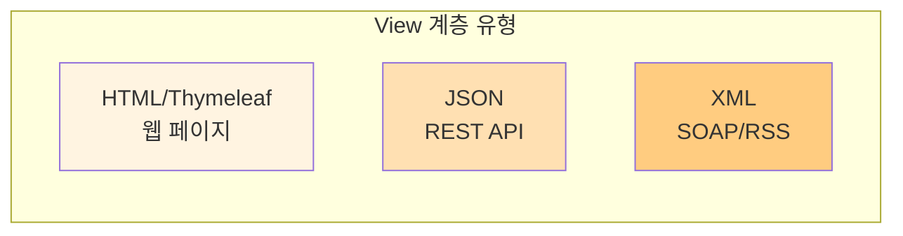

**주요 책임:**
- 데이터 시각화
- 사용자 인터페이스 렌더링
- 사용자 입력 폼 제공
- 클라이언트에게 응답 전달

**Spring Boot 구현 방식:**

1. **템플릿 엔진 (Server-Side Rendering)**
   - Thymeleaf, JSP, Freemarker
   - HTML 페이지 생성
   - 서버에서 렌더링

2. **REST API (Client-Side Rendering)**
   - JSON/XML 응답
   - `@RestController` 사용
   - SPA (React, Vue, Angular) 지원

**예시 (Thymeleaf):**
```html
<!DOCTYPE html>
<html xmlns:th="http://www.thymeleaf.org">
<head>
    <title>상품 목록</title>
</head>
<body>
    <h1>상품 목록</h1>
    <table>
        <thead>
            <tr>
                <th>ID</th>
                <th>상품명</th>
                <th>가격</th>
                <th>재고</th>
            </tr>
        </thead>
        <tbody>
            <tr th:each="product : ${products}">
                <td th:text="${product.id}"></td>
                <td th:text="${product.name}"></td>
                <td th:text="${product.price}"></td>
                <td th:text="${product.stock}"></td>
            </tr>
        </tbody>
    </table>
</body>
</html>
```

**예시 (REST API - JSON):**
```kotlin
// Response DTO
data class ProductResponse(
    val id: Long,
    val name: String,
    val price: BigDecimal,
    val stock: Int
)

// Controller에서 JSON 반환
@RestController
@RequestMapping("/api/products")
class ProductApiController(
    private val productService: ProductService
) {
    @GetMapping
    fun getAllProducts(): List<ProductResponse> {
        return productService.getAllProducts()
            .map { ProductResponse(it.id!!, it.name, it.price, it.stock) }
    }
}
```

**금지 사항:**
- ❌ 비즈니스 로직 포함
- ❌ 데이터베이스 직접 접근
- ❌ 데이터 검증 및 처리

---

### 3. Controller (컨트롤러)

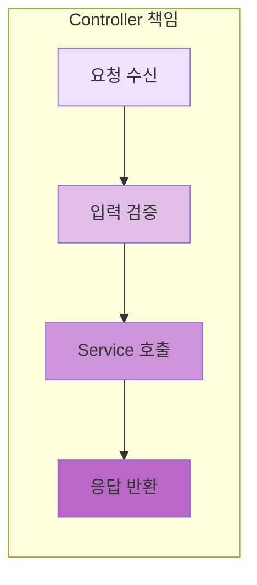

**주요 책임:**
- HTTP 요청 처리
- 요청 데이터 검증
- 적절한 Service 메서드 호출
- Model 데이터를 View에 전달
- 응답 반환 (HTML, JSON 등)

**Spring Boot 어노테이션:**

1. **@Controller**
   - 전통적인 MVC 컨트롤러
   - View 이름 반환
   - Thymeleaf, JSP 등과 함께 사용

2. **@RestController**
   - RESTful API 컨트롤러
   - `@Controller` + `@ResponseBody`
   - JSON/XML 직접 반환

**예시 (웹 MVC):**
```kotlin
@Controller
@RequestMapping("/products")
class ProductController(
    private val productService: ProductService
) {
    @GetMapping
    fun listProducts(model: Model): String {
        val products = productService.getAllProducts()
        model.addAttribute("products", products)
        return "products/list" // Thymeleaf 템플릿 이름
    }

    @GetMapping("/new")
    fun newProductForm(model: Model): String {
        model.addAttribute("product", CreateProductDto())
        return "products/form"
    }

    @PostMapping
    fun createProduct(
        @Valid @ModelAttribute dto: CreateProductDto,
        bindingResult: BindingResult
    ): String {
        if (bindingResult.hasErrors()) {
            return "products/form"
        }

        productService.createProduct(dto)
        return "redirect:/products"
    }
}
```

**예시 (REST API):**
```kotlin
@RestController
@RequestMapping("/api/products")
class ProductApiController(
    private val productService: ProductService
) {
    @GetMapping
    fun getAllProducts(): ResponseEntity<List<ProductResponse>> {
        val products = productService.getAllProducts()
            .map { ProductResponse(it.id!!, it.name, it.price, it.stock) }
        return ResponseEntity.ok(products)
    }

    @PostMapping
    fun createProduct(
        @Valid @RequestBody dto: CreateProductDto
    ): ResponseEntity<ProductResponse> {
        val product = productService.createProduct(dto)
        val response = ProductResponse(product.id!!, product.name, product.price, product.stock)
        return ResponseEntity.status(HttpStatus.CREATED).body(response)
    }

    @GetMapping("/{id}")
    fun getProduct(@PathVariable id: Long): ResponseEntity<ProductResponse> {
        val product = productService.getProductById(id)
            ?: return ResponseEntity.notFound().build()

        val response = ProductResponse(product.id!!, product.name, product.price, product.stock)
        return ResponseEntity.ok(response)
    }
}
```

**금지 사항:**
- ❌ 비즈니스 로직 구현
- ❌ 데이터베이스 직접 접근
- ❌ 복잡한 데이터 처리
- ❌ UI 렌더링 로직

---

## 🌊 데이터 흐름

### 웹 MVC 요청 흐름

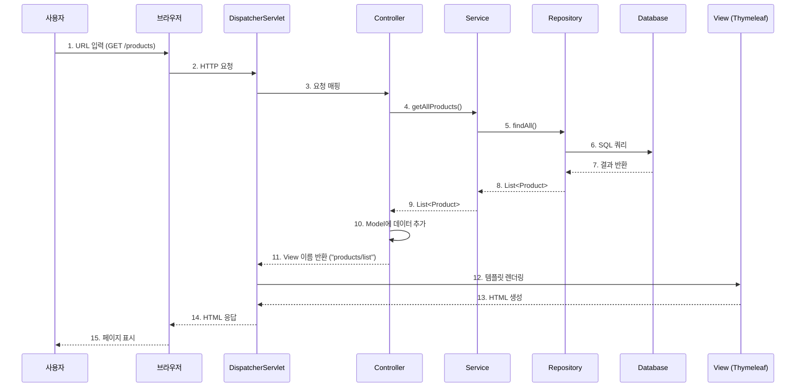

### REST API 요청 흐름

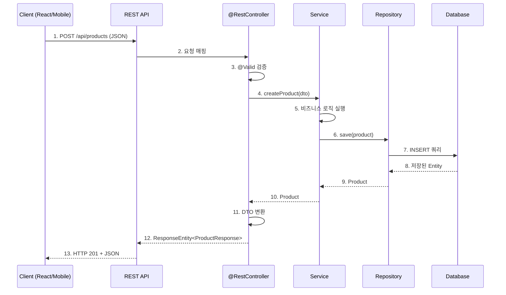

### 상품 생성 플로우 (전체)

```mermaid
flowchart TD
    START([사용자 요청])

    subgraph "1. Controller Layer"
        REQ[HTTP 요청 수신]
        VAL[입력 검증 @Valid]
        CALL[Service 호출]
    end

    subgraph "2. Service Layer"
        BIZ[비즈니스 로직 실행]
        TRANS[@Transactional 시작]
    end

    subgraph "3. Repository Layer"
        SAVE[save 메서드 호출]
        JPA[JPA 쿼리 변환]
    end

    subgraph "4. Database"
        INSERT[INSERT SQL 실행]
        COMMIT[트랜잭션 커밋]
    end

    subgraph "5. Response"
        CONV[DTO 변환]
        RESP[HTTP 응답 생성]
    end

    START --> REQ
    REQ --> VAL
    VAL -->|유효| CALL
    VAL -->|오류| ERROR[400 Bad Request]
    CALL --> BIZ
    BIZ --> TRANS
    TRANS --> SAVE
    SAVE --> JPA
    JPA --> INSERT
    INSERT --> COMMIT
    COMMIT --> CONV
    CONV --> RESP
    RESP --> END([응답 반환])

    style REQ fill:#f0e1ff
    style VAL fill:#e1bee7
    style BIZ fill:#e1f5ff
    style TRANS fill:#bbdefb
    style SAVE fill:#90caf9
    style INSERT fill:#e8f5e9
    style CONV fill:#fff4e1
```

---

## 🌸 Spring Boot에서의 MVC

### Spring MVC 아키텍처

Spring Boot는 Spring MVC 프레임워크를 기반으로 하며, 다음과 같은 핵심 컴포넌트를 제공합니다:

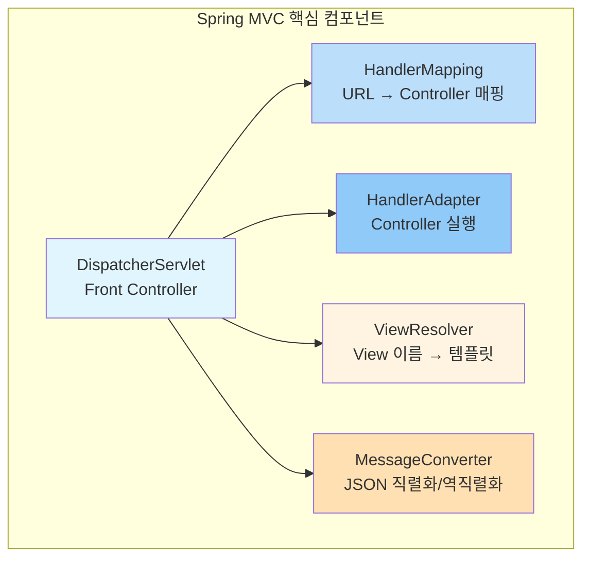

### Spring Boot 자동 구성

Spring Boot는 다음을 자동으로 구성합니다:

1. **DispatcherServlet**: 모든 HTTP 요청의 진입점
2. **기본 View Resolver**: Thymeleaf, JSP 등 지원
3. **JSON Converter**: Jackson을 통한 JSON 직렬화
4. **에러 핸들링**: 기본 에러 페이지
5. **정적 리소스**: `/static`, `/public` 폴더

### 프로젝트 구조

```
kotlin-springboot-mvc/
├── build.gradle.kts
├── settings.gradle.kts
└── src/
    └── main/
        ├── kotlin/
        │   └── com/example/mvc/
        │       ├── MvcApplication.kt          # Main 클래스
        │       │
        │       ├── controller/                # Controller 계층
        │       │   ├── ProductController.kt   # 웹 MVC
        │       │   └── ProductApiController.kt # REST API
        │       │
        │       ├── service/                   # Service 계층 (Model)
        │       │   └── ProductService.kt
        │       │
        │       ├── repository/                # Repository 계층 (Model)
        │       │   └── ProductRepository.kt
        │       │
        │       ├── model/                     # Entity (Model)
        │       │   └── Product.kt
        │       │
        │       └── dto/                       # DTO
        │           ├── CreateProductDto.kt
        │           └── ProductResponse.kt
        │
        └── resources/
            ├── application.yml                # 설정 파일
            ├── templates/                     # Thymeleaf 템플릿 (View)
            │   └── products/
            │       ├── list.html
            │       └── form.html
            └── static/                        # 정적 리소스
                ├── css/
                └── js/
```

### 주요 어노테이션

```mermaid
graph LR
    subgraph "Spring MVC 어노테이션"
        C1[@Controller<br/>웹 MVC]
        C2[@RestController<br/>REST API]
        C3[@RequestMapping<br/>URL 매핑]
        C4[@GetMapping<br/>GET 요청]
        C5[@PostMapping<br/>POST 요청]
        C6[@PathVariable<br/>경로 변수]
        C7[@RequestBody<br/>JSON 요청]
        C8[@ResponseBody<br/>JSON 응답]
    end

    subgraph "Service/Repository"
        S1[@Service<br/>비즈니스 로직]
        S2[@Repository<br/>데이터 접근]
        S3[@Transactional<br/>트랜잭션]
    end

    subgraph "JPA"
        J1[@Entity<br/>엔티티]
        J2[@Id<br/>기본 키]
        J3[@GeneratedValue<br/>자동 생성]
    end

    style C1 fill:#f0e1ff
    style C2 fill:#e1bee7
    style S1 fill:#e1f5ff
    style S2 fill:#bbdefb
    style J1 fill:#90caf9
```

---

## ⚖️ 장단점

### 장점

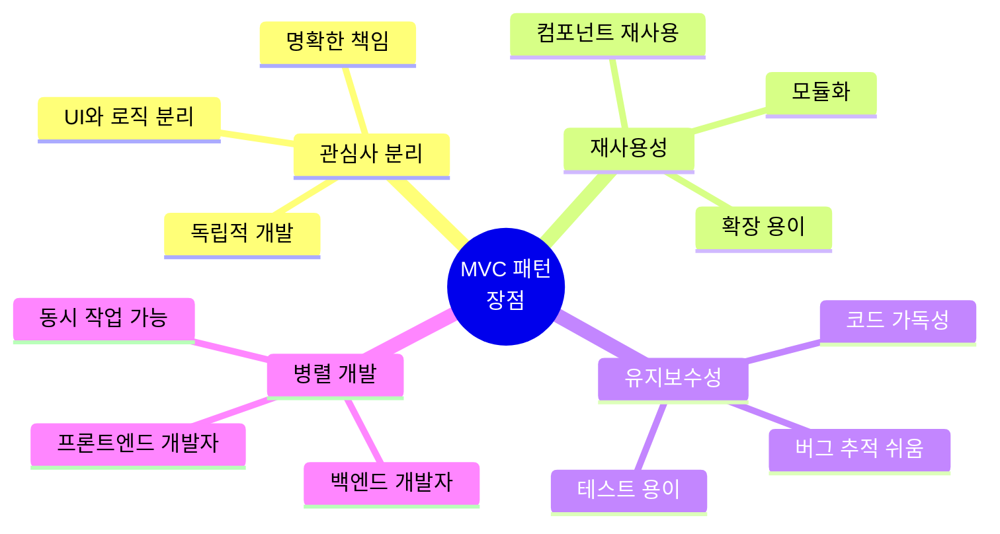

**✅ 주요 장점:**

1. **관심사의 명확한 분리**
   - UI, 비즈니스 로직, 데이터 관리가 독립적
   - 각 컴포넌트의 책임이 명확
   - 코드 이해가 쉬움

2. **유지보수 용이**
   - 변경 사항이 다른 부분에 영향을 최소화
   - 버그 수정이 쉬움
   - 리팩토링이 안전

3. **재사용성 향상**
   - 동일한 Model을 여러 View에서 사용 가능
   - 컴포넌트 재사용
   - API와 웹 UI 공통 로직 공유

4. **테스트 용이성**
   - 각 계층을 독립적으로 테스트
   - Mock 객체 활용
   - 단위 테스트 작성 쉬움

5. **병렬 개발 가능**
   - 프론트엔드와 백엔드 팀 분리
   - 동시 개발 가능
   - 생산성 향상

6. **SEO 친화적 (서버 사이드 렌더링)**
   - Thymeleaf 등을 사용하면 서버에서 HTML 생성
   - 검색 엔진 최적화
   - 초기 로딩 속도 개선

---

### 단점

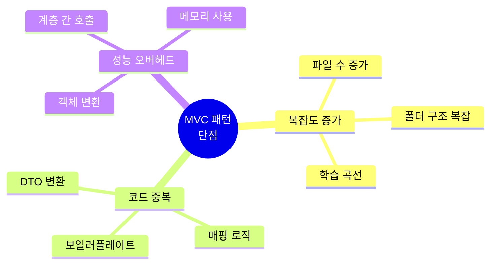

**❌ 주요 단점:**

1. **초기 구조 복잡도**
   - 작은 프로젝트에는 과도할 수 있음
   - 많은 파일과 폴더
   - 초보자에게 어려울 수 있음

2. **보일러플레이트 코드**
   - DTO 변환 코드
   - 매핑 로직
   - 반복적인 CRUD 코드

3. **계층 간 데이터 전달 오버헤드**
   - 객체 변환 비용
   - 메모리 사용 증가
   - 성능 저하 가능성

4. **View와 Model의 강한 결합 가능성**
   - 잘못 설계하면 View가 Model에 의존
   - 변경 시 영향 범위 증가

---

## 💼 사용 사례

### MVC 패턴이 적합한 경우

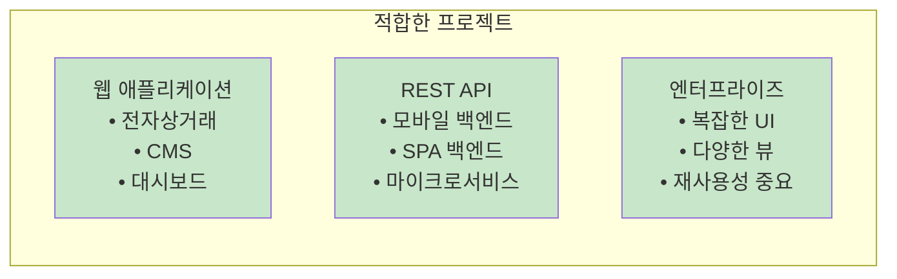

**✅ 적합한 경우:**

1. **웹 애플리케이션**
   - 전자상거래 사이트
   - 콘텐츠 관리 시스템 (CMS)
   - 관리자 대시보드
   - 소셜 미디어 플랫폼

2. **REST API 서비스**
   - 모바일 앱 백엔드
   - SPA (Single Page Application) 백엔드
   - 마이크로서비스 아키텍처

3. **다양한 View가 필요한 경우**
   - 웹 + 모바일 API
   - 다국어 지원
   - 테마 변경

4. **팀 협업 프로젝트**
   - 프론트엔드/백엔드 분리
   - 역할 분담 명확
   - 병렬 개발

---

### MVC 패턴이 부적합한 경우

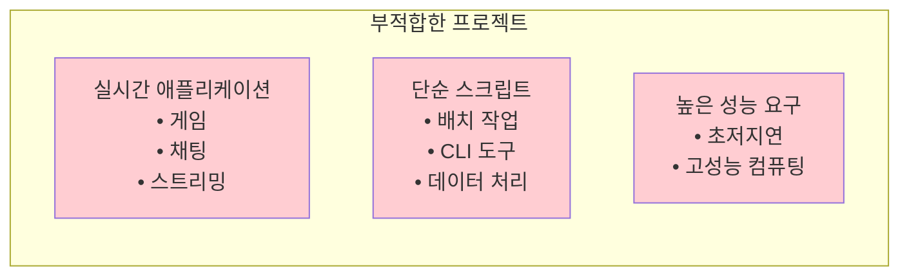

**❌ 부적합한 경우:**

1. **실시간 상호작용이 많은 애플리케이션**
   - 실시간 게임
   - 실시간 협업 도구 (Google Docs 유사)
   - → MVVM, Reactive 패턴 고려

2. **단순한 스크립트나 CLI 도구**
   - 배치 작업
   - 데이터 마이그레이션
   - → 절차적 프로그래밍으로 충분

3. **매우 높은 성능이 요구되는 시스템**
   - 초저지연 거래 시스템
   - 고성능 컴퓨팅
   - → 계층 오버헤드 제거 필요

---

## 🆚 MVC vs 레이어드 아키텍처

### 비교

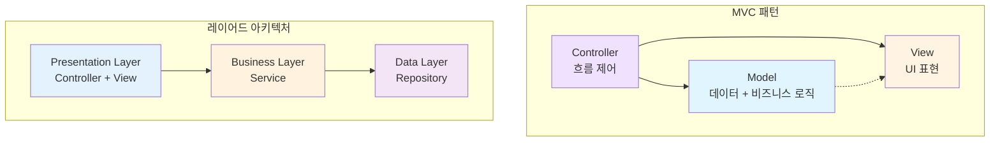

### 주요 차이점

| 측면 | MVC | 레이어드 아키텍처 |
|------|-----|-------------------|
| **초점** | UI와 비즈니스 로직 분리 | 수평적 계층 분리 |
| **구조** | Model-View-Controller | Presentation-Business-Data |
| **목적** | 사용자 인터페이스 관리 | 전체 시스템 구조화 |
| **범위** | 주로 프레젠테이션 계층 | 애플리케이션 전체 |
| **의존성 방향** | Controller → Model, View | 상위 → 하위 계층 |
| **사용 사례** | 웹 애플리케이션, UI 중심 | 엔터프라이즈 시스템 전체 |

### 통합 사용

Spring Boot에서는 **MVC와 레이어드 아키텍처를 함께 사용**하는 것이 일반적입니다:

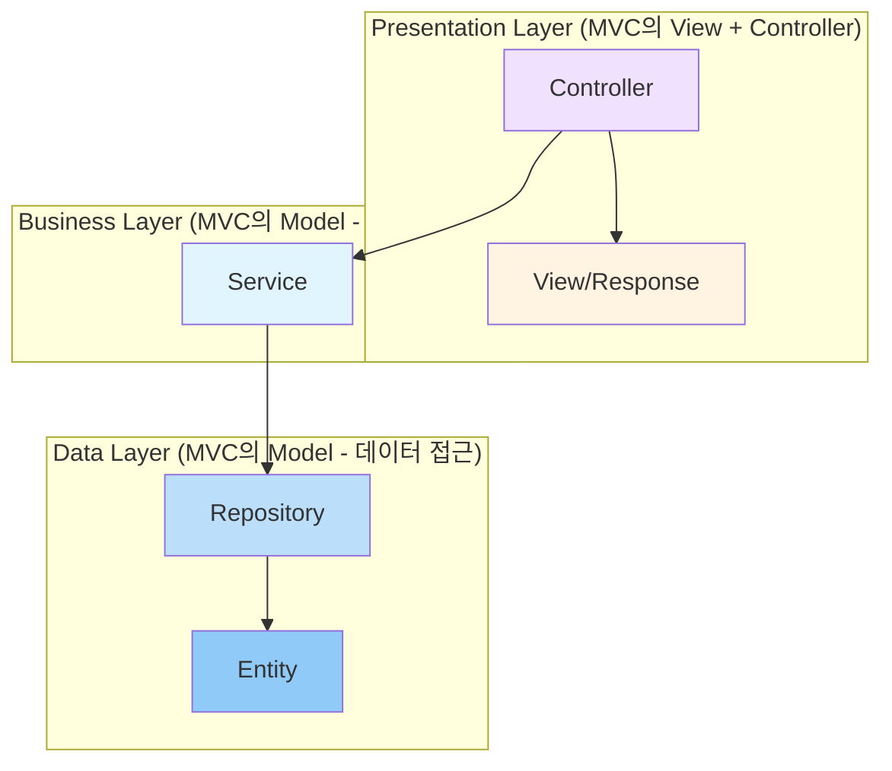

**통합 접근법:**
- **Controller (MVC)** → **Presentation Layer (레이어드)**
- **Service (MVC Model)** → **Business Layer (레이어드)**
- **Repository (MVC Model)** → **Data Layer (레이어드)**
- **View (MVC)** → **Presentation Layer (레이어드)**

---

## ⚠️ 안티패턴

### 1. Fat Controller (비대한 컨트롤러)

```kotlin
// ❌ 잘못된 예 - Controller에 비즈니스 로직
@RestController
@RequestMapping("/api/products")
class ProductController(
    private val productRepository: ProductRepository
) {
    @PostMapping
    fun createProduct(@RequestBody dto: CreateProductDto): Product {
        // 비즈니스 로직이 Controller에 있음
        if (dto.price < BigDecimal.ZERO) {
            throw IllegalArgumentException("가격은 음수일 수 없습니다")
        }

        // Controller에서 직접 Repository 호출
        val product = Product(
            name = dto.name,
            price = dto.price,
            stock = dto.stock
        )
        return productRepository.save(product)
    }
}

// ✅ 올바른 예 - Thin Controller
@RestController
@RequestMapping("/api/products")
class ProductController(
    private val productService: ProductService  // Service 주입
) {
    @PostMapping
    fun createProduct(@Valid @RequestBody dto: CreateProductDto): ResponseEntity<ProductResponse> {
        val product = productService.createProduct(dto)  // Service에 위임
        val response = ProductResponse(product.id!!, product.name, product.price, product.stock)
        return ResponseEntity.status(HttpStatus.CREATED).body(response)
    }
}
```

---

### 2. View에 비즈니스 로직

```html
<!-- ❌ 잘못된 예 - Thymeleaf 템플릿에 비즈니스 로직 -->
<div th:each="product : ${products}">
    <span th:text="${product.name}"></span>
    <!-- 비즈니스 로직이 View에 있음 -->
    <span th:if="${product.price > 10000}" class="expensive">고가 상품</span>
    <span th:if="${product.stock < 5}" class="low-stock">재고 부족</span>
    <span th:text="${product.price * 1.1}">세금 포함 가격</span>
</div>
```

```kotlin
// ✅ 올바른 예 - Model에 비즈니스 로직
@Entity
data class Product(
    @Id @GeneratedValue
    val id: Long? = null,
    var name: String,
    var price: BigDecimal,
    var stock: Int
) {
    // 비즈니스 로직을 Model 메서드로
    fun isExpensive(): Boolean = price > BigDecimal(10000)
    fun isLowStock(): Boolean = stock < 5
    fun priceWithTax(): BigDecimal = price * BigDecimal("1.1")
}
```

```html
<!-- ✅ 올바른 예 - View는 단순 표시만 -->
<div th:each="product : ${products}">
    <span th:text="${product.name}"></span>
    <span th:if="${product.expensive}" class="expensive">고가 상품</span>
    <span th:if="${product.lowStock}" class="low-stock">재고 부족</span>
    <span th:text="${product.priceWithTax()}">세금 포함 가격</span>
</div>
```

---

### 3. Model과 View의 강한 결합

```kotlin
// ❌ 잘못된 예 - Entity를 직접 View에 노출
@RestController
class ProductController(private val repo: ProductRepository) {
    @GetMapping("/api/products/{id}")
    fun getProduct(@PathVariable id: Long): Product {
        return repo.findById(id).orElseThrow()  // Entity 직접 반환
    }
}

// 문제점:
// 1. 데이터베이스 스키마가 API 응답에 그대로 노출
// 2. Entity 변경 시 API 응답도 변경됨
// 3. 민감한 정보가 노출될 수 있음
// 4. N+1 문제 발생 가능 (Lazy Loading)
```

```kotlin
// ✅ 올바른 예 - DTO 사용
data class ProductResponse(
    val id: Long,
    val name: String,
    val price: BigDecimal,
    val stock: Int
    // 필요한 필드만 선택적으로 노출
)

@RestController
class ProductController(private val service: ProductService) {
    @GetMapping("/api/products/{id}")
    fun getProduct(@PathVariable id: Long): ResponseEntity<ProductResponse> {
        val product = service.getProductById(id)
            ?: return ResponseEntity.notFound().build()

        val response = ProductResponse(
            id = product.id!!,
            name = product.name,
            price = product.price,
            stock = product.stock
        )
        return ResponseEntity.ok(response)
    }
}
```

---

### 4. Anemic Domain Model (빈약한 도메인 모델)

```kotlin
// ❌ 잘못된 예 - 데이터만 가진 Entity
@Entity
data class Product(
    @Id @GeneratedValue val id: Long? = null,
    var name: String,
    var price: BigDecimal,
    var stock: Int
)
// 모든 로직이 Service에만 있음
```

```kotlin
// ✅ 올바른 예 - 비즈니스 로직을 포함한 Rich Model
@Entity
class Product(
    @Id @GeneratedValue
    val id: Long? = null,

    var name: String,
    var price: BigDecimal,
    var stock: Int
) {
    // 비즈니스 로직을 Model에 포함
    fun updateStock(quantity: Int) {
        if (stock + quantity < 0) {
            throw InsufficientStockException("재고가 부족합니다")
        }
        stock += quantity
    }

    fun applyDiscount(discountRate: BigDecimal) {
        if (discountRate < BigDecimal.ZERO || discountRate > BigDecimal.ONE) {
            throw IllegalArgumentException("할인율은 0~100% 사이여야 합니다")
        }
        price = price * (BigDecimal.ONE - discountRate)
    }

    fun isAvailable(): Boolean = stock > 0
}
```

---

## 📚 참고 자료

### Spring 공식 문서
- 🌐 [Spring MVC Documentation](https://docs.spring.io/spring-framework/reference/web/webmvc.html)
- 🌐 [Spring Boot Reference](https://docs.spring.io/spring-boot/docs/current/reference/html/)
- 🌐 [Spring Data JPA](https://docs.spring.io/spring-data/jpa/docs/current/reference/html/)
- 🌐 [Thymeleaf Documentation](https://www.thymeleaf.org/documentation.html)

### 추천 도서
- 📕 **"Spring in Action"** - Craig Walls
- 📗 **"Spring Boot in Practice"** - Somnath Musib
- 📘 **"Patterns of Enterprise Application Architecture"** - Martin Fowler (MVC 패턴 원조)
- 📙 **"Clean Architecture"** - Robert C. Martin

### Kotlin + Spring Boot 리소스
- 🌐 [Kotlin for Spring](https://spring.io/guides/tutorials/spring-boot-kotlin/)
- 🌐 [Building web applications with Spring Boot and Kotlin](https://spring.io/guides/tutorials/spring-boot-kotlin/)

### 온라인 자료
- 🌐 [Baeldung - Spring MVC](https://www.baeldung.com/spring-mvc)
- 🌐 [Spring Guides](https://spring.io/guides)

---

## 📊 요약

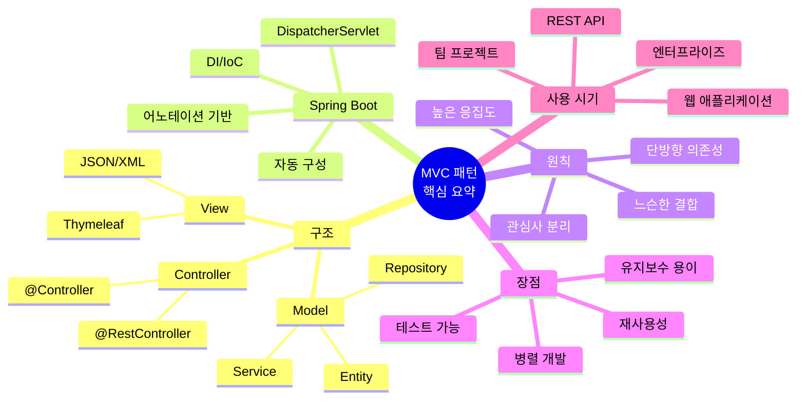

MVC 패턴은 **웹 애플리케이션 개발의 표준 패턴**으로, Spring Boot와 함께 사용하면 강력하고 유지보수하기 쉬운 애플리케이션을 만들 수 있습니다. Model, View, Controller의 명확한 분리를 통해 각 컴포넌트의 책임을 명확히 하고, 테스트 가능하며 확장 가능한 구조를 제공합니다.

---

**다음 단계:** [Kotlin + Spring Boot MVC 구현 예제 보기](./kotlin-springboot/README.md)
