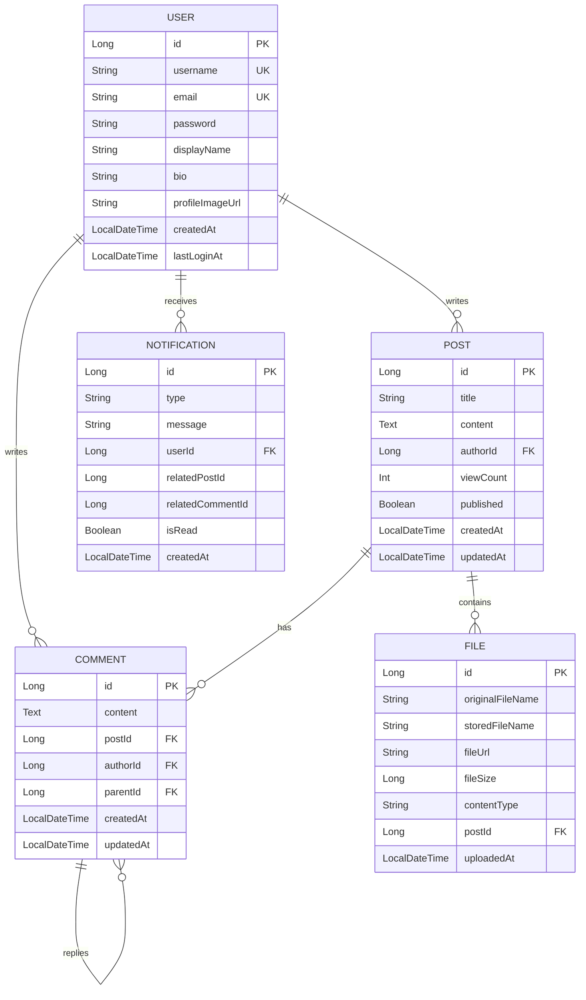

# Kotlin + Spring Boot MVC 구현 예제

> 소셜 미디어/블로그 플랫폼을 통해 학습하는 실제 동작하는 MVC 패턴 구현 예제

---

## 📋 목차

1. [프로젝트 개요](#-프로젝트-개요)
2. [도메인 모델](#-도메인-모델)
3. [프로젝트 구조](#-프로젝트-구조)
4. [기술 스택](#-기술-스택)
5. [실행 방법](#-실행-방법)
6. [주요 기능](#-주요-기능)
7. [코드 설명](#-코드-설명)
8. [API 엔드포인트](#-api-엔드포인트)
9. [학습 포인트](#-학습-포인트)

---

## 🎯 프로젝트 개요

이 프로젝트는 **소셜 미디어/블로그 플랫폼**을 통해 Spring Boot MVC 패턴을 학습하기 위한 예제입니다.

**주요 기능:**
- ✅ 게시글 작성, 조회, 수정, 삭제 (CRUD)
- ✅ 사용자 관리 (프로필, 작성 게시글)
- ✅ 댓글 및 대댓글 기능
- ✅ 파일/이미지 첨부 (구조 설계)
- ✅ 알림 시스템 (댓글, 시스템 알림)
- ✅ Thymeleaf 템플릿 기반 웹 UI
- ✅ RESTful API 제공

**학습 목표:**
- MVC 패턴의 각 컴포넌트 역할 이해
- JPA 연관관계 매핑 (1:N, N:1, self-referencing)
- Spring Boot의 자동 구성 활용
- Kotlin + Spring Boot 통합
- Repository Pattern과 Service Layer
- DTO를 통한 Entity 보호
- Thymeleaf 템플릿 엔진 사용
- REST API 설계 원칙

---

## 🗺️ 도메인 모델

### 엔티티 관계도



### 주요 연관관계

1. **User ↔ Post** (1:N)
   - 한 사용자가 여러 게시글 작성
   - `@OneToMany` / `@ManyToOne`

2. **User ↔ Comment** (1:N)
   - 한 사용자가 여러 댓글 작성
   - `@OneToMany` / `@ManyToOne`

3. **Post ↔ Comment** (1:N)
   - 한 게시글에 여러 댓글
   - `@OneToMany` / `@ManyToOne`

4. **Comment ↔ Comment** (1:N, self-referencing)
   - 대댓글 지원
   - `@ManyToOne` (parent) / `@OneToMany` (replies)

5. **Post ↔ File** (1:N)
   - 한 게시글에 여러 파일/이미지
   - `@OneToMany` / `@ManyToOne`

6. **User ↔ Notification** (1:N)
   - 한 사용자가 여러 알림 받음
   - `@OneToMany` / `@ManyToOne`

---

## 📁 프로젝트 구조

```
kotlin-springboot/
├── build.gradle.kts                    # Gradle 빌드 설정 (Kotlin DSL)
├── settings.gradle.kts                 # Gradle 프로젝트 설정
│
└── src/
    └── main/
        ├── kotlin/
        │   └── com/example/mvc/
        │       ├── MvcApplication.kt           # Spring Boot Main 클래스
        │       │
        │       ├── controller/                 # Controller 계층
        │       │   ├── HomeController.kt       # 홈 컨트롤러
        │       │   ├── PostController.kt       # 게시글 웹 MVC
        │       │   └── PostApiController.kt    # 게시글 REST API
        │       │
        │       ├── service/                    # Service 계층 (Model - 비즈니스 로직)
        │       │   ├── UserService.kt          # 사용자 서비스
        │       │   ├── PostService.kt          # 게시글 서비스
        │       │   ├── CommentService.kt       # 댓글 서비스
        │       │   └── NotificationService.kt  # 알림 서비스
        │       │
        │       ├── repository/                 # Repository 계층 (Model - 데이터 접근)
        │       │   ├── UserRepository.kt
        │       │   ├── PostRepository.kt
        │       │   ├── CommentRepository.kt
        │       │   ├── FileRepository.kt
        │       │   └── NotificationRepository.kt
        │       │
        │       ├── model/                      # Entity (Model - 데이터 구조)
        │       │   ├── User.kt                 # 사용자 엔티티
        │       │   ├── Post.kt                 # 게시글 엔티티
        │       │   ├── Comment.kt              # 댓글 엔티티
        │       │   ├── FileEntity.kt           # 파일 엔티티
        │       │   └── Notification.kt         # 알림 엔티티
        │       │
        │       ├── dto/                        # DTO (Data Transfer Object)
        │       │   ├── UserDto.kt              # 사용자 DTO
        │       │   ├── PostDto.kt              # 게시글 DTO
        │       │   └── CommentDto.kt           # 댓글 DTO
        │       │
        │       ├── exception/                  # 예외 처리
        │       │   └── ResourceNotFoundException.kt
        │       │
        │       └── config/                     # 설정
        │           └── DataInitializer.kt      # 초기 데이터 생성
        │
        └── resources/
            ├── application.yml                 # Spring Boot 설정
            │
            ├── templates/                      # Thymeleaf 템플릿 (View)
            │   └── posts/
            │       ├── list.html               # 게시글 목록
            │       ├── detail.html             # 게시글 상세
            │       └── form.html               # 게시글 작성/수정 폼
            │
            └── static/                         # 정적 리소스
                ├── css/
                └── js/
```

---

## 🛠️ 기술 스택

### Backend
- **Kotlin** 1.9+
- **Spring Boot** 3.2+
- **Spring Web MVC**
- **Spring Data JPA**
- **H2 Database** (인메모리 DB)
- **Bean Validation**

### View
- **Thymeleaf** 3.1+ (템플릿 엔진)
- **Bootstrap** 5 (CSS 프레임워크)
- **Bootstrap Icons**

### Build Tool
- **Gradle** 8+ (Kotlin DSL)

---

## 🚀 실행 방법

### 1. 프로젝트 빌드

```bash
cd architecture/mvc/kotlin-springboot
./gradlew build
```

### 2. 애플리케이션 실행

```bash
./gradlew bootRun
```

### 3. 브라우저에서 접속

- **웹 UI**: http://localhost:8080/posts
- **REST API**: http://localhost:8080/api/posts
- **H2 Console**: http://localhost:8080/h2-console

### 4. H2 Database 접속 정보

```yaml
JDBC URL: jdbc:h2:mem:testdb
Username: sa
Password: (공백)
```

---

## ✨ 주요 기능

### 1. 웹 UI (Thymeleaf)

#### 게시글 목록 페이지
- URL: `GET /posts`
- 전체 게시글 목록 표시 (카드 레이아웃)
- 조회수, 댓글 수 표시
- 작성자 정보 및 작성 시간

#### 게시글 상세 페이지
- URL: `GET /posts/{id}`
- 게시글 전체 내용
- 댓글 목록
- 수정/삭제 버튼

#### 게시글 작성 페이지
- URL: `GET /posts/new`
- 게시글 작성 폼
- 입력 검증 (Bean Validation)
- 즉시 게시 옵션

#### 게시글 수정 페이지
- URL: `GET /posts/{id}/edit`
- 기존 게시글 정보로 폼 채우기
- 수정 후 저장

### 2. REST API

| HTTP 메서드 | 엔드포인트 | 설명 |
|-------------|-----------|------|
| GET | /api/posts | 전체 게시글 목록 조회 |
| GET | /api/posts/popular | 인기 게시글 조회 (조회수 기준) |
| GET | /api/posts/{id} | 특정 게시글 조회 |
| POST | /api/posts | 새 게시글 작성 |
| PUT | /api/posts/{id} | 게시글 정보 수정 |
| DELETE | /api/posts/{id} | 게시글 삭제 |
| GET | /api/posts/search?title=keyword | 게시글 검색 |
| GET | /api/posts/author/{authorId} | 특정 작성자의 게시글 조회 |

---

## 📖 코드 설명

### 1. Model - Entity

#### User (사용자)

```kotlin
@Entity
@Table(name = "users")
data class User(
    @Id
    @GeneratedValue(strategy = GenerationType.IDENTITY)
    val id: Long? = null,

    @Column(nullable = false, unique = true, length = 50)
    var username: String,

    @Column(nullable = false, unique = true, length = 100)
    var email: String,

    @Column(nullable = false)
    var password: String,

    @Column(length = 100)
    var displayName: String? = null,

    @Column(length = 500)
    var bio: String? = null,

    @Column(nullable = false)
    val createdAt: LocalDateTime = LocalDateTime.now(),

    // 연관관계
    @OneToMany(mappedBy = "author", cascade = [CascadeType.ALL])
    val posts: MutableList<Post> = mutableListOf(),

    @OneToMany(mappedBy = "author", cascade = [CascadeType.ALL])
    val comments: MutableList<Comment> = mutableListOf()
)
```

**특징:**
- `@Entity`: JPA 엔티티 선언
- `@OneToMany`: 사용자가 작성한 게시글/댓글 목록
- `cascade = [CascadeType.ALL]`: 연관 엔티티 자동 관리
- `data class`: Kotlin의 데이터 클래스 활용

#### Post (게시글)

```kotlin
@Entity
@Table(name = "posts")
data class Post(
    @Id
    @GeneratedValue(strategy = GenerationType.IDENTITY)
    val id: Long? = null,

    @Column(nullable = false, length = 200)
    var title: String,

    @Column(nullable = false, columnDefinition = "TEXT")
    var content: String,

    @Column(nullable = false)
    var viewCount: Int = 0,

    // 연관관계
    @ManyToOne(fetch = FetchType.LAZY)
    @JoinColumn(name = "author_id", nullable = false)
    var author: User,

    @OneToMany(mappedBy = "post", cascade = [CascadeType.ALL])
    val comments: MutableList<Comment> = mutableListOf()
) {
    // 비즈니스 로직
    fun incrementViewCount() {
        viewCount++
    }

    fun update(title: String, content: String) {
        this.title = title
        this.content = content
        this.updatedAt = LocalDateTime.now()
    }
}
```

**특징:**
- `@ManyToOne`: 게시글 작성자 (N:1 관계)
- `fetch = FetchType.LAZY`: 지연 로딩으로 성능 최적화
- 비즈니스 메서드 포함 (Rich Domain Model)

#### Comment (댓글)

```kotlin
@Entity
@Table(name = "comments")
data class Comment(
    @Id
    @GeneratedValue(strategy = GenerationType.IDENTITY)
    val id: Long? = null,

    @Column(nullable = false, columnDefinition = "TEXT")
    var content: String,

    @ManyToOne(fetch = FetchType.LAZY)
    @JoinColumn(name = "post_id", nullable = false)
    var post: Post,

    @ManyToOne(fetch = FetchType.LAZY)
    @JoinColumn(name = "author_id", nullable = false)
    var author: User,

    // 대댓글 지원 (self-referencing)
    @ManyToOne(fetch = FetchType.LAZY)
    @JoinColumn(name = "parent_id")
    var parent: Comment? = null,

    @OneToMany(mappedBy = "parent", cascade = [CascadeType.ALL])
    val replies: MutableList<Comment> = mutableListOf()
)
```

**특징:**
- **Self-referencing 관계**: 대댓글 지원
- `parent`: 부모 댓글 (null이면 최상위 댓글)
- `replies`: 대댓글 목록

---

### 2. Model - Repository

```kotlin
@Repository
interface PostRepository : JpaRepository<Post, Long> {
    fun findByAuthor(author: User): List<Post>
    fun findByPublishedTrue(): List<Post>
    fun findByTitleContaining(title: String): List<Post>

    @Query("SELECT p FROM Post p WHERE p.published = true ORDER BY p.createdAt DESC")
    fun findAllPublishedOrderByCreatedAtDesc(): List<Post>

    @Query("SELECT p FROM Post p WHERE p.published = true ORDER BY p.viewCount DESC")
    fun findAllPublishedOrderByViewCountDesc(): List<Post>
}
```

**특징:**
- `JpaRepository` 상속으로 기본 CRUD 메서드 자동 제공
- 메서드 이름 규칙으로 쿼리 자동 생성
- `@Query`로 복잡한 쿼리 정의

---

### 3. Model - Service

```kotlin
@Service
@Transactional(readOnly = true)
class PostService(
    private val postRepository: PostRepository,
    private val userRepository: UserRepository
) {
    fun getAllPosts(): List<Post> {
        return postRepository.findAllPublishedOrderByCreatedAtDesc()
    }

    fun getPostById(id: Long): Post {
        return postRepository.findById(id)
            .orElseThrow { ResourceNotFoundException("게시글을 찾을 수 없습니다: ID = $id") }
    }

    @Transactional
    fun createPost(authorId: Long, title: String, content: String): Post {
        val author = userRepository.findById(authorId)
            .orElseThrow { ResourceNotFoundException("사용자를 찾을 수 없습니다") }

        val post = Post(
            title = title,
            content = content,
            author = author
        )
        return postRepository.save(post)
    }

    @Transactional
    fun incrementViewCount(postId: Long) {
        val post = getPostById(postId)
        post.incrementViewCount()
    }
}
```

**특징:**
- `@Service`: 비즈니스 로직 계층 표시
- `@Transactional`: 트랜잭션 관리
- 생성자 주입으로 Repository 의존성 주입

---

### 4. Controller - 웹 MVC

```kotlin
@Controller
@RequestMapping("/posts")
class PostController(
    private val postService: PostService,
    private val commentService: CommentService
) {
    @GetMapping
    fun listPosts(model: Model): String {
        val posts = postService.getAllPosts()
        model.addAttribute("posts", posts)
        return "posts/list"  // templates/posts/list.html
    }

    @GetMapping("/{id}")
    fun showPost(@PathVariable id: Long, model: Model): String {
        val post = postService.getPostById(id)
        val comments = commentService.getCommentsByPost(id)

        postService.incrementViewCount(id) // 조회수 증가

        model.addAttribute("post", post)
        model.addAttribute("comments", comments)
        return "posts/detail"
    }

    @PostMapping
    fun createPost(
        @Valid @ModelAttribute("post") dto: CreatePostDto,
        bindingResult: BindingResult,
        redirectAttributes: RedirectAttributes
    ): String {
        if (bindingResult.hasErrors()) {
            return "posts/form"
        }

        val authorId = 1L // 실제로는 로그인한 사용자 ID
        val post = postService.createPost(authorId, dto.title, dto.content)

        redirectAttributes.addFlashAttribute("message", "게시글이 작성되었습니다.")
        return "redirect:/posts/${post.id}"
    }
}
```

**특징:**
- `@Controller`: 웹 MVC 컨트롤러
- View 이름 반환 (Thymeleaf 템플릿)
- `Model`에 데이터 추가
- Form 데이터 바인딩과 검증

---

### 5. Controller - REST API

```kotlin
@RestController
@RequestMapping("/api/posts")
class PostApiController(
    private val postService: PostService
) {
    @GetMapping
    fun getAllPosts(): ResponseEntity<List<PostSummaryResponse>> {
        val posts = postService.getAllPosts()
            .map { it.toSummaryResponse() }
        return ResponseEntity.ok(posts)
    }

    @GetMapping("/{id}")
    fun getPost(@PathVariable id: Long): ResponseEntity<PostResponse> {
        val post = postService.getPostById(id)
        postService.incrementViewCount(id)
        return ResponseEntity.ok(post.toResponse())
    }

    @PostMapping
    fun createPost(
        @Valid @RequestBody dto: CreatePostDto,
        @RequestHeader("X-User-Id", required = false) userId: Long?
    ): ResponseEntity<PostResponse> {
        val authorId = userId ?: 1L
        val post = postService.createPost(authorId, dto.title, dto.content)
        return ResponseEntity
            .status(HttpStatus.CREATED)
            .body(post.toResponse())
    }
}
```

**특징:**
- `@RestController`: REST API 컨트롤러
- JSON 응답 자동 변환
- HTTP 상태 코드 명시
- Extension function으로 DTO 변환

---

### 6. DTO (Data Transfer Object)

```kotlin
// 게시글 생성 요청 DTO
data class CreatePostDto(
    @field:NotBlank(message = "제목은 필수입니다")
    @field:Size(min = 2, max = 200, message = "제목은 2~200자 이내여야 합니다")
    val title: String = "",

    @field:NotBlank(message = "내용은 필수입니다")
    @field:Size(min = 10, message = "내용은 최소 10자 이상이어야 합니다")
    val content: String = ""
)

// 게시글 응답 DTO
data class PostResponse(
    val id: Long,
    val title: String,
    val content: String,
    val authorUsername: String,
    val viewCount: Int,
    val commentCount: Int,
    val createdAt: LocalDateTime
)

// Extension function for DTO conversion
fun Post.toResponse() = PostResponse(
    id = this.id!!,
    title = this.title,
    content = this.content,
    authorUsername = this.author.username,
    viewCount = this.viewCount,
    commentCount = this.comments.size,
    createdAt = this.createdAt
)
```

**특징:**
- Bean Validation 어노테이션으로 입력 검증
- Entity와 분리하여 API 응답 제어
- Extension function으로 변환 로직 간결화

---

## 🌐 API 엔드포인트

### REST API 사용 예제

#### 1. 전체 게시글 조회
```bash
curl -X GET http://localhost:8080/api/posts
```

**응답:**
```json
[
  {
    "id": 1,
    "title": "Spring Boot와 Kotlin으로 시작하는 백엔드 개발",
    "contentPreview": "Spring Boot와 Kotlin은 현대적인 백엔드 개발을 위한...",
    "authorUsername": "johndoe",
    "viewCount": 245,
    "commentCount": 2,
    "createdAt": "2024-01-15T10:30:00"
  }
]
```

#### 2. 게시글 작성
```bash
curl -X POST http://localhost:8080/api/posts \
  -H "Content-Type: application/json" \
  -H "X-User-Id: 1" \
  -d '{
    "title": "새로운 게시글",
    "content": "게시글 내용입니다. 최소 10자 이상 작성해야 합니다."
  }'
```

**응답:** `201 Created`
```json
{
  "id": 4,
  "title": "새로운 게시글",
  "content": "게시글 내용입니다. 최소 10자 이상 작성해야 합니다.",
  "authorUsername": "johndoe",
  "viewCount": 0,
  "commentCount": 0,
  "createdAt": "2024-01-15T14:20:00"
}
```

#### 3. 게시글 검색
```bash
curl -X GET "http://localhost:8080/api/posts/search?title=Spring"
```

#### 4. 게시글 삭제
```bash
curl -X DELETE http://localhost:8080/api/posts/1
```

**응답:** `204 No Content`

---

## 📚 학습 포인트

### 1. MVC 패턴 이해
- **Model**: Entity (User, Post, Comment), Repository, Service
- **View**: Thymeleaf 템플릿 (`list.html`, `detail.html`, `form.html`)
- **Controller**: `PostController` (웹), `PostApiController` (API)

### 2. JPA 연관관계 매핑
- `@OneToMany` / `@ManyToOne`: 1:N 관계
- Self-referencing: 대댓글 구현
- `cascade`: 연관 엔티티 자동 관리
- `orphanRemoval`: 고아 객체 자동 삭제
- `FetchType.LAZY`: 지연 로딩으로 성능 최적화

### 3. Spring Boot 핵심 개념
- **의존성 주입 (DI)**: 생성자 주입 방식
- **자동 구성**: `@SpringBootApplication`
- **어노테이션 기반**: `@Controller`, `@Service`, `@Repository`

### 4. Spring Data JPA
- `JpaRepository` 상속으로 CRUD 자동 구현
- 메서드 이름 규칙으로 쿼리 생성
- `@Query`로 복잡한 쿼리 정의
- `@Transactional`로 트랜잭션 관리

### 5. Bean Validation
- `@NotBlank`, `@NotNull`, `@Size` 등
- 입력 검증 자동화
- `@Valid`와 `BindingResult`

### 6. REST API 설계
- RESTful 원칙 준수
- HTTP 메서드 활용 (GET, POST, PUT, DELETE)
- 적절한 상태 코드 반환 (200, 201, 204, 404)
- DTO 패턴으로 요청/응답 분리

### 7. Kotlin + Spring Boot
- `data class` 활용
- Null 안정성 (`?`, `!!`)
- Extension function
- 간결한 문법

### 8. Rich Domain Model
- Entity에 비즈니스 로직 포함
- `incrementViewCount()`, `update()` 등
- Anemic Domain Model 회피

---

## 🔍 추가 학습 자료

### 다음 단계
1. **예외 처리 강화**
   - `@ControllerAdvice`로 전역 예외 처리
   - 커스텀 에러 응답

2. **페이징과 정렬**
   - `Pageable` 인터페이스 활용
   - `PagingAndSortingRepository`

3. **검색 기능 강화**
   - Query DSL
   - Specification API

4. **보안**
   - Spring Security
   - JWT 인증
   - 비밀번호 암호화 (BCrypt)

5. **파일 업로드**
   - MultipartFile 처리
   - 이미지 업로드 및 저장

6. **테스트**
   - Unit Test (MockMvc)
   - Integration Test
   - Repository Test

---

## 📝 라이선스

이 프로젝트는 학습 목적으로 작성되었습니다.
